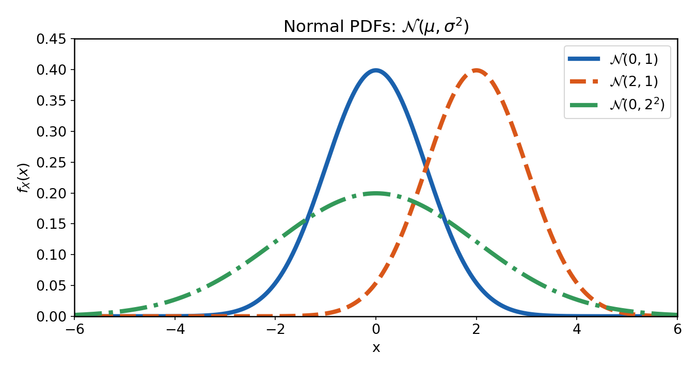

# Obiectiv

Generarea de eșantioane normale pentru diferite valori ale lui $\mu$ și $\sigma$.
Compararea histogramelor și a statisticilor eșantioanelor cu teoria.
Calculul probabilităților pentru distribuția normală folosind `erf()` și estimarea lor din eșantioane.

# Aspecte teoretice

## Distribuția normală

### Definiție și parametri

Distribuția normală descrie o variabilă aleatoare care ia valori cu probabilitate mai mare în jurul mediei sale $\mu$
decât valori îndepărtate de aceasta,
conform unei funcții densitate de probabilitate în formă de clopot („clopotul lui Gauss”).

O variabilă normală se notează:

$$X \sim \mathcal{N}(\mu,\sigma^2), \qquad \sigma > 0.$$

Densitatea de probabilitate normală are expresia matematică:

$$
w_X(x) = \frac{1}{\sigma\sqrt{2\pi}}
\exp\left[-\frac{(x-\mu)^2}{2\sigma^2}\right].
$$

{width=80% fig-align="center"}

Distribuția normală are doi parametri:

- $\mu$, **media** („centrul”), care controlează poziția maximului densității de probabilitate;

- $\sigma$, **deviația standard**, care controlează lățimea lobului.

- Uneori se specifică valoarea lui $\sigma^2$, **varianța**, în locul lui $\sigma$.

Modificarea lui $\mu$ deplasează densitatea de probabilitate într-o parte sau în alta.
Un $\sigma$ mai mare înseamnă o funcție mai lată și mai aplatizată, iar un $\sigma$ mai mic înseamnă o funcție mai îngustă și mai înaltă.

**Distribuția normală standard** este distribuția normală cu $\mu=0$ și $\sigma=1$:

$$Z \sim \mathcal{N}(\mu=0,\sigma^2=1).$$

### Generarea eșantioanelor normale în Matlab

`randn()` generează valori din distribuția normală standard $\mathcal{N}(\mu=0,\sigma^2=1)$:

```matlab
z = randn()          % o valoare din N(0,1)

z = randn(1, 10)     % 10 valori independente din N(0,1)
```

Pentru valori arbitrare ale lui $\mu$ și $\sigma$, scalați cu $\sigma$ și deplasați cu $\mu$:

$$B = \mu + \sigma A, \qquad \text{ unde } A \sim \mathcal{N}(\mu=0,\sigma^2=1).$$

```matlab
mu = 5;
sigma = 2;
N = 1000;

x_normal = mu + sigma*randn(1, N);
```

Observație: înmulțiți cu deviația standard $\sigma$, nu cu varianța $\sigma^2$.

### Calculul probabilităților pentru distribuția normală

FR a distribuției normale nu poate fi exprimată prin funcții elementare.
Se folosește funcția `erf()` din Matlab pentru a o evalua.

Pentru o variabilă normală $A \sim \mathcal{N}(\mu,\sigma^2)$, probabilitatea ca $A$ să fie în intervalul $[a,b]$ este:

$$P(a \le A \le b) = F_A(b) - F_A(a),$$

unde $F_A(x)$ este funcția de repartiție (FR) a lui $A$ și se calculează folosind funcția de eroare `erf()`:

$$
F_A(x) = P(A \le x) = \frac{1}{2}\left[1 + \operatorname{erf}\left(\frac{x-\mu}{\sigma\sqrt{2}}\right)\right].
$$

```{=latex}
\begin{samepage}
```
În Matlab:

Exemplu: $A \sim \mathcal{N}(\mu=10,\sigma^2=4)$ și $P(8 \le A \le 12)$:

```matlab
mu = 10;
sigma = 2;
a = 8;
b = 12;

F_a = 0.5*(1 + erf((a-mu)/(sigma*sqrt(2))));
F_b = 0.5*(1 + erf((b-mu)/(sigma*sqrt(2))));
p_normal_theory = F_b - F_a
```

Rezultatul este aproximativ 0.6827. Îl putem estima și din eșantioane, folosind metoda introdusă în Laboratorul 2
bazată pe numărarea valorilor care satisfac condiția:

```matlab
N = 10000;
x_normal = mu + sigma*randn(1, N);
p_normal_estimated = sum(x_normal >= a & x_normal <= b)/N;
```

```{=latex}
\end{samepage}
```

## Calculul statisticilor din eșantioane de date

Pentru un vector de valori:

- se pot folosi `mean()`, `std()` și `var()` pentru a calcula statistici din date.
Acestea estimează valorile teoretice $\mu$, $\sigma$ și $\sigma^2$,
dar precizia depinde de numărul de valori folosite.

- se poate reprezenta histograma normalizată introdusă în Laboratorul 2 pentru comparația cu o densitate teoretică:

  ```matlab
  histogram(x, 35, 'Normalization', 'pdf')
  xlabel('Valoare')
  ylabel('Densitate de probabilitate estimată')
  grid on
   ```

- se poate estima orice probabilitate numărând valorile care satisfac condiția și împărțind la `numel()`:

  ```matlab
  p_estimated = sum(x >= a & x <= b)/numel(x);
  ```

## Rezumat: funcții și notații pe care trebuie să le cunoașteți

<style>
table td, table th { border-bottom: 1px solid #ddd; }
</style>

| Sintaxă sau notație | Exemplu | Descriere |
|---|---|---|
| $A\sim\mathcal{N}(\mu,\sigma^2)$ | $A\sim\mathcal{N}(2,2)$ | Distribuție normală: media $\mu$, varianța $\sigma^2$ |
| $\sigma=\sqrt{\sigma^2}$ | $\sigma=\sqrt{2}$ | Deviația standard, folosită pentru scalarea lui `randn()` |
| `randn(m,n)` | `randn(1,1000)` | $m\times n$ valori din $\mathcal{N}(0,1)$ |
| `mu + sigma*randn(m,n)` | `2 + sqrt(2)*randn(1,1000)` | Valori din $\mathcal{N}(\mu,\sigma^2)$ |
| `mean(x)`, `std(x)`, `var(x)` | `std(x)` | Media, deviația standard și varianța eșantionului |
| `histogram(x,n)` | `histogram(x,35)` | Histogramă cu `n` intervale; adăugați `'Normalization','pdf'` pentru arie unitară |
| `erf(x)` | `0.5*(1+erf((x-mu)/(sigma*sqrt(2))))` | Funcția de eroare folosită pentru evaluarea FR normale |
| $F_A(b)-F_A(a)$ | $P(a\le A\le b)$ | Probabilitatea unui interval din FR |
| `sum(condition)/numel(x)` | `sum(x > 5)/numel(x)` | Probabilitate empirică |

```{=latex}
\newpage
```

# Exerciții teoretice

1. Fie $A$ o variabilă aleatoare continuă cu distribuția normală $\mathcal{N}(\mu = 1, \sigma^2 = 20)$.

   a. Calculați probabilitatea $P(A \in [2, \; 4])$.
   b. Care este distribuția variabilei aleatoare $B$ definite prin $B = A - 2$?
   c. Care este valoarea maximă a densității $w_A(x)$ și pentru ce valoare $x$ este atinsă?
   d. Care este distribuția variabilei aleatoare $C$ definite prin $C = 3*A$?

      (Indiciu: Porniți de la $\mu_C = \overline{C}$ și $\sigma_C^2 = \overline{(C-\mu_C)^2}$ și înlocuiți $C$.)

# Exerciții

Scrieți singuri toate comenzile într-un script sau live script. Etichetați figurile și răspundeți
la întrebările de interpretare în comentarii.

1. Eșantioane aleatoare normale:

   a. Generați 10000 de valori din $\mathcal{N}(\mu=2,\sigma^2=2)$ și stocați-le
      în `x_normal_1`. Al doilea parametru este varianța.
   b. Reprezentați primele 100 de valori în funcție de indicele lor.
   c. Reprezentați o histogramă cu 35 de intervale, normalizată ca densitate de probabilitate.
   d. Calculați media, deviația standard și varianța eșantionului. Comparați-le
      cu $2$, $\sqrt{2}$ și $2$.
   e. Generați din nou vectorul. Care rezultate se schimbă?

2. Efectul parametrilor distribuției normale:

   a. Generați 10000 de valori din $\mathcal{N}(\mu=-3,\sigma^2=2)$.
      Comparați histograma normalizată ca densitate de probabilitate cu cea din Exercițiul 1.
   b. Păstrați $\mu=2$, dar setați $\sigma=0.5$. Generați 10000 de valori și comparați din nou.
   c. Descrieți schimbările de poziție, lățime și înălțime în fiecare comparație.
   d. Calculați media și deviația standard ale eșantionului pentru cei doi vectori noi.
      Comparați-le cu valorile lor teoretice.

3. Probabilități pentru o variabilă normală:

   Fie $A\sim\mathcal{N}(\mu=2,\sigma^2=2)$.

   a. Folosiți `erf()` pentru a calcula $P(A\le 3)$, $P(0\le A\le 4)$ și $P(A>5)$.
   b. Estimați toate cele trei probabilități din `x_normal_1`.
   c. Repetați estimările cu 100000 de valori. Comparați cu teoria.
   d. Calculați numărul așteptat de valori mai mari decât 5 pentru $N=10000$.
      Comparați-l cu numărul observat în `x_normal_1`.

4. Aceeași medie și varianță, distribuții diferite:

   a. Generați 10000 de valori uniforme în intervalul $[2-\sqrt{6},2+\sqrt{6}]$.
   b. Folosiți formulele distribuției uniforme din Laboratorul 2 pentru a verifica faptul că
      media și varianța teoretice sunt ambele 2.
   c. Comparați histograma normalizată ca densitate de probabilitate cu cea a lui `x_normal_1`.
   d. Comparați mediile și varianțele eșantioanelor. Pot doar aceste două mărimi
      să distingă distribuțiile?
   e. Estimați $P(1\le A\le 3)$ pentru fiecare vector. Sunt probabilitățile similare?

## Exercițiu suplimentar

5. Estimați o densitate de probabilitate direct din eșantioane:

   Scrieți `p = myPDF(v, x, epsilon)` folosind

   $$\widehat{w}_A(x)=\frac{\text{numărul de valori în }[x-\varepsilon,x+\varepsilon]}
   {2\varepsilon N},\qquad N=\operatorname{numel}(v).$$

   a. Evaluați-o în 100 de puncte de la $-4$ la $8$ folosind `x_normal_1`.
   b. Reprezentați estimarea împreună cu densitatea normală teoretică. Folosiți
      operații element cu element când evaluați densitatea pe un vector.
   c. Repetați cu $\varepsilon=0.1$, $0.3$ și $0.8$. Comparați netezimea și nivelul de detaliu.

# Întrebări finale

1. Un vector normal generat are valori minime și maxime. De ce nu ar trebui
   folosite ca limite fixe pentru eșantioane viitoare din aceeași distribuție?
2. Poate un experiment să nu conțină nicio valoare peste un prag, chiar dacă
   probabilitatea teoretică de depășire este pozitivă?
3. De ce pot două distribuții cu aceeași medie și varianță să dea probabilități
   diferite pentru același interval?
4. O histogramă are formă de clopot. Este suficient pentru a concluziona că datele
   urmează o distribuție normală? Ce comparații suplimentare ați putea face?
