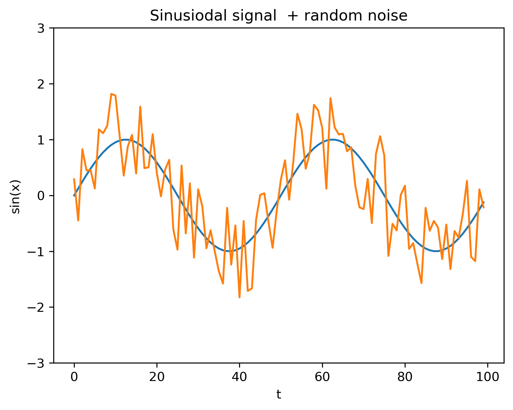
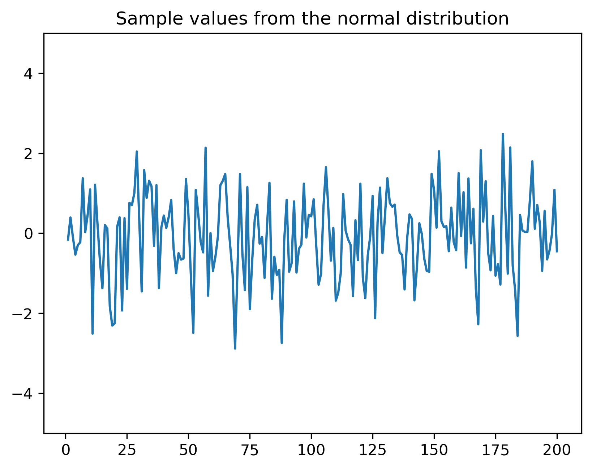
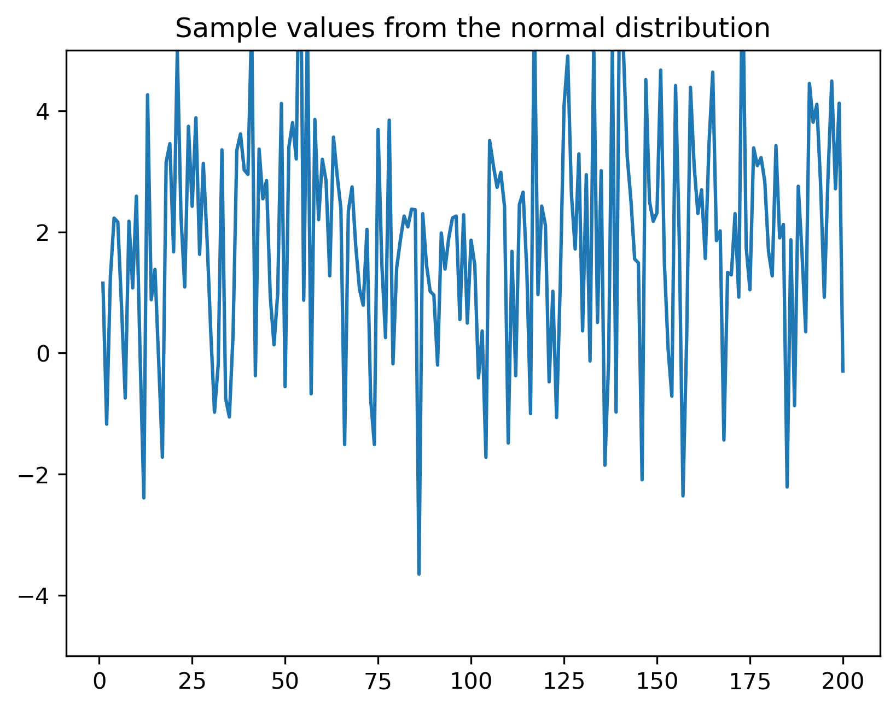
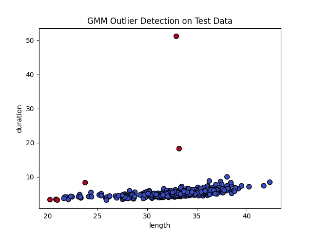
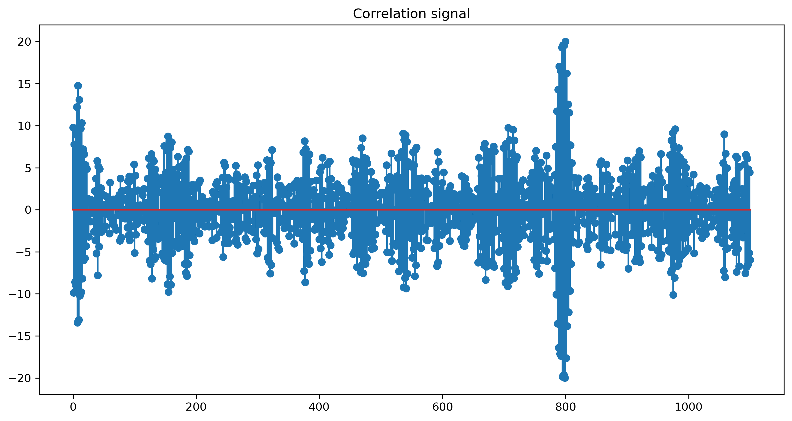

# Capitolul I. Semnale aleatoare

## I.1 Variabile aleatoare

### Variabile aleatoare

- **Variabilă aleatoare** = o variabilă care denumește o valoare produsă printr-un fenomen aleator
    - Practic, reprezintă *un nume* atașat unei valori arbitrare
    - Prescurtat: v.a.
- Notație uzuală: $X$, $Y$ etc..

- Exemple:
    - $X$ = Numărul obținut prin aruncarea unui zar
    - $V_{in}$ = Voltajul măsurat într-un punct dintr-un circuit

### Realizări ale unei variabile aleatoare

- O **realizare** a unei v.a. = o valoare particulară posibilă

- **Spațiul realizărilor** $\Omega$ = mulțimea valorilor posibile ale unei v.a
    - mulțimea tuturor realizărilor

- Exemplu: aruncarea unui zar
    - V.a. se notează $X$
    - Se poate obține o realizare $X = 3$
    - Dar s-ar fi putut obține orice valoare din spațiul realizărilor
    $$\Omega = \left\{1, 2, 3, 4, 5, 6\right\}$$

- V.a. **discretă**: dacă $\Omega$ este o mulțime discretă
  - Exemplu: Numărul obținut prin aruncarea unui zar
- V.a. **continuă**: dacă $\Omega$ este o mulțime compactă
  - Exemplu: Valoarea tensiunii măsurate într-un punct

### Aruncarea unei monede

- Variabila aleatoare X = "fața obținută la aruncarea unei monede"

	\smallskip

    {.id width=50%}

(sursa imaginii: *https://www.mathsisfun.com/data/random-variables.html*)

### Unde se întâlnesc variabile aleatoare?

- Variabilele aleatoare modelează semnale de **zgomot**

- Exemple:
    - Se măsoară tensiunea într-un punct dintr-un circuit
    - Dacă se măsoară de mai multe ori, se obțin valori *ușor diferite*.
    - Valoarea este afectată de zgomot
    - Valoarea tensiunii este o *variabilă aleatoare*

### Funcția masă de probabilitate

- Fie o v.a. discretă $A$

- **Funcția masă de probabilitate** (FMP) (*probability mass function*) =
probabilitatea ca $A$ să aibă valoarea egală cu $x$
$$w_A(x)= P\left\{ A = x\right\}$$

- Se mai numește **distribuția** variabilei A

- Exemplu: FMP pentru valoarea unui zar, grafic pe tablă

- Probabilitatea ca $A$ să aibă valoarea $v$
$$P\left\{ A = v\right\} = w_A(v)$$

- Probabilitatea ca A să fie între valorile $a$ și $b$ (inclusiv):
$$P\left\{ a \leq A \leq b\right\} = \sum_{x=a}^b w_A(x)$$

### Funcția de repartiție

- **Funcția de repartiție (FR)** = probabilitatea ca $A$
să aibă valoarea mai mică sau egală cu $x$
$$F_A(x) = P\left\{ A \leq x \right\}$$

- Exemplu: FR pentru un zar, grafic la tablă

- Pentru v.a. discrete, FR este "în trepte"

- Probabilitatea ca $A$ să aibă valoarea $v$
$$P\left\{ A = v\right\} = F_A(v) - F_A(v-1)$$

- Probabilitatea ca A să fie între valorile $a$ și $b$ (inclusiv):
$$P\left\{ a \leq A \leq b\right\} = F_A(b) - F_A(a-1)$$

### Relația între FMP și FR

- FR este *suma cumulativă* (un fel de "integrală discretă") a FMP
$$F_A(x) = \sum_{t = -\infty}^{t = x} w_A(t)$$

- Exemplu pentru zar: grafic, la tablă

### Variabile aleatoare discrete și continue

\smallskip

{.id width=80%}

(sursa imaginii: "Probability Distributions: Discrete and Continuous", Seema Singh, *https://towardsdatascience.com/probability-distributions-discrete-and-continuous-7a94ede66dc0*)

### Funcția de repartiție

- Fie o v.a. **continuă** $A$

- **Funcția de repartiție (FR)** = probabilitatea ca $A$
să aibă valoarea mai mică sau egală cu $x$
$$F_A(x) = P\left\{ A \leq x \right\}$$

- **Funcția densitate de probabilitate (FDP)** (sau **distribuția** lui A)
este derivata funcției de repartiție:
$$w_A(x) = \frac{\mathrm{d}F_A(x)}{\mathrm{d}x}$$

- Informal: densitatea de probabilitate $w_A(x)$ este proporțională
  cu probabilitatea ca valoarea lui $A$ să fie **în jurul lui** unei $x$

### Probabilitatea unei valori exacte

- Probabilitatea ca o v.a. continuă $A$ să ia **exact** o valoare $x$ este **zero**
  - pentru că există o infinitate de valori posibile (v.a. continuă)
  - de aceea nu se poate defini o funcție masă de probabilitate ca la v.a. discrete

- De aceea FDP reprezintă probabilitatea de a fi **într-o vecinătate** a valorii $x$, și nu exact egal cu $x$

### Calculul probabilității cu FDP și FR

- Probabilitatea ca $A$ să aibă exact valoarea $v$ este întotdeauna 0
$$P\left\{ A = v\right\} = 0$$

- Probabilitatea ca A să fie între valorile $a$ și $b$  = integrala FDP între $a$ și $b$:
$$P\left\{ a \leq A \leq b\right\} = \int_a^b w_A(x) dx$$

- Probabilitatea ca valoarea lui A să fie între $a$ și $b$:
$$P\left\{ a \leq A \leq b\right\} = F_A(b) - F_A(a)$$

- Nu contează dacă intervalul este deschis sau închis
  - $[a,b]$ sau $(a,b)$, nu contează
  - de ce?

### Relația între FDP și FR

- FR este **integrala** FDP
- FDP este **derivata** FR

$$F_A(x) = \int_{-\infty}^x w_A(x) \mathrm{d}x$$

$$\begin{split}
w_A(x) &= \frac{\mathrm{d}F_A(x)}{\mathrm{d}x} \\
&= \lim_{\epsilon \to 0}{\frac{F_A(x+\epsilon) - F_A(x-\epsilon)}{2 \epsilon}} \\
&= \lim_{\epsilon \to 0}{\frac{P(A \in [x-\epsilon, x+\epsilon])}{2 \epsilon}}
\end{split}$$

### Interpretare grafică

* Probabilitatea ca $A$ să fie între $a$ și $b$ este **suprafața de sub FDP**
    * adică integrala de la $a$ la $b$

* Probabilitatea ca $A$ să fie exact egal cu o valoare este zero
    * aria de sub un punct este nulă

\smallskip

{.id width=50%}

(sursa: "https://intellipaat.com/blog/tutorial/statistics-and-probability-tutorial/probability-distributions-of-continuous-variables/*)


### V.a. discrete vs continue

Comparație între v.a. discrete și continue

- FR $F_A(x)$ are aceeași definiție, înseamnă același lucru
- FDP/FMP $w_A(x)$ este derivata FR
    - la v.a. continue:
        - este o derivată obișnuită
        - reprezintă probabilitatea de a fi "in jurul" valorii $x$
    - la v.a. discrete:
        - un fel de "derivată discretă"
        - reprezintă probabilitatea de a avea exact valoarea $x$

### Proprietățile v.a

FR:

- FR este mereu pozitivă, $F_A(x) \geq 0$
- FR este monoton crescătoare (nu descrește)
- FR pornește din 0 și ajunge la valoarea 1
$$F_A(-\infty) = 0 \;\;\;\; F_A(\infty) = 1$$

FDP/FMP:

- PDF/PMF sunt mereu pozitive $w_A(x) \geq 0$
- Integrala/suma pe întreg domeniul = 1
$$\int_{-\infty}^\infty w_A(x) \mathrm{d}x = 1$$
$$\sum_{x = -\infty}^\infty w_A(x) = 1$$


### Diferite distribuții

* Semnal sinusoidal

```{.python .cb.run session=plot}
import matplotlib.pyplot as plt, numpy as np, math;
x = np.linspace(0, 99, 100);
s = np.sin(2*math.pi*0.02*x)
plt.figure(figsize=(10,6));
plt.plot(x,s);
plt.ylim(-3,3)
plt.xlabel('t');
plt.ylabel('sin(x)');
plt.title('Sinusiodal signal');
plt.savefig('fig/01_RandomSignals_Sine.png', transparent=True, bbox_inches='tight', dpi=300)
plt.close()
```
{width=70% max-width=1000px}


### Diferite distribuții

* Sinus + zgomot (normal, $\mu = 0, \sigma^2 = 1$)

```{.python .cb.run session=plot}
import matplotlib.pyplot as plt, numpy as np, math;
x = np.linspace(0, 99, 100);
s = np.sin(2*math.pi*0.02*x)
sn = s + np.random.randn(100)
plt.plot(x,s, x, sn);
plt.ylim(-3,3)
plt.xlabel('t');
plt.ylabel('sin(x)');
plt.title('Sinusiodal signal + random noise');
plt.savefig('fig/01_RandomSignals_SinePlusRandn.png', transparent=True, bbox_inches='tight', dpi=300)
plt.close()
```
{width=70% max-width=1000px}

### Diferite distribuții

* Sinus + zgomot (uniform $\mathcal{U} [-1,1]$)

* Ce diferă? Tipul distribuției

```{.python .cb.run session=plot}
import matplotlib.pyplot as plt, numpy as np, math;
x = np.linspace(0, 99, 100);
s = np.sin(2*math.pi*0.02*x)
sn = s + np.random.uniform(-1,1,100)
plt.plot(x,s,x,sn);
plt.ylim(-3,3)
plt.xlabel('t');
plt.ylabel('sin(x)');
plt.title('Sinusiodal signal  + random noise');
plt.savefig('fig/01_RandomSignals_SinePlusRand.png', transparent=True, bbox_inches='tight', dpi=300)
plt.close()
```
{width=70% max-width=1000px}


### Diferite distribuții

* Imagine originală

```{.python .cb.run session=plot}
import matplotlib.pyplot as plt, numpy as np, math, PIL;
from PIL import Image
myImage = Image.open("img/TestImageGirl.gif").convert("L");
im = np.array(myImage)
plt.imshow(im, cmap='gray', vmin=0, vmax=255)
plt.savefig('fig/01_RandomSignals_ImageClean.png', transparent=True, bbox_inches='tight', dpi=300)
plt.close()
```
{width=70% max-width=1000px}


### Diferite distribuții

* Imagine + zgomot (normal, $\mu = 0, \sigma^2 = 1$)

```{.python .cb.run session=plot}
import matplotlib.pyplot as plt, numpy as np, math, PIL;
from PIL import Image
myImage = Image.open("img/TestImageGirl.gif").convert("L");
im = np.array(myImage)
sigma = math.sqrt(225);
imn = im + sigma*np.random.randn(im.shape[0], im.shape[1])
plt.imshow(imn, cmap='gray', vmin=0, vmax=255)
plt.savefig('fig/01_RandomSignals_ImageRandn1.png', transparent=True, bbox_inches='tight', dpi=300)
plt.close()
```
{width=70% max-width=1000px}


### Diferite distribuții

* Imagine + zgomot mai mare (normal, $\mu = 0, \sigma^2 = 10$)

```{.python .cb.run session=plot}
import matplotlib.pyplot as plt, numpy as np, math, PIL;
from PIL import Image
myImage = Image.open("img/TestImageGirl.gif").convert("L");
im = np.array(myImage)
sigma = math.sqrt(1500);
imn = im + sigma*np.random.randn(im.shape[0], im.shape[1])
plt.imshow(imn, cmap='gray', vmin=0, vmax=255)
plt.savefig('fig/01_RandomSignals_ImageRandn2.png', transparent=True, bbox_inches='tight', dpi=300)
plt.close()
```
{width=70% max-width=1000px}


### Diferite distribuții

* Imagine + zgomot (uniform, $\mathcal{U} [-5, 5]$)

```{.python .cb.run session=plot}
import matplotlib.pyplot as plt, numpy as np, math, PIL;
from PIL import Image
myImage = Image.open("img/TestImageGirl.gif").convert("L");
im = np.array(myImage)
imn = im + sigma*np.random.uniform(-5, 5, im.shape)
plt.imshow(imn, cmap='gray', vmin=0, vmax=255)
plt.savefig('fig/01_RandomSignals_ImageRandUnif.png', transparent=True, bbox_inches='tight', dpi=300)
plt.close()
```
{width=70% max-width=1000px}


### Distribuția normală

* Densitatea de probabilitate:

$$w_A(x) = \frac{1}{\sigma \sqrt{2 \pi}} e^{-\frac{(x-\mu)^2}{2 \sigma^2}}$$

```{.python .cb.run session=plot}
import matplotlib.pyplot as plt, numpy as np, math;
mu = 3;
sigma = 1;
x = np.linspace(mu-5*sigma,mu+5*sigma,200);
pdf = 1/(sigma*math.sqrt(2*math.pi))*np.exp(-(x-mu)**2/(2*sigma**2)); #**
plt.plot(x,pdf);
plt.xlabel('x');
plt.ylabel('fdp(x)');
plt.title('The normal distribution $\mathcal{N}(\mu=3,\sigma=1)$');
plt.savefig('fig/01_RandomSignals_DistributionNormal.png', transparent=True, bbox_inches='tight', dpi=300)
plt.close()
```
{width=60% max-width=1000px}


### Distribuția normală

* Are doi parametri:
    * **Media** $\mu$ = "centrul" funcției
    * **Deviația standard** $\sigma$  = "lățimea" funcției
        - $\sigma$ mic = funcție îngustă și înaltă
        - $\sigma$ mare = funcție largă și joasă

* Constanta de la începutul expresiei asigură normalizarea (faptul că integrala = 1)

* Extrem de des întâlnită în practică

* Orice valoare reală este posibilă ($w_A(x) > 0, \forall x \in \mathbb{R}$)

* Se notează cu $\mathcal{N}(\mu, \sigma^2)$

### Distribuția normală

- Distribuția descrește pe măsură ce $x$ se îndepărtează de centrul $\mu$
    - Datorită termenului $-(x - \mu)^2$ de la exponent
    - Valorile cele mai probabile sunt în jurul lui $\mu$ ($x - \mu = 0$)
    - Valorile apropiate de $\mu$ sunt mai probabile, valorile mai depărtate de $\mu$ sunt mai puțin probabile

- Distribuția exprimă o preferință pentru valori apropiate de $\mu$,
cu probabilitate din ce în ce mai scăzută la valori mai depărtate de $\mu$

### Exemple de valori generate cu distribuția normală (mu=0, sigma^2=1)

```{.python .cb.run session=plot}
import matplotlib.pyplot as plt, numpy as np, math;
mu = 0;
sigma = 1;
x = np.linspace(1, 200, 200)
v = mu + np.sqrt(sigma)*np.random.randn(200)
plt.plot(x,v)
plt.ylim(-5,5)
plt.title('Sample values from the normal distribution');
plt.savefig('fig/01_RandomSignals_DistributionNormalSampleValues1.png', transparent=True, bbox_inches='tight', dpi=300)
plt.close()
```
{width=70% max-width=1000px}


### Exemple de valori generate cu distribuția normală (mu=2, sigma^2=4)

```{.python .cb.run session=plot}
import matplotlib.pyplot as plt, numpy as np, math;
mu = 2;
sigma = 4;
x = np.linspace(1, 200, 200)
v = mu + np.sqrt(sigma)*np.random.randn(200)
plt.plot(x,v)
plt.ylim(-5,5)
plt.title('Sample values from the normal distribution');
plt.savefig('fig/01_RandomSignals_DistributionNormalSampleValues2.png', transparent=True, bbox_inches='tight', dpi=300)
plt.close()
```
{width=70% max-width=1000px}


### Distribuția uniformă

* Densitatea de probabilitate = constantă între două limite

$$w_A(x) =
\begin{cases}
\frac{1}{b-a}, & x \in [a, b] \\
 0, &elsewhere
\end{cases}$$

```{.python .cb.run session=plot}
import matplotlib.pyplot as plt, numpy as np, math
a = -1
b = 3
x = np.linspace(-2, 4, 60)
pdf = np.hstack( (np.zeros((10)), 1/(b-a)*np.ones((40)),  np.zeros((10))))  #*
plt.plot(x,pdf)
plt.xlabel('x')
plt.ylabel('fdp(x)')
plt.title('The uniform distribution $\mathcal{U}\;[-1,3]$')
plt.savefig('fig/01_RandomSignals_DistributionUniform.png', transparent=True, bbox_inches='tight', dpi=300)
plt.close()
```
{width=60% max-width=1000px}


### Distribuția uniformă

* Are doi parametri: limitele $a$ și $b$ ale intervalului

* "Înălțimea" funcției este $\frac{1}{b-a}$ pentru normalizare
    - pentru ca integrala (aria) să fie 1

* Sunt posibile doar valori din intervalul $[a, b]$
    - valorile din afara intervalului au probabilitatea 0

* Se notează cu $\mathcal{U} \;[a, b]$

### Alte distribuții

* Nenumărate variante, apar în diverse aplicații

### Calculul probabilității pentru distribuția normală

- Cum calculăm $\int_a^b$ dintr-o distribuție normală?
    - Nu se poate prin formule algebrice, funcție ne-elementară

- Se folosește *the error function*:
$$erf(z) = \frac{2}{\sqrt{\pi}} \int_0^z e^{-t^2} dt$$

- Funcția de repartiție a unei distribuții normale $\mathcal{N}(\mu, \sigma^2)$
$$F_A(X) = \frac{1}{2}(1 + erf(\frac{x - \mu}{\sigma \sqrt{2}}))$$

- Valorile funcției *erf()* sunt tabelate / se calculează numeric
    - de ex. pe Google, căutați $erf(0.5)$
    - Alte valori folositoare:
        - $erf(-\infty) = -1$
        - $erf(\infty) = 1$

### Exercițiu

Exercițiu:

  - Fie $A$ o v.a. cu distribuția $\mathcal{N}(3, 2)$.
Calculați probabilitatea ca $A \in [2, 4]$

### Suma unei constante cu o v.a.

- Fie o v.a. $A$
- Ce reprezintă $B = 5 + A$?

Răspuns:

- B este tot o variabilă aleatoare
- B are același tip de distribuție, dar "translată" cu 5 la dreapta

Exemplu:

- A este o v.a. cu distribuție normală $w_A(x) = \mathcal{N}(\mu=3, \sigma^2=2)$
- Care este distribuția variabilei $B = 5 + A$?
- Răspuns: $w_B(x) = \mathcal{N}(\mu=8, \sigma^2=2)$

### V.a. ca funcții de alte v.a

- O funcție aplicată unei v.a. produce o altă v.a.

- Exemple: dacă $A$ este o v.a. distribuită $\mathcal{U}\;[0,10]$, atunci
    - $B = 5 + A$ este o altă v.a., distribuită $\mathcal{U}\;[5,15]$
    - $C = A^2$ este de asemenea o v.a.
    - $D = cos(A)$ este de asemenea o v.a.

- Motivație: dacă $A$ este aleatoare, și valorile $B$, $C$, $D$ sunt aleatoare

- A, B, C, D nu sunt independente
    - O anumită valoare a uneia implică automat și valoarea celorlalte

### Sisteme de mai multe variabile aleatoare

- Fie un sistem cu două v.a. continue $A$ și $B$

- Care este probabilitatea ca perechea $(A,B)$ să aibă valoarea
în jurul $(x,y)$?

- Distribuția valorilor perechii $(A,B)$ este descrisă de:
    - Densitatea de probabilitate comună $w_{AB}(x,y)$
    - Funcția de repartiție comună $F_{AB}(x,y)$

### Sisteme de mai multe variabile aleatoare

- Funcția de repartiție comună:
$$F_{AB}(x,y) = P_{AB}\left\{ A \leq x \cap B \leq y \right\}$$

- Densitatea de probabilitate comună:
$$w_{AB}(x,y) = \frac{\partial^2 F_{AB}(x,y)}{\partial x \partial y}$$

* FDP comună descrie probabilitatea ca perechea $(A,B)$
să aibă valoarea într-o vecinătate a $(x,y)$

* Similar pentru v.a discrete:
$$w_{AB}(x,y) = P\left\{ A = x \cap B = y \right\}$$

### Variabile independente

- Două v.a. $A$ și $B$ sunt **independente** dacă valoarea uneia nu
influențează în nici un fel valoarea celeilalte

- Pentru v.a. independente, probabilitatea ca $A$ să fie în jurul lui
 $x$ și $B$ în jurul lui $y$ este produsul celor două probabilități

$$w_{AB}(x,y) = w_A(x) \cdot w_B(y)$$

- Valabilă pentru FR / FDP / FMP, v.a. continue sau aleatoare etc.

- Similar pentru mai mult de două v.a.

### Variabile independente

Exercițiu:

  - Calculați probabilitatea ca trei v.a. $X$, $Y$ și $Z$ i.i.d. $\mathcal{N}(-1,1)$
  să fie toate pozitive
      - ***i.i.d*** = "independente și identic distribuite"

### Distribuția normală 2D

- Distribuția normală 2D pentru o pereche de variabile aleatoare $\mathbf{x} = \begin{bmatrix}x_1 \\ x_2 \end{bmatrix}$
  este:

  $$w_\mathbf{x}(\mathbf{x}) = \frac{1}{2 \pi \sqrt{\det \Sigma}} e^{\left( -\frac{1}{2} (\mathbf{x} - \boldsymbol{\mu})^\top \Sigma^{-1} (\mathbf{x} - \boldsymbol{\mu}) \right)} $$

- Ea este caracterizată de o medie $\boldsymbol{\mu} = \begin{bmatrix}\mu_1 \\ \mu_2 \end{bmatrix}$, care stabilește centrul,
  și o matrice de covarianță $\Sigma$ cu dimensiunea $2 \times 2$ care stabilește forma elipsoidală

### Distribuția normală 2D


### Distribuția normală 2D  - vedere de sus

- Vedere de sus
- Aici, $\mu = (0,0)$
- Probabilitatea scade pe măsură ce crește distanța față de centru,
în elipse concentrice (simetric)

{.id width=50%}

### Altă distribuție normală 2D

- Vedere de sus
- Forma elipsoidală (orientare, alungire) este dată de matricea de covarianță

{.id width=75%}

### Exemplu: traiectorii

Traiectorii ale vehiculelor in intersecția Podu Roș


### Exemplu: traiectorii

Distribuția duratei traiectoriilor

- a. In Splai -> Out Palat
- b. In Splai -> Out Podu Ros

{.id width=49%} {.id width=49%}

### Exemplu: traiectorii

Distribuția (lungime, durată) pentru traiectorii

- a. In Podu Ros -> Out Splai
- b. In Splai -> Out Podu Ros

{.id width=49%} {.id width=49%}

### Exemplu: traiectorii

Distribuția (lungime, durată, curbură) pentru traiectorii

a. In Podu Ros -> Out Palat
b. In Splai -> Out Podu Ros

{.id width=49%}  {.id width=49%}


### Medii statistice

* V.a. sunt caracterizate prin medii statistice ("*momente*")

* **Valoarea medie** (momentul de ordin 1)

* Pentru v.a. continue:
$$\overline{A} = E\{A\} = \int_{-\infty}^{\infty} x \cdot w_A(x) dx$$

* Pentru v.a. discrete:
$$\overline{A} = E\{A\} = \sum_{x=-\infty}^{\infty} x \cdot w_A(x)$$

* (Exemplu: entropia H(X) = valoarea medie a informației)

* Notație uzuală: $\mu$


### Ce înseamna valoarea medie

* Ce înseamnă, practic, valoarea medie a unei variabile aleatoare?

  * Dacă avem $N \to \infty$ valori aleatoare conform distribuției respective,
  valoarea medie = media tuturor acestor valori;
  * Dacă trebuie să prezicem valoarea unei variabile aleatoare $X$, și plătim un cost proporțional
  cu pătratul erorii pe care o facem, $(u - X)^2$, valoarea medie $\mu$ este cea mai bună alegere,
  întrucât minimizează costul global:

  $$\mu = \arg\min_u \int_{-\infty}^{\infty} (u - x)^2\cdot w(x) dx$$

  * Demonstrație: la tablă: derivare, derivata = 0

### Ce înseamna valoarea medie

* Valorile care au probabilitate ridicată "trag" valoarea medie înspre ele

* Pentru distribuții cu formă simetrică (de ex. distribuția normală),
valoarea medie = valoarea centrală a funcției
  * Demonstrație: ambele laturi ale funcției "trag" valoare medie înspre ele în mod egal,
  valoarea medie rămâne la mijloc

* Pentru distribuția normală, $\overline{X} = \mu$

* Pentru distribuția uniformă $\mathcal{U} [a, b]$, $\overline{X} = \frac{a + b}{2}$ (mijlocul intervalului)


### Proprietățile valorii medii

* Calculul valorii medii este o operație **liniară**
    * pentru că, la bază, integrala / suma este o operație liniară

* Pentru două variabile aleatoare A și B (independente):

* Liniaritate
$$E\{c_1A + c_2B\} = c_1E\{A\} + c_2E\{B\}$$

* Sau:
$$E\{cA\} = c E\{A\}, \forall c \in \mathbb{R}$$
$$E\{A + B\} = E\{A\} + E\{B\}$$

* Fără demonstrație

### Valoarea pătratică medie

* Valoarea pătratică medie = valoarea medie a pătratelor valorilor

* Momentul de ordin 2

* Pentru v.a. continue:
$$\overline{A^2} = E\{A^2\} = \int_{-\infty}^{\infty} x^2 \cdot w_A(x) dx$$

* Pentru v.a. discrete:
$$\overline{A^2} = E\{A^2\} = \sum_{-\infty}^{\infty} x^2 \cdot w_A(x)$$

* Interpretare: media pătratelor = energia medie a unui semnal

### Varianța

* Varianța = valoarea pătratică medie a abaterii față de valoarea medie :)

* V.a. continue:
$$\sigma^2 = \overline{\left\{ A - \mu \right\}^2} = \int_{-\infty}^{\infty} (x-\mu)^2 \cdot w_A(x) dx$$

* V.a. discrete:
$$\sigma^2 = \overline{\left\{ A - \mu \right\}^2} = \sum_{-\infty}^{\infty} (x-\mu)^2 \cdot w_A(x)$$

* Interpretare: cât de mult variază valorile în jurul mediei
    * $\sigma^2 =$ mare: abateri mari față de medie
    * $\sigma^2 =$ mic: valori concentrate în jurul mediei

### Legătura între cele trei mărimi

* Legătura între medie, valoarea pătratică medie și varianță:
$$\begin{split}
\sigma^2 &= \overline{\left\{ A - \mu \right\}^2} \\
&= \overline{A^2 - 2 \cdot A \cdot \mu + \mu^2} \\
&= \overline{A^2} - 2 \mu \overline{A} + \mu^2 \\
&= \overline{A^2} - \mu^2
\end{split}$$

### Suma variabilelor aleatoare

* Suma a două sau mai multe v.a. **independente** este tot o v.a.

* Distribuția ei = **convoluția** distribuțiilor v.a. componente

* Dacă $C = A + B$, atunci:
$$w_C(x) = w_A(x) \star w_B(x)$$

* Caz particular: dacă $A$ și $B$ sunt v.a. normale, cu $\mathcal{N}(\mu_A, \sigma_A^2)$ și $\mathcal{N}(\mu_B, \sigma_B^2)$, atunci:
    * $C$ este tot o v.a. cu distribuție normală, $\mathcal{N}(\mu_C, \sigma_C^2)$, având:
    * media = suma mediilor: $\mu_C = \mu_A + \mu_B$
    * varianța = suma varianțelor: $\sigma_C^2 = \sigma_A^2 + \sigma_B^2$


## II.2 Procese aleatoare

### Procese aleatoare

- Un **proces aleator** = o secvență de variabile aleatoare indexate (înșiruite) în timp

- Proces aleator **în timp discret** $f[n]$ = o secvență de v.a. la momente de timp discrete
    - ex: o secvență de 50 aruncări de zar, cotația zilnică a unor acțiuni la bursă

- Proces aleator **în timp continuu** $f(t)$ = o secvență de v.a. la orice moment de timp
    - ex: un semnal tip zgomot de tensiune

- Fiecare eșantion dintr-un proces aleator este o v.a. de sine stătătoare
    - ex:. $f(t_0)$  = valoarea la momentul $t_0$ este o v.a.

### Realizări ale proceselor aleatoare

- **Realizare** a unui p.a. = o secvență particulară de realizări ale v.a. componente

    - ex: un anume semnal de zgomot măsurat cu un osciloscop; am obținut o anume realizare, dar am fi putut obține orice altă realizare

- Notația uzuală: $f^{(k)}[n]$ sau $f^{(k)}(t)$

   - $k$ indică realizarea particulară care se consideră
   - $t$ sau $n$ este timpul

- Când considerăm un p.a., considerăm întregul set de realizări posibile
    - la fel ca atunci când considerăm o v.a.


### Proces aleator = un fenomen 2-D

- Un proces aleator trebuie vizualizat în două dimensiuni:

  - $f^{(k)}[n]$ sau $f^{(k)}(t)$ depind de două variabile:

    - $k$ = realizarea

    - $t$ sau $n$ = timpul

### Proces aleator = un fenomen 2-D

{.id width=80%}

* sursa: "Information-Based Inversion and Processing with Applications"
Edited by Tadeusz J. Ulrych, Mauricio D. Sacchi, Volume 36,

### Proces aleator = un fenomen 2-D

{.id width=80%}

* sursa: Razdolsky, L. (2014). Random Processes. In Probability-Based Structural Fire Load (pp. 89-136). Cambridge: Cambridge University Press

### Proces aleator = un fenomen 2-D

{.id width=60%}

* sursa: https://www.quora.com/What-is-the-difference-between-a-stationary-ergodic-and-a-stationary-non-ergodic-process

### Două feluri de valori medii

- Procesele aleatoare au două tipuri de valori medii:

  - Valori medii **statistice** = calculate la un timp $t$ sau $n$ fixat, de-a lungul tuturor realizărilor posibile
  - Valori medii **temporale** = calculate pentru o realizare $k$ fixată, de-a lungul timpului

### Două feluri de valori medii

{.id width=60%}

* sursa: https://www.quora.com/What-is-the-difference-between-a-stationary-ergodic-and-a-stationary-non-ergodic-process


### Distribuții de ordin 1 ale proceselor aleatoare

* Fiecare eșantion $f(t_1)$ dintr-un proces aleator este o v.a.
    - descris de o **distribuție de ordin 1**
    - are FR $F_1(x;t_1)$
    - are FDP / FMP $w_1(x;t_1) = \frac{dF_1(x;t_1)}{dx}$
    - distribuția depinde de momentul $t_1$

- Un eșantion la alt moment $t_2$ este o v.a. diferită, cu funcții posibil diferite
    - altă FR $F_1(x;t_2)$
    - altă FDP / FMP $w_2(x;t_2) = \frac{dF_1(x;t_2)}{dx}$

- Aceste funcții descriu distribuția valorilor unui eșantion

- Indicele $w_1$ arată că considerăm o singură v.a. din proces (distribuții de ordin 1-)

- Similar pentru p.a. discrete

### Distribuții de ordin 2

* O pereche de v.a. $f(t_1)$ și $f(t_2)$ formează un sistem de 2 v.a.:

    - sunt descrise de o **distribuție de ordin 2**
    - au FR comună $F_2(x_i, x_j; t_1, t_2)$
    - au FDP / FMP comună $w_2(x_i, x_j; t_1, t_2) = \frac{\partial^2 F_2(x_i, x_j;t_1, t_2)}{\partial x_i \partial x_j}$
    - distribuția depinde de momentele $t_1$ și $t_2$

- Aceste funcții descriu cum sunt distribuite valorile perechilor (distribuții *de ordin 2*)

- Similar pentru p.a. discrete

### Distribuții de ordin n

- Generalizare la un grup de $n$ eșantioane dintr-un p.a.

- Un set de $n$ v.a. $f(t_1), ...f(t_n)$ dintr-un proces aleator $f(t)$:
    - sunt descrise de o **distribuție de ordin n**
    - au FR comună $F_n(x_1,... x_n; t_1,... t_n)$
    - au FDP / FMP comună $w_n(x_1,... x_n; t_1,... t_n) = \frac{\partial^2 F_n(x_1,... x_n;t_1,... t_n)}{\partial x_1 ... \partial x_n}$
    - depind de momentele de timp $t_1$, $t_2$, ... $t_n$

- Aceste funcții descriu cum sunt distribuite valorile seturilor de $n$ eșantioane (distribuții *de ordin n*)

- Similar pentru p.a. discrete

### Medii statistice

Procesele aleatoare sunt caracterizate de medii **statistice** și **temporale**

Pentru procese continue:

1. **Valoarea medie**
$$\overline{f(t_1)} = \mu(t_1) = \int_{-\infty}^{\infty} x \cdot w_1(x; t_1) dx$$

2. **Valoarea pătratică medie**
$$\overline{f^2(t_1)} = \int_{-\infty}^{\infty} x^2 \cdot w_1(x; t_1) dx$$

### Medii statistice - varianța

3. **Varianța**
$$\sigma^2(t_1) = \overline{\left\{ f(t_1) - \mu(t_1) \right\}^2} = \int_{-\infty}^{\infty} (x-\mu(t_1)^2 \cdot w_1(x; t_1) dx$$

- Legătura între aceste trei mărimi:
    $$\begin{split}
    \sigma^2(t_1) =& \overline{\left\{ f(t_1) - \mu(t_1) \right\}^2} \\
    =& \overline{f(t_1)^2 - 2f(t_1)\mu(t_1) + \mu(t_1)^2} \\
    =& \overline{f^2(t_1)} - \mu(t_1)^2
    \end{split}$$

* Observații:
    - aceste trei valori sunt calculate pentru toate realizările, la momentul $t_1$
    - ele caracterizează doar eșantionul de la momentul $t_1$
    - la alt moment de timp $t_2$, v.a. $f(t_2)$ este diferită, și valorile medii pot diferi

### Medii statistice - autocorelația

Medii statistice care caracterizează **o pereche** de eșantioane:

4. **Funcția de autocorelație**
$$R_{ff}(t_1,t_2) = \overline{f(t_1) f(t_2)} = \int_{-\infty}^\infty \int_{-\infty}^\infty x_1 x_2 w_2(x_1, x_2; t_1, t_2) dx_1 dx_2$$

5. **Funcția de corelație** (pentru două procese aleatoare diferite $f(t)$ și $g(t)$)
$$R_{fg}(t_1,t_2) = \overline{f(t_1) g(t_2)} = \int_{-\infty}^\infty \int_{-\infty}^\infty x_1 y_2 w_2(x_1, y_2; t_1, t_2) dx_1 dy_2$$

- Observații:
    - aceste funcții pot fi diferite pentru perechi de valori luate la momente diferite ($t_1$,$t_2$)

### Procese aleatoare discrete

Pentru **procese aleatoare discrete**, se înlocuiește $\int$ cu $\sum$, și notația $f(t)$ cu $f[t]$:

1. $\overline{f[t_1]} = \mu(t_1) = \sum_{x=-\infty}^{\infty} x \cdot w_1(x; t_1)$

2. $\overline{f^2[t_1]} = \sum_{x=-\infty}^{\infty} x^2 \cdot w_1(x; t_1)$

3. $\sigma^2(t_1) = \overline{\left\{ f[t_1] - \mu(t_1) \right\}^2} = \sum_{x=-\infty}^{\infty} (x-\mu(t_1)^2 \cdot w_1(x; t_1)$

4. $R_{ff}(t_1,t_2) = \overline{f[t_1] f[t_2]} = \sum_{x_1=-\infty}^\infty \sum_{x_2=-\infty}^\infty x_1 x_2 w_2(x_1, x_2; t_1, t_2)$

5. $R_{fg}(t_1,t_2) = \overline{f[t_1] g[t_2]} = \sum_{x_1=-\infty}^\infty \sum_{x_2=-\infty}^\infty x_1 y_2 w_2(x_1, y_2; t_1, t_2)$


### Medii temporale

- Dacă avem acces doar la o singură realizare $f^{(k)}(t)$ a procesului?

- Calculăm valorile medii **pentru o singură realizare $f^{(k)(t)}$, de-a lungul timpului**

### Medii temporale

**Medii temporale** pentru procese aleatoare continue:

1. **Valoarea medie temporală**
    $$\overline{f^{(k)}(t)} = \mu^{(k)} = \lim_{T \to \infty} \frac{1}{T} \int_{T/2}^{T/2} f^{(k)}(t) dt$$

2. **Valoarea medie pătratică temporală**
    $$\overline{[f^{(k)}(t)]^2} = \lim_{T \to \infty} \frac{1}{T} \int_{-T/2}^{T/2} [f^{(k)}(t)]^2 dt$$

### Varianța temporală

3. **Varianța temporală**
    $$\sigma^2 = \overline{\left\{ f^{(k)}(t) - \mu^{(k)} \right\}^2} = \lim_{T \to \infty} \frac{1}{T} \int_{-T/2}^{T/2} (f^{(k)}(t)-\mu^{(k)})^2 dt$$

- Relația dintre cele trei mărimi:
    $$\sigma^2 = \overline{[f^{(k)}(t)]^2} - [\mu^{(k)}]^2$$

- Observație:
    - aceste valori nu mai depind de timpul $t$

### Autocorelația temporală

4. **Funcția de autocoreație temporală**
    $$\begin{split}
    R_{ff}(t_1,t_2) =& \overline{f^{(k)}(t_1 + t) f^{(k)}(t_2+t)} \\
    =& \lim_{T \to \infty} \frac{1}{T} \int_{-T/2}^{T/2} f^{(k)}(t_1+t) f^{(k)}(t_2 + t) dt
    \end{split}$$

5. **Funcția de corelație temporală** (pentru două procese diferite $f(t)$ și $g(t)$)
    $$\begin{split}
    R_{fg}(t_1,t_2) =& \overline{f^{(k)}(t_1 + t) g^{(k)}(t_2+t)}\\
    =& \lim_{T \to \infty} \frac{1}{T} \int_{-T/2}^{T/2} f^{(k)}(t_1+t) g^{(k)}(t_2 + t) dt
    \end{split}$$

### Procese aleatoare discrete

Pentru **procese aleatoare discrete**, se înlocuiește $\int$ cu $\sum$, $T$ cu $N$, și se împarte la $2N+1$ în loc de $2T$

1. $\overline{f^{(k)}[t]} = \mu^{(k)} = \lim_{N \to \infty} \frac{1}{2N+1} \sum_{t=-N}^{N} f^{(k)}[t]$

2. $\overline{[f^{(k)}[t]]^2} = \lim_{N \to \infty} \frac{1}{2N+1} \sum_{t=-N}^{N} (f^{(k)}[t])^2$

3. $\sigma^2 = \overline{\left\{ f^{(k)}[t] - \mu^{[k]} \right\}^2} = \lim_{N \to \infty} \frac{1}{2N+1} \sum_{t=-N}^{N} (f^{(k)}[t]-\mu^{(k)})^2$

### Procese aleatoare discrete

4. Autocorelația temporală:

$$\begin{split}
R_{ff}(t_1,t_2) =& \overline{f^{(k)}[t_1 + t] f^{(k)}[t_2+t]} \\
=& \lim_{N \to \infty} \frac{1}{2N+1} \sum_{t=-N}^{N} f^{(k)}[t_1+t] f^{(k)}[t_2 + t]
\end{split}$$

5. Corelația temporală:

$$\begin{split}
R_{fg}(t_1,t_2) =& \overline{f^{(k)}[t_1 + t] g^{(k)}[t_2+t]}\\
=& \lim_{N \to \infty} \frac{1}{2N+1} \sum_{t=-N}^{N} f^{(k)}[t_1+t] g^{(k)}[t_2 + t]
\end{split}$$

### Realizări de lungime finită

- E posibil să avem o realizare de **lungime finită** (de ex. un vector cu 1000 de eșantioane dintr-o realizare a unui p.a.)

- Cum calculăm mediile temporale?

- Se fac sumele/integralele de la $\int_{t_{min}}^{t_{max}}$ sau $\sum_{t_{min}}^{t_{max}}$ în loc de la $-\infty$ la $\infty$

- Exemplu: calculați mediile temporale pentru realizarea de lungime finită
$$\{1,-1,2,-2,3,-3,4,-4,5,-5\}$$


### Medii statistice și temporale

- Mediile statistice sunt, de obicei, cele de dorit

    - dar necesită cunoașterea distribuțiilor $w(x)$, care în practică sunt rareori cunoscute

- În practică, de obicei avem acces doar la o singură realizare, obținută printr-o măsurătoare

    - deci putem calcula doar mediile temporale pe acea realizare

- Din fericire, în multe cazuri mediile statistice și temporale sunt **identice** ("ergodicitate")

### Procese aleatoare staționare

- Până acum, am considerat că mediile statistice depind de timp

    - pot fi diferite pentru un eșantion de la $t_1$ și de la $t_2$

- Proces aleator **staționar** = dacă mediile statistice rămân aceleași
la modificarea originii timpului (întârzierea semnalului)

- Altfel spus: distribuțiile (FDP/FMP) eșantioanelor rămân identice la modificarea originii timpului
    $$w_n(x_1,...x_n; t_1,...t_n) = w_n(x_1,...x_n; t_1+\tau,... t_n + =tau)$$

- Practic, pentru a fi staționar trebuie ca **toate mediile statistice să nu mai depindă de timp** $t$

### Staționar în sens strict sau larg

- Proces aleator **staționar în sens strict**:

    - relația e valabilă pentru distribuțiile de orice ordin $n$

    - valoarea medie, valoarea pătratică medie, varianța, autocorelația **și toate celelalte** statistici de ordin superior
    nu depind de originea timpului $t$

- Proces aleator **staționar în sens larg**:

    - relația e valabilă doar pentru distribuțiile de ordin $n=1$ și $n=2$ (distribuțiile unui singur eșantion, sau a două eșantioane)

    - **doar** valoarea medie, valoarea pătratică medie, varianța și autocorelația nu depind de originea timpului $t$, dar
    statisticile de ordin superior pot depinde

### Procese aleatoare staționare

- Este procesul aleator schițat mai jos staționar sau nu?

{.id width=60%}

* sursa: SEX, LIES & STATISTICS, Ned Wright, http://www.astro.ucla.edu/~wright/statistics/

### Procese aleatoare staționare

- Răspuns: ne-staționar

- Se observă că varianța nu este aceeași la toate momentele de timp


### Consecințe ale staționarității

- Pentru distribuții ale unui singur eșantion (de ordin $n=1$):
    $$w_1(x_i;t_1) = w_1(x_i; t_2) = w_1(x_i)$$

- Valoarea medie, valoarea medie pătratică, varianța
unui eșantion sunt **identice la orice moment de timp** $t$
$$\overline{f(t)} = constant, \forall t$$
$$\overline{f^2(t)} = constant, \forall t$$
$$\sigma^2(t) = constant, \forall t$$

### Consecințe ale staționarității

* Pentru distribuții ale unor perechi de eșantioane (de ordin $n=2$):
    $$w_2(x_i,x_j;t_1,t_2) = w_2(x_i,x_j;0, t_2-t_1) = w_2(x_i,x_2; t_2-t_1)$$

- Funcția de autocorelație depinde doar de **diferența de timp**
$\tau = t_2 - t_1$ dintre eșantioane
$$R_{ff}(t_1,t_2) = R_{ff}(0, t_2 - t_1) = R_{ff}(\tau) = \overline{f(t) f(t + \tau)}$$

- Depinde doar de valoarea $\tau = t_2 - t_1$ = diferența de timp dintre cele două eșantioane

### Consecințe ale staționarității

Definiția funcției de autocorelație pentru p.a. **staționare**:

- Autocorelația statistică: formula rămâne aceeași

- Autocorelația temporală:
    - pentru p.a. continue
    $$\begin{split}
    R_{ff}(\tau) = \overline{f(t) f(t + \tau)} = \lim_{T \to \infty} \frac{1}{T} \int_{-T/2}^{T/2} f^{(k)}(t) f^{(k)}(t + \tau) dt
    \end{split}$$

    - pentru p.a. discrete
    $$\begin{split}
    R_{ff}(\tau) = \overline{f(t) f(t + \tau)} = \lim_{N \to \infty} \frac{1}{2N+1} \sum_{t=-N}^{N} f^{(k)}[t] f^{(k)}[t + \tau]
    \end{split}$$

    - lungime finită: se limitează integralele / sumele la intervalul avut la dispoziție, $\int_{t_{min}}^{t_{max}}$ sau $\sum_{t_{min}}^{t_{max}}$


### Consecințe ale staționarității

- Pentru funcția de **corelație**, definiția este similară cu cea de la autocorelație de mai sus

- Corelația depinde doar de **diferența de timp** $\tau = t_2 - t_1$ dintre cele două eșantioane
$$R_{fg}(t_1,t_2) = R_{fg}(0, t_2 - t_1) = R_{fg}(\tau) = \overline{f(t) g(t + \tau)}$$


### Interpretarea autocorelației

- $R_{ff}(\tau) = \overline{f(t) f(t + \tau)}$ = **media produsului a două eșantioane situate la distanță de $\tau$**

    - ne spune dacă eșantioanele variază la fel sau nu

- Idem pentru corelație, doar că eșantioanele provin din p.a. diferite, $f$ și $g$

### Interpretarea autocorelației

- Exemple:

    - $R_{ff}(0.5) > 0$: două eșantioane decalate cu $0.5$ secunde tind să varieze în aceeași direcție (ambele pozitive, ambele negative => produsele sunt majoritar pozitive)

        - dacă se cunoaște una dintre ele, se poate "ghici" ceva despre cealaltă

    - $R_{ff}(1) < 0$: două eșantioane decalate cu 1 secundă tind să varieze în direcții opuse (când unul e pozitiv, celălalt e negativ => produsele sunt majoritar negative)

        - dacă se cunoaște una dintre ele, se poate "ghici" ceva despre cealaltă

    - $R_{ff}(2) = 0$: două eșantioane decalate cu 2 secunde sunt **necorelate**
(produsele sunt în medie 0, deci cele două eșantioane au la fel de multe șanse de a fi de același semn sau cu semne contrare)

        - dacă se cunoaște una dintre ele, **nu** se mai poate "ghici" ceva despre cealaltă

### Procese aleatoare ergodice

- În practică, avem acces la o singură realizare

- Proces aleator **ergodic** = dacă mediile temporale pe orice realizare sunt **identice cu mediile statistice**

- Ergodicitatea înseamnă:

    - Se pot calcula toate mediile pe baza unei singure realizări (oricare)
        - dar realizarea respectivă trebuie să fie foarte lungă (lungimea $\to \infty$) pentru valori precise

    - Toate realizările sunt similare unele cu altele, dpdv statistic
        - o realizare este caracteristică pentru întreg procesul aleator

### Procese aleatoare ergodice

- Majoritatea proceselor aleatoare de interes sunt ergodice și staționare

    - de ex. zgomote de tensiune

- Exemplu de proces aleator **ne-ergodic**:

    - se aruncă un zar, următoarele 50 valori sunt identice cu prima valoare

        - o singură realizare nu e caracteristică pentru tot procesul

### Procese aleatoare ergodice

{.id width=60%}

- XKCD 221 (link aici: [https://xkcd.com/221/](https://xkcd.com/221/))

- Se consideră toate numerele care s-ar fi putut obține în loc de 4 (1,2,3,5 sau 6)

- Care e problema aici?
    - proces aleator staționar sau ne-staționar?
    - proces aleator ergodic sau ne-ergodic?


## I.3 Proprietăți ale autocorelației

### Densitatea spectrală de putere

- **Densitatea spectrală de putere** (DSP) $S_{ff}(\omega)$ reprezintă
puterea unui semnal în funcție de frecvență ($f$ sau $\omega = 2 \pi f$)

- Pentru un semnal **determinist** (ne-aleator), este dată de modului transf. Fourier la pătrat:
    $$S_{ff}(\omega) = |F(\omega)|^2$$

- Puterea în banda de frecvență $[f_1, f_2]$ este $\int_{f_1}^{f_2} S_{ff}(\omega) d\omega$

- Puterea totală a procesului aleator este $P = \int_{-\infty}^{\infty} S_{ff}(\omega) d\omega$

- DSP este o funcție măsurabilă practic:

    - poate fi determinată experimental
    - este importantă în aplicații practice (inginerești)

### Densitatea spectrală de putere

- Ce reprezintă DSP pentru un proces aleator?
    - nu mai avem un singur semnal, cu o infinitate de realizări posibile
    - fiecare realizare are o transformată Fourier proprie, diferită
    - DSP fiind diferită pentru fiecare realizare în parte, este, ea însăși, un proces aleator

- **DSP a unui proces aleator** = media DSP pentru toate realizările posibile

- Are aceeași utilitate și semnificație ca în cazul unui semnal determinist,
doar că **în medie** în raport cu toate realizările posibile
    - pentru o realizare particulară, DSP poate varia în jurul DSP medii


### Teorema Wiener-Hincin

**Teorema Wiener-Hincin**:

- Densitatea spectrală de putere = **transformata Fourier a funcției de autocorelație**
    $$S_{ff}(\omega) = \int_{-\infty}^{\infty} R_{ff}(\tau) e^{- j \omega \tau} d\tau$$
    $$R_{ff}(\tau) = \frac{1}{2 \pi}\int_{-\infty}^{\infty} S_{ff}(\omega) e^{j \omega \tau} d\omega$$

- Fără demonstrație

- Leagă două concepte de natură diferită
    - Funcția de autocorelație: o proprietate *statistică*
    - DSP: o proprietate *fizică* (ține de energia semnalului; importantă în aplicații practice)

### Zgomot alb

- **Zgomot alb** = un proces aleator cu **funcția de autocorelație egală cu un Dirac**
    $$R_{ff}(\tau) = \delta(\tau)$$

    - este proces aleator: orice eșantion este o variabilă aleatoare
    - autocorelația este un Dirac: este 0 pentru orice $\tau \neq 0$
    - oricare două eșantioane diferite ($\tau \neq 0$) au corelație zero (necorelate)
        - valorile a două eșantioane distincte nu au legătură între ele

### Zgomot alb

- **Densitatea spectrală de putere** = transf. Fourier a unui Dirac = **constantă** $\forall \omega$
    $$S_{ff}(\omega) = constant, \forall \omega $$

    - putere constantă pentru toate frecvențele, până la $f = \infty$

- Zgomotul alb poate avea **orice distribuție** (normală, uniformă etc.)

    - termenul "zgomot alb" nu se referă la distribuția eșantioanelor,
    ci la faptul că valorile eșantioanele sunt necorelate

### Zgomot alb de bandă limitată

- În lumea reală, pentru orice semnal puterea scade la 0 la frecvențe foarte înalte

    - pentru că puterea totală $P = \int_{-\infty}^{\infty} S_{ff}{\omega}$ nu poate fi infinită

    - se numește zgomot alb **de bandă limitată**

- În acest caz, autocorelația = **aproximativ** un Dirac, dar nu chiar infinit de "subțire"

    - eșantioane foarte apropiate sunt totuși corelate

    - de ex. din cauza unor mici capacități parazite

### AWGN

- **AWGN** = Additive White Gaussian Noise

    - Zgomot alb, Gaussian, aditiv

    - tipul/modelul de zgomot cel mai frecvent întâlnit în aplicații

- Înseamnă:

    - **zgomot**: este un proces aleator (fiecare eșantion este aleator, fiecare realizare este diferită)

    - **gaussian**: eșantioanele au distribuția normală

    - **alb**: valorile eșantioanelor sunt necorelate între ele

    - **aditiv**: zgomotul se adună peste semnalul original (adică de ex. nu se multiplică cu acesta)


### Examen 2020-2021

- Până aici s-a făcut în 2020-2021. Celelalte slide-uri din acest fișier nu se cer.

### Proprietățile funcției de autocorelație

1. Este o funcție pară
$$R_{ff}(\tau) = R_{ff}(-\tau)$$

    * Demonstrație: Schimbare de variabilă în definiție

2. La infinit, tinde la o valoare constantă
$$R_{ff}(\infty) = \overline{f(t)}^2 = const$$

    * Dem.: două eșantioane la un interval $\infty$ sunt necesar independente

3. Are valoarea maximă în 0
$$R_{ff}(0) \geq R_{ff}(\tau)$$

    * Dem.: se pornește de la $\overline{(f(t) - f(t + \tau))^2} \geq 0$
    * Interpretare: eșantioane diferite mai pot varia diferit, dar un eșantion variază întotdeauna identic cu sine însuși

### Proprietățile funcției de autocorelație

4. Valoarea în 0 = puterea procesului aleator
$$R_{ff}(0) = \frac{1}{2 \pi} \int_{-\infty}^{\infty} S_{ff}(\omega) d\omega$$

    * Dem.: Se pune $\tau = 0$ în transf. Fourier inversă din teorema Wiener-Hincin

5. Varianța = diferența între valoarea din 0 și cea de la $\infty$
$$\sigma^2 = R_{ff}(0) - R_{ff}(\infty)$$

    * Dem.: $R_{ff}(0) = \overline{f(t)^2}$, $R_{ff}(\infty) = \overline{f(t)}^2$

### Autocorelația unui proces aleator filtrat

* Fie un proces aleator aplicat la intrarea unui sistem
    * fie în timp continuu: intrarea $x(t)$, sistemul $H(s)$, ieșirea $y(t)$
    * fie în timp discret: intrarea $x[n]$, sistemul $H(z)$, ieșirea $y[n]$

* Cum depinde autocorelația ieșirii $y$ de cea a intrării $x$?

* Se știe că $y$ este convoluția lui $x$ cu răspunsul la impuls $h$

### Dezvoltare matematică

* Pentru un proces aleator în timp discret
$$\begin{split}
R_{yy}(\tau) =& \overline{y[n] y[n + \tau]}\\
=& \overline{\sum_{k_1=-\infty}^\infty h[k_1] x[n-k_1] \sum_{k_2=-\infty}^\infty h[k_2] x[n+\tau-k_2]}\\
=& \sum_{k_1=-\infty}^\infty \sum_{k_2=-\infty}^\infty h[k_1] h[k_2] \overline{x[n-k_1] x[n+\tau-k_2]}\\
=& \sum_{k_1=-\infty}^\infty \sum_{k_2=-\infty}^\infty h[k_1] h[k_2] R_{xx}[\tau - k_1 + k_2]
\end{split}$$

* Din teorema Wiener-Hincin se știe că:
$$S_{ff}(\omega) = \sum_{\tau = -\infty}^{\infty} R_{ff}(\tau) e^{- j \omega \tau}$$


### Dezvoltare matematică

* Așadar
$$
S_{yy}(\omega) = \sum_{\tau=-\infty}^{\infty} \sum_{k_1=-\infty}^\infty \sum_{k_2=-\infty}^\infty h[k_1] h[k_2] R_{xx}[\tau - k_1 + k_2] e^{- j \omega \tau}
$$

* Schimbare de variabilă $\tau - k_1 + k_2 = u$
    * rezultă $\tau = u + k_1 - k_2$

$$\begin{split}
S_{yy}(\omega) =& \sum_{u=-\infty}^{\infty} \sum_{k_1=-\infty}^\infty \sum_{k_2=-\infty}^\infty h[k_1] h[k_2] R_{xx}[u] e^{- j \omega (u + k_1 + k_2)}\\
=& \sum_{u=-\infty}^{\infty} R_{xx}[u] e^{- j \omega u} \sum_{k_1=-\infty}^\infty h[k_1] e^{- j \omega k_1} \sum_{k_2=-\infty}^\infty h[k_2]  e^{ j \omega k_2}\\
=& S_{xx}(\omega) \cdot H(\omega) \cdot H*^(\omega)\\
=& S_{xx}(\omega) \cdot |H(\omega)|^2\\
\end{split}$$

### Rezultat

$$S_{yy}(\omega) = S_{xx}(\omega) \cdot |H(\omega)|^2$$

* DSP a lui $y$ = DSP a lui $x$ multiplicată cu răspunsul în amplitudine, la pătrat, al filtrului

* Relația este valabilă și pentru procese aleatoare continue

### Aplicații ale (auto)corelației

* Căutarea unei anume porțiuni într-un semnal mai mare

* Corelația a două semnale = o măsura a **similarității** celor două semnale
    * Funcția de corelație măsoară similaritatea unui semnal cu toate versiunile decalate ale celuilalt
    * Exemplu numeric la tablă, semnale de lungime finită

* Corelația poate fi utilizată pentru localizare
    * Funcția de (auto)corelație are valori mari atunci când cele două semnale se potrivesc
    * Valori mari sunt atunci când valorile pozitive / negative ale semnalelor se potrivesc
    * Valori mici atunci când nu se potrivesc

### Semnalul căutat

```{.python .cb.run session=plot}
import matplotlib.pyplot as plt, numpy as np
x1 = np.array([1, -1, 1, -1, 1, -1, 1, -1, 1, -1, 1, -1, 1, -1, 1, -1, 1, -1, 1, -1])
x2 = np.hstack((np.random.randn(800), x1, np.random.randn(300)))
corr = np.correlate(x2, x1)
plt.figure(figsize=(12,6))
plt.stem(x1); plt.title ('Signal to look for');plt.axis([0, 20, -1.5, 1.5])
plt.savefig('fig/01_RandomSignals_CorrSearch_Pattern.png', transparent=True, bbox_inches='tight', dpi=300)
plt.close()
```
{width=70% max-width=1000px}


### Semnalul de dimensiuni mari

```{.python .cb.run session=plot}
import matplotlib.pyplot as plt, numpy as np
x1 = np.array([1, -1, 1, -1, 1, -1, 1, -1, 1, -1, 1, -1, 1, -1, 1, -1, 1, -1, 1, -1])
x2 = np.hstack((np.random.randn(800), x1, np.random.randn(300)))
corr = np.correlate(x2, x1)
plt.figure(figsize=(12,6))
plt.stem(x2); plt.title ('Signal to search in');
plt.savefig('fig/01_RandomSignals_CorrSearch_CompleteSignal.png', transparent=True, bbox_inches='tight', dpi=300)
plt.close()
```
{width=70% max-width=1000px}


### Rezultatul corelației

```{.python .cb.run session=plot}
import matplotlib.pyplot as plt, numpy as np
x1 = np.array([1, -1, 1, -1, 1, -1, 1, -1, 1, -1, 1, -1, 1, -1, 1, -1, 1, -1, 1, -1])
x2 = np.hstack((np.random.randn(800), x1, np.random.randn(300)))
corr = np.correlate(x2, x1)
plt.figure(figsize=(12,6))
plt.stem(corr); plt.title ('Correlation signal');
plt.savefig('fig/01_RandomSignals_CorrSearch_Result.png', transparent=True, bbox_inches='tight', dpi=300)
plt.close()
```
{width=70% max-width=1000px}


### Identificare de sistem

* Determinarea răspunsului la impuls al unui sistem necunoscut, liniar și invariant în timp

* Se bazează pe corelația intrării cu ieșirea sistemlui

{#id .class width=60%}

### Identificare de sistem

$$\begin{split}
R_{fg}(\tau) =& \overline{f[n] g[n + \tau]}\\
=& \overline{f[n] \sum_{k=-\infty}^\infty h[k] f[n+\tau-k]}\\
=& \sum_{k=-\infty}^\infty h[k] \overline{f[n] f[n+\tau-k]}\\
=& \sum_{k=-\infty}^\infty h[k] R_{ff}[\tau - k]\\
=& h[\tau] \star R_{ff}[\tau]
\end{split}$$

* Dacă intrarea $f$ este **zgomot alb** cu puterea $A$, $R_{ff}[n] = A \cdot \delta[n]$, și
$$R_{fg}(\tau) = h[\tau] \star R_{ff}[\tau] = A \cdot h[\tau] \star \delta[\tau] = A \cdot h[\tau]$$

* Corelația măsurată este proporțională cu răspunsul la impuls al sistemului necunoscut
