# Capitolul II. Elemente de teorie statistică a detecției

## II.1 Introducere

### Introducere

- Detecția semnalelor = a decide care semnal este prezent
dintre două sau mai multe posibilități

    - inclusiv că nu există nici un semnal (este 0)

- Avem la dispoziție observații **cu zgomot**

    - semnalele sunt afectate de zgomot
    - zgomotul este aditiv (se adună la semnalul original)

### Contextul problemei de decizie

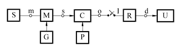{#id .class width=60%}

- Schema bloc a unui sistem de comunicație:

    - Sursa de informație: generează mesajele $a_n$ cu probabilitățile $p(a_n)$
    - Generator: generează semnalele diferite $s_1(t)$,...$s_n(t)$
    - Modulator: transmite semnalul $s_n(t)$ la mesajul $a_n$
    - Canal: adaugă zgomot aleator
    - Eșantionare: ia eșantioane din semnalul $s_n(t)$
    - Receptor: **decide** ce mesaj $a_n$ s-a fost recepționat
    - Utilizator: primește mesajele recuperate

### Formularea problemei

- Două mesaje $a_0$ și $a_1$ (0 logic sau 1 logic)

- Mesajele sunt modulate cu semnalele $s_0(t)$ și $s_1(t)$
    - pentru $a_0$: se transmite $s(t) = s_0(t)$
    - pentru $a_1$: se transmite $s(t) = s_1(t)$
    
- Peste semnal se suprapune zgomotul $n(t)$

- Se recepționează un semnal cu zgomot, $r(t) = s(t) + n(t)$

- **Problema deciziei**: pe baza $r(t)$, care semnal a fost cel transmis?

### Scenarii practice

- Transmisie de date cu diverse modulații binare:

    - nivele constante de tensiune (de ex. $s_n(t)$ = constant 0 sau 5V)
    
    - modulație PSK (Phase Shift Keying): $s_n(t)$ = cosinus cu aceeași frecvență dar faze inițiale diferite
    
    - modulație FSK (Frequency Shift Keying): $s_n(t)$ = cosinus cu frecvențe diferite
    
    - modulație OFDM (Orthogonal Frequency Division Multiplexing): caz particular de FSK
    
    - la recepție se primește un semnal afectat de zgomot, **se decide** dacă s-a primit 0 sau 1

### Scenarii practice

- Detecții radar

    - se emite un semnal; în cazul unui obstacol, semnalul se reflectă înapoi
    
    - receptorul așteaptă posibilele reflecții ale semnalului emis și **decide**
    
        - nu este prezentă o reflecție -> nici un obiect
        - semnalul reflectat este prezent -> obiect detectat

### Generalizări

- Decizie între mai mult de două semnale

- Numărul de eșantioane (observații):

    - un singur eșantion
    - mai multe eșantioane
    - observarea întregului semnal continuu, pentru un timp $T$

## II.2 Detecția semnalelor folosind 1 eșantion

### Formularea problemei

- Două mesaje $a_0$ și $a_1$ (0 logic sau 1 logic)

- Mesajele sunt modulate cu semnalele $s_0(t)$ și $s_1(t)$
    - pentru $a_0$: se transmite $s(t) = s_0(t)$
    - pentru $a_1$: se transmite $s(t) = s_1(t)$
    
- Peste semnal se suprapune zgomotul $n(t)$

- Se recepționează un semnal cu zgomot, $r(t) = s(t) + n(t)$

- **Problema deciziei**: pe baza $r(t)$, care semnal a fost cel transmis?

### Detecția unui semnal cu 1 eșantion

- Două mesaje $a_0$ și $a_1$ (0 logic sau 1 logic)

- Mesajele sunt modulate cu semnalele $s_0(t)$ și $s_1(t)$
    - pentru $a_0$: se transmite $s(t) = s_0(t)$
    - pentru $a_1$: se transmite $s(t) = s_1(t)$
    
- Peste semnal se suprapune zgomotul $n(t)$

- Se recepționează un semnal cu zgomot, $r(t) = s(t) + n(t)$

- **Decizie**: pe baza $r(t)$, care semnal a fost cel transmis?

- Cel mai simplu scenariu: la recepție **se ia un singur eșantion** 
la momentul $t_0$, $r = r(t_0)$, și se decide pe baza sa

### Ipoteze și decizii

- Există **două ipoteze**:

    - $H_0$: semnalul adevărat este $s(t) = s_0(t)$ (s-a transmis $a_0$)
    
    - $H_1$: semnalul adevărat este $s(t) = s_1(t)$ (s-a transmis $a_1$)

- Receptorul poate lua una din **două decizii**:

    - $D_0$: receptorul decide că semnalul corect este $s(t) = s_0(t)$
    
    - $D_1$: receptorul decide că semnalul corect este $s(t) = s_1(t)$

### Rezultate posibile

- Există 4 situații posibile:

    1. **Rejecție corectă**: ipoteza corectă este $H_0$, decizia este $D_0$
    
        - Probabilitatea este $P_r = P(D_0 \cap H_0)$
        - "**True Negative**"
        
    2. **Alarmă falsă**: ipoteza corectă este $H_0$, decizia este $D_1$
    
        - Probabilitatea este $P_{af} = P(D_1 \cap H_0)$
        - "**False Positive**"
        
    3. **Pierdere**: ipoteza corectă este $H_1$, decizia este $D_0$
        
        - Probabilitatea este $P_p = P(D_0 \cap H_1)$
        - "**False Negative**"
        
    4. **Detecție corectă**: ipoteza corectă este $H_1$, decizia este $D_1$
    
         - Probabilitatea este $P_d = P(D_1 \cap H_1)$
         - "**True Positive**"

### Originea termenilor

- Terminologia are la origine aplicații radar:

    - un semnal se emite de către sursă
    
    - semnal recepționat = o posibilă reflecție din partea unei ținte, puternic afectată de zgomot
    
    - $H_0$ = nu există un obiect, nu există semnal reflectat (doar zgomot)
    
    - $H_1$ = există un obiect, există un semnal reflectat
    
    - de aici numele "alarmă falsa", "pierdere" etc.

### Zgomotul

- În general se consideră zgomot **aditiv**, **alb**, **staționar**

    - aditiv = zgomotul se adună cu semnalul
    
    - alb = eșantioane distincte sunt necorelate
    
    - staționar = are aceleași proprietăți statistice la orice moment de timp

- Semnalul de zgomot $n(t)$ este necunoscut

    - este o realizare a unui proces aleator
    
    - se cunoaște doar distribuția sa, nu și valorile particulare

### Eșantionul preluat la recepție

- La recepție se primește semnalul $r(t) = s(t) + n(t)$

    - $s(t)$ = semnalul original, fie $s_0(t)$, fie $s_1(t)$
    
    - $n(t)$ = semnalul de zgomot necunoscut

- Valoarea eșantionului luat la momentul $t_0$ este $r(t_0) = s(t_0) + n(t_0)$

    - $s(t_0)$ = fie $s_0(t_0)$, fie $s_1(t_0)$
    
    - $n(t_0)$ este un eșantion din semnalul de zgomot

### Eșantionul preluat la recepție

- Eșantionul $n(t_0)$ este o **variabilă aleatoare**

    - fiind un eșantion de zgomot (un eșantion dintr-un proces aleator)
    - v.a. continuă , intervalul valorilor posibile e continuu

- $r(t_0) = s(t_0) + n(t_0)$ = o constantă + o variabilă aleatoare

    - este de asemenea o variabilă aleatoare
    - $s(t_0)$ este o constantă, egală fie cu $s_0(t_0)$, fie cu $s_1(t_0)$

- Care e distribuția lui $r(t_0)$?

    - o constantă + o v.a. = aceeași distribuție ca v.a., dar translată
    cu valoarea constantei

### Funcții de plauzibilitate

- Fie distribuția zgomotului cunoscută, $w(x)$

- Distribuția lui $r$ este $w(x)$ translată cu $s(t_0)$

- În ipoteza $H_0$, distribuția eșantionului este $w(r|H_0)$ = $w(x)$ translată cu $s_0(t_0)$

- În ipoteza $H_1$, distribuția eșantionului este $w(r|H_1)$ = $w(x)$ translată cu $s_1(t_0)$

- $w(r|H_0)$ și $w(r|H_1)$ se numesc **distribuții condiționate** sau **funcțiile de plauzibilitate**
    - "|" înseamnă "condiționat de", "dat fiind"
    - adică dat fiind una sau cealaltă dintre ipoteze
    - $r$ reprezintă necunoscuta funcției

### Funcții de plauzibilitate

Exemplu:

- Un semnal constant $s(t)$ poate avea două valori posibile, 0 sau 4. 
Semnalul este afectat de zgomot $\mathcal{N}(\mu=0, \sigma^2 = 2)$.
Care e distribuția unui eșantion $r$, în ambele ipoteze?

### Problema deciziei

Decizie pe baza celor două distribuții:

- Avem două distribuții posibile (câte una în fiecare ipoteză)

- Avem un eșantion $r = r(t_0)$, care poate proveni din oricare distribuție

- Care ipoteză **decidem** a fi adevărată?

### Plauzibilitatea unui parametru

- În general, **plauzibilitatea** (**likelihood**) unui parametru $P$ 
pe baza unor **observații** $O$ = densitatea de probabilitate a lui $O$, dacă parametrul are valoarea $P$:  
  $$L(P | O) = w(O | P)$$

- În cazul nostru:

  - parametrul necunoscut = care ipoteză $H$ este cea adevărată
  - observațiile = eșantionul $r$

- **Plauzibilitatea unei ipoteze H** pe baza **observației** $r$ este:
  $$L(H_0 | r) = w(r | H_0)$$
  $$L(H_1 | r) = w(r | H_1)$$

### Criteriul plauzibilității maxime (Maximum Likelihood)

- **Criteriul plauzibilității maxime** ("Maximum Likelihood"): se alege ipoteza 
cu **cea mai mare plauzibilitate** de a fi generat eșantionul observat $r = r(t_0)$

    - "alegem ipoteza cea mai plauzibilă"
    - "se alege ipoteza cu plauzibilitatea mai mare"
    
    $$\frac{L(H_1 | r)}{L(H_0 | r)} = \frac{w(r|H_1)}{w(r|H_0)} \grtlessH 1$$

- Se alege valoarea maximă dintre $w(r(t_0)|H_0)$ și $w(r(t_0) | H_1)$    
    
- Se compară **raportul de plauzibilitate** cu 1
    

### Exemplu: zgomot gaussian

Exemplu (continuare):

- Un semnal constant $s(t)$ poate avea două valori posibile, 0 sau 4. 
Semnalul este afectat de zgomot $\mathcal{N}(\mu=0, \sigma^2 = 2)$.

- Care e decizia luată cu criteriul ML, pentru un eșantion $r=1.6$?

- La tablă:

    - schiță a celor două distribuții condiționate $w(r|H_0)$ și $w(r|H_1)$
    - discuție: ce decizie se ia pentru diferite valori ale lui $r$
    - discuție: care este pragul $T$ pentru decizii

### Exemplu: Frunze

Din care copac a căzut frunza?

{#id .class width=60%}

### Exemplu: Frunze

Alegem copacul cu **plauzibilitatea maximă**:

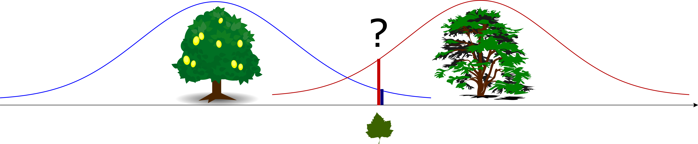

### Zgomot cu distribuție normală (AWGN)

- Caz particular: zgomotul are distribuția normală $\mathcal{N}(0,\sigma^2)$
    - zgomot de tip AWGN

- Raportul de plauzibilitate este $\frac{w(r|H_1)}{w(r|H_0)} = \frac{e^{-\frac{(r-s_1(t_0))^2}{2\sigma^2}}}{e^{-\frac{(r-s_0(r_0))^2}{2\sigma^2}}} \grtlessH 1$

- Pentru distribuția normală, aplicăm **logaritmul natural**
    - logaritmul este o funcție monoton crescătoare, deci nu schimbă rezultatul comparației
    - dacă $A < B$, atunci $\log(A) < \log(B)$

### Zgomot cu distribuție normală (AWGN)

- Aplicarea logaritmului natural la ambii termeni ai relației conduce la:
$$-(r-s_1(t_0))^2 + (r-s_0(t_0))^2 \grtlessH 0$$

- Care este echivalent cu:
$$|r-s_0(t_0)| \grtlessH |r - s_1(t_0)|$$

- Notă: $|r-A|$ = **distanța** dintre $r$ și $A$
    - $|r|$ = distanța de la $r$ la $0$

- Așadar, se alege **distanța minimă** dintre $r(t_0)$ și $s_1(t_0)$ sau $s_0(t_0)$

### Criteriul ML pentru zgomot gaussian

- Criteriul ML **pentru zgomot gaussian**: ipoteza se alege pe baza 
**celei mai apropiate** valori dintre $s_0(t_0)$ și $s_1(t_0)$ față de eșantionul $r = r(t_0)$

    - principiul **cel mai apropiat vecin** ("*nearest neighbor*")
    - un principiu foarte general, întâlnit în multe alte scenarii
    - un receptor ce folosește ML se mai numește **receptor de distanță minimă** ("*minimum distance receiver*")

### Etape pentru decizia pe baza ML

1. Se schițează cele două distribuții condiționate $w(r|H_0)$ și $w(r|H_1)$

2. Se determină care dintre cele două funcții este mai mare în dreptul valorii eșantionului observat $r = r(t_0)$

### Etape pentru decizia pe baza ML, zgomot gaussian

- Doar dacă zgomotul este gaussian, identic pentru toate ipotezele:

    1. Se determină $s_0(t_0)$ = valoarea semnalului original, în absența zgomotului, în cazul ipotezei $H_0$
    2. Se determină $s_1(t_0)$ = valoarea semnalului original, în absența zgomotului, în cazul ipotezei $H_1$
    3. Se compară cu eșantionul observat $r(t_0)$, se alege **cea mai apropiată** valoare

### Decizie pe bază de prag

- Alegerea valorii celei mai apropiate = același lucru cu **compararea $r$ cu un prag** $T = \frac{s_0(t_0) + s_1(t_0)}{2}$
    
    - i.e. dacă cele două valori sunt 0 și 5, luăm o decizie prin compararea lui $r$ cu 2.5
 
- La **criteriul ML** , pragul = **punctul de intersecție** al celor două distribuții condiționate

### Exercițiu

- Un semnal poate avea două valori posibile, $0$ sau $5$. 
Semnalul este afectat de zgomot alb, gaussian, cu distribuția $\mathcal{N}\;(\mu=0, \sigma^2=2)$.
Receptorul ia un singur eșantion, cu valoarea $r = 2.25$

    a. Scrieți expresiile celor două distribuții condiționate, și reprezentați-le
    a. Ce decizie se ia pe baza criteriului plauzibilității maxime?
    b. Dar dacă semnalul $0$ este afectat de zgomot gaussian $\mathcal{N}(0, 0.5)$, iar semnalul $5$ de zgomot uniform $\mathcal{U}[-4,4]$?
    c. Repetați b. și c. dacă valoarea $0$ se înlocuiește cu $-1$

### Regiuni de decizie

- **Regiuni de decizie** = intervalul de valori ale eșantionului $r$ pentru care se ia o anumită decizie

- Regiunea de decizie $R_0$ = intervalul de valori ale lui $r$ care conduc la decizia $D_0$
- Regiunea de decizie $R_1$ = intervalul de valori ale lui $r$ care conduc la decizia $D_1$
- Regiunile de decizie acoperă întreg domeniul de valori ale lui $r$ (toată axa reală)

- Exemplu: indicați regiunile de decizie la exercițiul anterior 
    - $R_0 = [-\infty, 2.5]$
    - $R_1 = [2.5, \infty]$

### Plauzibilitate vs probabilitate

- Există o distincție subtilă între termenii "probabilitate" și "plauzibilitate"

- Să considerăm distribuția condiționată $w(r | H_i)$ de la exemplul anterior:
    
    $$\frac{1}{\sigma \sqrt{2 \pi}}e^{-\frac{(r - s_i(t_0))^2}{2\sigma^2}}$$

- Care este necunoscuta în această expresie?
   
   - în general, $r$
   - dar în cazul deciziei nosatre este $i$, iar $r$ este cunoscut

### Terminologie: probabilitate și plauzibilitate

- Pentru aceeași expresie matematică a funcției de distribuție:

    - dacă se cunosc parametrii statistici (de ex. $\mu$, $\sigma$, $H_i$), și necunoscuta este valoarea însăși (de ex. $r$, $x$)
atunci funcția o interpretăm ca densitatea de **probabilitate**

    - dacă se cunoaște valoarea însăși (de ex. $r$, $x$), și necunoscuta este un parametru statistic (de ex. $\mu$, $\sigma$, $i$),
atunci avem o **funcție de plauzibilitate**

### Generalizări

- Dacă zgomotul are altă distribuție?

    - Se schițează distribuțiile condiționate
    - Se evaluează pentru $r = r(t_0)$
    - Criteriul ML = se alege cea mai mare funcție $w(r|H_i)$ în punctul $r$ dat

- Regiunile de decizie sunt date de **punctele de intersecție** ale distribuțiilor condiționate

    - Pot fi mai multe intersectări, în general, deci mai multe praguri

### Generalizări

- Dacă zgomotul are distribuție diferită în ipoteza $H_0$ față de ipoteza $H_1$? 

- Similar:
    - Se schițează distribuțiile condiționate
    - Se evaluează pentru $r = r(t_0)$
    - Criteriul ML = se alege **cea mai înaltă funcție** $w(r|H_i)$ în punctul $r$ dat

### Generalizări

- Dacă cele două semnale $s_0(t)$ și $s_1(t)$ sunt constante / nu sunt constante?

- **Nu contează forma** semnalelor

- Tot ce contează sunt **valorile celor două semnale la momentul de eșantionare $t_0$**: 
    - $s_0(t_0)$
    - $s_1(t_0)$

### Generalizări

- Dacă avem mai mult de 2 ipoteze?

- Se extinde raționamentul la $n$ ipoteze

    - Avem $n$ semnale posibile $s_0(t)$, ... $s_{n-1}(t)$
    
    - Avem $n$ valori diferite $s_0(t_0)$, ... $s_{n-1}(t_0)$
    
    - Avem $n$ distribuții condiționate $w(r|H_i)$
    
    - Se alege distribuția $w(r|H_i)$ **cea mai înaltă**     
    pentru $r = r(t_0)$ dat 

### Generalizări

- Dacă se iau mai multe eșantioane din semnale?

- Va fi tratat separat într-un subcapitol ulterior

### Detecții succesive

- Într-o comunicație binară, fiecare detecție/decizie produce valoarea unui bit (mesaj)

- Se repetă o altă detecție separată pentru bitul (mesajul) următor, și tot așa

### Exercițiu

- Un semnal poate avea patru valori posibile: -6, -2, 2, 6. 
Fiecare valoare este transmisă timp de o secundă. 
Semnalul este afectat de zgomot alb cu distribuție normală. 
Receptorul ia un singur eșantion pe secundă.
Folosind criteriul plauzibilității maxime, decideți ce semnal s-a transmis, dacă receptorul primește
eșantioanele următoare:
$$4,\; 6.6,\; -5.2,\; 1.1,\; 0.3,\; -1.5,\; 7,\; -7,\; 4.4$$

### Probabilități condiționate

- Putem calcula **probabilitățile condiționate** ale celor 4 rezultate posibile

- Fie regiunile de decizie:
    - $R_0$: dacă $r \in R_0$, decizia este $D_0$
    - $R_1$: daca $r \in R_1$, decizia este $D_1$

- Probabilitatea condiționată a rejecției corecte
    - = probabilitatea de a lua decizia $D_0$ când ipoteza este $H_0$
    - = probabilitatea ca $r$ să fie în $R_0$, calculată pe distribuția $w(r|H_0)$ 
$$P(D_0 | H_0) = \int_{R_0} w(r|H_0) dx$$

- Probabilitatea condiționată a alarmei false
    - = probabilitatea de a lua decizia $D_1$ când ipoteza este $H_0$
    - = probabilitatea ca $r$ să fie în $R_1$, calculată pe distribuția $w(r|H_0)$ 
$$P(D_1 | H_0) = \int_{R_1} w(r|H_0) dx$$

### Probabilități condiționate

- Probabilitatea condiționată de pierdere
    - = probabilitatea de a lua decizia $D_0$ când ipoteza este $H_1$
    - = probabilitatea ca $r$ să fie în $R_0$, calculată pe distribuția $w(r|H_1)$ 
$$P(D_0 | H_1) = \int_{R_0} w(r|H_1) dx$$

- Probabilitatea condiționată a detecției corecte
    - = probabilitatea de a lua decizia $D_1$ când ipoteza este $H_1$
    - = probabilitatea ca $r$ să fie în $R_1$, calculată pe distribuția $w(r|H_1)$ 
$$P(D_1 | H_1) = \int_{R_1} w(r|H_1) dx$$

### Probabilități condiționate

- Relații între probabilitățile condiționate

    - suma $P(D_0 | H_0) + P(D_1 | H_0) = 1$ (rejecție corectă + alarmă falsă)
    
    - suma $P(D_0 | H_1) + P(D_1 | H_1) = 1$ (pierdere + detecție corectă)
    
    - De ce? Justificați.

### Probabilități condiționate

{#id .class width=60%}

- Ignorați textul, contează zonele colorate
- [sursa: hhttp://gru.stanford.edu/doku.php/tutorials/sdt]*

### Optimalitatea criteriului ML

**Teoremă:**

  Criteriul ML **minimizează probabilitatea totală de eroare condiționată $P(D_1 | H_0) + P(D_0 | H_1)$**
    
**Demonstrație:**

  Informal: de pe figura precedentă, dacă pragul $T$ se deplasează fie la dreapta fie la stânga,
suma celor două arii hașurate (probabilități) pentru alarmă falsă + pierdere crește

  TODO: demonstrație riguroasă
  
### Probabilitățile celor 4 rezultate

- Probabilitățile condiționate sunt calculate **dat fiind** una sau alta dintre ipoteze

- Nu includ și probabilitățile **ipotezelor înselor**

    - adică, $P(H_0)$ = probabilitatea de a avea ipoteza $H_0$
    - $P(H_1)$ = probabilitatea de a avea ipoteza $H_1$

- Pentru a le lua în calcul, se multiplică cu $P(H_0)$ sau $P(H_1)$

    - $P(H_0)$ și $P(H_1)$ se numesc probabilitățile **inițiale** (sau **a priori**) ale ipotezelor

### Reamintire (TCI): regula lui Bayes

- Reamintire (TCI): **regula lui Bayes**
$$P(A \cap B) = P(B | A) \cdot P(A)$$

- Interpretare:

    - Probabilitatea $P(A)$ este extrasă afară din din $P(B|A)$
    
    - $P(B|A)$ nu mai conține nici o informație despre $P(A)$, șansele ca $A$ chiar să aibă loc
    
    - Exemplu: P(gol | șut la poartă) = $\frac{1}{2}$. Câte goluri se înscriu?

- La noi: 
    $$P(D_i \cap H_j) = P(D_i | H_j) \cdot P(H_j)$$

    - pentru toți $i$ și $j$ (în toate cele 4 cazuri)

### Exercițiu

- Un semnal constant poate avea două valori posibile, $0$ sau $5$.
Semnalul este afectat de zgomot gaussian $\mathcal{N}\;(\mu=0, \sigma^2=2)$.
Receptorul decide pe baza criteriului plauzibilității maxime, 
folosind un singur eșantion din semnal.

    a. Calculați probabilitatea condiționată a alarmei false
    a. Calculați probabilitatea condiționată de pierdere
    c. Dacă $P(H_0) = \frac{1}{3}$ și $P(H_1) = \frac{2}{3}$, calculați probabilitatea
    rejecției corecte și a detecției corecte (nu cele condiționate)

### Dezavantaje ale criteriului plauzibilității maxime

- Criteriul ML compară distribuțiile **condiționate** ale eșantionului observat

    - condiționate de ipotezele $H_0$ sau $H_1$

- Condiționarea de ipotezele $H_0$ și $H_1$ **ignoră probabilitatea celor două ipoteze $H_0$ și $H_1$**

    - Decizia e aceeași indiferent dacă $P(H_0) = 99.99\%$ și $P(H_1) = 0.01\%$,
sau invers

- Dacă $P(H_0) > P(H_1)$, am vrea să împingem pragul de decizie înspre $H_1$, și vice-versa

    - pentru că este mai probabil ca semnalul să fie $s_0(t)$
    - și de aceea vrem să "favorizăm"/"încurajăm" decizia $D_0$ 

- Avem nevoie de un criteriu mai general ...

### Exemplu: Terenuri de fotbal

TODO

### Criteriul probabilității minime de eroare

- Se iau în calcul probabilitățile $P(H_0)$ și $P(H_1)$

- **Criteriul probabilității minime de eroare** (MPE):

$$\frac{w(r | H_1)}{w(r | H_0)} \grtlessH \frac{P(H_0)}{P(H_1)}$$

$$\frac{P(H_1) \cdot w(r | H_1)}{P(H_0) \cdot w(r | H_0)} \grtlessH 1$$
    
  - prescurtat MPE (Minimum Probability of Error)

### Criteriul probabilității minime de eroare

**Teoremă:**

  Criteriul MPE **minimizează probabilitatea totală de eroare**: 
  $$P_e = P_{af} + P_p = P(D_1 \cap H_0) + P(D_0 \cap H_1)$$
    
  - nu probabilitățile condiționate, ci cele care includ $P(H_i)$
  
### Criteriul probabilității minime de eroare

**Demonstrație:**

- Probabilitatea unei alarme false este:
$$\begin{split}
P(D_1 \cap H_0) =& P(D_1 | H_0) \cdot P(H_0)\\
=& \int_{R_1} w(r | H_0) dx \cdot P(H_0)\\
=& (1 - \int_{R_0} w(r | H_0) dx \cdot P(H_0)
\end{split}$$

- Probabilitatea de pierdere este:
$$\begin{split}
P(D_0 \cap H_1) =& P(D_0 | H_1) \cdot P(H_1)\\
=& \int_{R_0} w(r | H_1) dx \cdot P(H_1)
\end{split}$$

- Probabilitatea totală a erorilor (suma lor) este:
$$P_e = P(H_0) + \int_{-\infty}^T [w(r|H_1) \cdot P(H_1) - w(r|H_0) \cdot P(H_0)] dx$$

### Probabilitatea de eroare minimă

- Urmărim minimizarea $P_e$, adică să minimizăm integrala

- Putem alege $R_0$ cum dorim, pentru acest scop

- Pentru a minimiza integrala, se alege $R_0$ astfel încât pentru toți $r \in R_0$, 
termenul din integrala este **negativ**
    - integrarea pe întregul interval în care o funcție este negativă conduce la valoarea minimă

- Așadar, când $w(r|H_1) \cdot P(H_1) - w(r|H_0) \cdot P(H_0) < 0$ avem $r \in R_0$, adică decizia $D_0$
- Invers, dacă $w(r|H_1) \cdot P(H_1) - w(r|H_0) \cdot P(H_0) > 0$ avem $r \in R_1$, adică decizia $D_1$

### Probabilitatea de eroare minimă

- Astfel
$$w(r|H_1) \cdot P(H_1) - w(r|H_0) \cdot P(H_0) \grtlessH 0$$
$$\frac{w(r | H_1)}{w(r | H_0)} \grtlessH \frac{P(H_0)}{P(H_1)}$$

### Interpretare

- Criteriul MPE este o generalizare a criteriului ML, depinde de probabilitățile celor două ipoteze (cazuri, simboluri)
    - se exprimă tot sub forma unui raport de plauzibilitate

- Când una dintre ipoteze este mai probabilă decât cealaltă, pragul
    este împins în favoarea sa, înspre cealaltă ipoteză

- Criteriul ML este un caz particular al MPE pentru 
for $P(H_0) = P(H_1) = \frac{1}{2}$

### Criteriul probabilității minime de eroare - zgomot gaussian

- Presupunând că zgomotul este gaussian (normal), $\mathcal{N}(0, \sigma^2)$
$$w(r | H_1) = e^{-\frac{(r-s_1(t_0))^2}{2\sigma^2}}$$
$$w(r | H_0) = e^{-\frac{(r-s_0(t_0))^2}{2\sigma^2}}$$

- Se aplică logaritmul natural
$$-\frac{(r-s_1(t_0))^2}{2\sigma^2} + \frac{(r-s_0(t_0))^2}{2\sigma^2} \grtlessH \ln \left(\frac{P(H_0)}{P(H_1)} \right)$$

- Echivalent
$$(r-s_0(t_0))^2 \grtlessH (r-s_1(t_0))^2 + 2\sigma^2 \cdot\ln \left(\frac{P(H_0)}{P(H_1)} \right)$$
    - sau, dacă se desfac parantezele:
$$ r \grtlessH \frac{s_0(t_0) + s_1(t_0)}{2} + \frac{\sigma^2}{s_1(t_0) - s_0(t_0)} \cdot\ln \left(\frac{P(H_0)}{P(H_1)} \right)$$

### Interpretarea 1: Comparație între distanțe

- La criteriul ML, se compară distanțele (la pătrat):
$$|r-s_0(t_0)| \grtlessH |r - s_1(t_0)|$$
$$(r-s_0(t_0))^2 \grtlessH (r - s_1(t_0))^2$$

- La criteriul MPE, se compară pătratul distanțelor, dar cu un termen suplimentar
în favoarea ipotezei mai probabile:
$$(r-s_0(t_0))^2 \grtlessH (r-s_1(t_0))^2 + 2\sigma^2 \cdot\ln \left(\frac{P(H_0)}{P(H_1)} \right)$$
    - termenul depinde de raportul $\frac{P(H_0)}{P(H_1)}$
    
### Interpretarea 2: valoarea de prag

- La criteriul ML, se compară $r$ cu un prag $T$
$$ r \grtlessH \frac{s_0(t_0) + s_1(t_0)}{2}$$

- La criteriul MPE, pragul este împins înspre ipoteza mai puțin probabilă:
$$ r \grtlessH \frac{s_0(t_0) + s_1(t_0)}{2} + \frac{\sigma^2}{s_1(t_0) - s_0(t_0)} \cdot\ln \left(\frac{P(H_0)}{P(H_1)} \right)$$
    - în funcție de raportul $\frac{P(H_0)}{P(H_1)}$

### Exerciții 

- Fie decizia între două semnale constante: $s_0(t) = -5$ și $s_1(t)=5$.
Semnalele sunt afectate de zgomot alb cu distribuție gaussiană $\mathcal{N}(0, \sigma^2=1)$
Receptorul ia un singur eșantion cu valoarea $r$.
    a. Să se găsească regiunile de decizie conform criteriului MPE
    b. Calculați probabilitatea alarmei false și probabilitatea de pierdere
    c. Repetați a) și b) dacă $s_1(t)$ este afectat de zgomot uniform $\mathcal{U}[-4,4]$?
    

### Criteriul riscului minim

- Dacă ne afectează mai mult un anume tip de erori (de ex. alarme false) decât celelalte (pierderi)?
    - Criteriul MPE tratează toate erorile la fel
    - Ne trebuie un criteriu mai general

- Idee: se atribuie **un cost** fiecărui scenariu, apoi
se minimizează costul mediu

- $C_{ij}$ = costul deciziei $D_i$ când ipoteza adevărată este $H_j$
    - $C_{00}$ = costul unei rejecții corecte
    - $C_{10}$ = costul unei alarme false
    - $C_{01}$ = costul unei pierderi
    - $C_{11}$ = costul unei detecții corecte

- Ideea de "costuri" și minimizarea costului mediu este general întâlnită
    - de ex. TCI: codare: "costul" unui mesaj este lungimea cuvântului de cod,
    vrem să minimizăm costul mediu, adică lungimea medie

### Criteriul riscului minim

-  Definim **riscul** = **media costurilor**
$$R = C_{00} P(D_0 \cap H_0) + C_{10} P(D_1 \cap H_0) + C_{01} P(D_0 \cap H_1) + C_{11} P(D_1 \cap H_1)$$

- Criteriul riscului minim: **se minimizează riscul R**
    - adică se minimizează costul mediu
    - se mai numește "criteriul costului minim"

### Calcule

- Demonstrație la tablă 
    - se folosește regula lui Bayes

- Concluzie: regula de decizie este
$$\frac{w(r|H_1)}{w(r|H_0)} \grtlessH \frac{(C_{10}-C_{00})p(H_0)}{(C_{01}-C_{11})p(H_1)}$$

### Criteriul riscului minim

**Criteriul riscului minim** (MR):

$$\frac{w(r|H_1)}{w(r|H_0)} \grtlessH \frac{(C_{10}-C_{00})p(H_0)}{(C_{01}-C_{11})p(H_1)}$$
    - prescurtat MR (Minimum Risk)

### Interpretare

- Criteriul MR este o generalizare a MPE (la rândul lui o generalizare a ML)
    - se exprimă tot printr-un raport de plauzibilitate

- Atât **probabilitățile** cât și **costurile** pot influența decizia
în favoarea uneia sau alteia dintre ipoteze

- Caz particular: dacă $C_{10}-C_{00} = C_{01}-C_{11}$, MR se reduce la criteriul MPE
    - de ex.: dacă $C_{00} = C_{11} = 0$ și $C_{10} = C_{01}$

### În zgomot gaussian

- Dacă zgomotul este gaussian (normal), la fel ca lal celelalte criterii, se aplică logaritmul natural

- Se obține:
$$(r-s_0(t_0))^2 \grtlessH (r-s_1(t_0))^2 + 2 \sigma^2 \cdot \ln \left( \frac{(C_{10}-C_{00})p(H_0)}{(C_{01}-C_{11})p(H_1)} \right)$$
    - sau
$$ r \grtlessH \frac{s_0(t_0) + s_1(t_0)}{2} + \frac{\sigma^2}{s_1(t_0) - s_0(t_0)} \cdot\ln \left(\frac{(C_{10}-C_{00})p(H_0)}{(C_{01}-C_{11})p(H_1)} \right)$$

### Interpretarea 1: Comparație între distanțe

- La criteriul MPE, se compară pătratul distanțelor, 
dar cu un termen suplimentar în favoarea ipotezei mai probabile:
$$(r-s_0(t_0))^2 \grtlessH (r-s_1(t_0))^2 + 2\sigma^2 \cdot\ln \left(\frac{P(H_0)}{P(H_1)} \right)$$
    - termenul depinde de raportul $\frac{P(H_0)}{P(H_1)}$
    
- La criteriul MR, pe lângă probabilități apar și costurile
$$(r-s_0(t_0))^2 \grtlessH (r-s_1(t_0))^2 + 2 \sigma^2 \cdot \ln \left( \frac{(C_{10}-C_{00})p(H_0)}{(C_{01}-C_{11})p(H_1)} \right)$$    

### Interpretarea 2: Valoarea de prag

- La criteriul MPE, pragul este împins înspre ipoteza mai puțin probabilă:
$$ r \grtlessH \frac{s_0(t_0) + s_1(t_0)}{2} + \frac{\sigma^2}{s_1(t_0) - s_0(t_0)} \cdot\ln \left(\frac{P(H_0)}{P(H_1)} \right)$$
    - în funcție de raportul $\frac{P(H_0)}{P(H_1)}$

- La criteriul MR, pragul este influențat și de costuri
$$ r \grtlessH \frac{s_0(t_0) + s_1(t_0)}{2} + \frac{\sigma^2}{s_1(t_0) - s_0(t_0)} \cdot\ln \left(\frac{(C_{10}-C_{00})p(H_0)}{(C_{01}-C_{11})p(H_1)} \right)$$

### Influența costurilor

- Criteriul MR împinge decizia înspre **minimizarea scenariilor cu cost ridicat**

- Exemplu: din ecuații:
    - ce se întâmplă dacă costul $C_{01}$ crește, iar celelalte rămân la fel?
    - ce se întâmplă dacă costul $C_{10}$ crește, iar celelalte rămân la fel?
    - ce se întâmplă dacă ambele costuri $C_{01}$ și $C_{10}$ cresc, iar celelalte rămân la fel?

### Pariul lui Pascal

Raționamentul filozofului și matematicianului Blaise Pascal (1623–1662):

> Dumnezeu există sau nu. Rațiunea nu poate decide între cele două alternative.
>
> Tu trebuie să pariezi (nu este opțional).
>
> În cazul în care câștigi, câștigi totul; dacă pierzi, nu pierzi nimic.
>
> Pariază fără ezitare că El există. Ai de câștigat o infinitate de vieți fericite, împotriva unui număr finit de șanse de a pierde.[^PW]

- Un exemplu filozofic de utilizare a criteriului riscului minim

[^PW]: sursa textului: Wikipedia

### Forma generală a criteriilor ML, MPE și MR

- Criteriile ML, MPE și MR au toate forma următoare
$$\frac{w(r|H_1)}{w(r|H_0)} \grtlessH K$$
    - pentru ML: $K=1$
    - pentru MPE: $K=\frac{P(H_0)}{P(H_1)}$
    - pentru MR: $K=\frac{(C_{10}-C_{00})p(H_0)}{(C_{01}-C_{11})p(H_1)}$

### Forma generală a criteriilor ML, MPE și MR

În zgomot gaussian, criteriile se reduc la:

- Compararea pătratului distanțelor:
$$(r-s_0(t_0))^2 \grtlessH (r-s_1(t_0))^2 + 2 \sigma^2 \cdot \ln \left( K \right)$$    

- Compararea eșantionului $r$ cu un prag $T$:
$$r \grtlessH \underbrace{\frac{s_0(t_0) + s_1(t_0)}{2} + \frac{\sigma^2}{s_1(t_0) - s_0(t_0)} \cdot\ln \left(K \right)}_T$$

### Exercițiu

- Un sistem *airbag* detectează un accident prin eșantionarea semnalului de la un senzor
 cu 2 valori posibile: $s_0(t) = 0$ (OK) sau $s_1(t) = 5$ (accident).
- Semnalul este afectat de zgomot gaussian$\mathcal{N}\;(\mu=0, \sigma^2=1)$.
- Se ia un singur eșantion din semnal.
- Costurile scenariilor sunt: $C_{00} = 0$, $C_{01} = 100$, $C_{10} = 10$, $C_{11} = -100$
    a. Găsiți regiunile de decizie $R_0$ și $R_1$.

### Criteriul Neyman-Pearson

- Un criteriu mai general decât toate cele de până acum

- Criteriul Neyman-Pearson: se maximizează probabilitatea de detecție ($P(D_1 \cap H_1)$)
păstrând probabilitatea alarmei false sub o limită fixată $(P(D_1 \cap H_0) \leq \lambda)$

    - Se deduce pragul $T$ din constrângerea la limită $P(D_1 \cap H_0) = \lambda$

- Criteriile ML, MPE și MR sunt cazuri particulare ale Neyman-Pearson, 
pentru diverse valori ale $\lambda$.

### Exercițiu
- O sursă de informație produce două mesaje cu probabilitățile $p(a_0) = \frac{2}{3}$ și $p(a_1) = \frac{1}{3}$.
- Mesajele sunt codate ca semnale constante cu valorile $-5$ ($a_0$) și $5$ ($a_1$).
- Semnalele sunt afectate de zgomot alb cu distribuție uniformă $U [-5,5]$.
- Receptorul ia un singur eșantion $r$.

    a. Găsiți regiunile de decizie conform criteriului Neymar-Pearson, pentru $P_{fa} \leq 10^{-2}$
    b. Care este probabilitatea de detecție corectă?

### Sumar: criterii de decizie

- Am văzut: decizie între două semnale, bazată pe 1 eșantion

- Toate criteriile au la bază raportul de plauzibilitate
$$\frac{w(r|H_1)}{w(r|H_0)} \grtlessH K$$

- Criterii diferite conduc la valori diferite pentru $K$

- În funcție de distribuția zgomotului, axa reală este împărțită în regiuni de decizie

    - regiunea $R_0$: dacă $r$ este aici, se decide $D_0$
    - regiunea $R_1$: dacă $r$ este aici, se decide $D_1$
    
- Pentru zgomot gaussian, granița între regiuni (valoarea de prag) este:
$$T = \frac{s_0(t_0) + s_1(t_0)}{2} + \frac{\sigma^2}{s_1(t_0) - s_0(t_0)} \cdot\ln \left(K \right)$$

### Compararea a două probleme de decizie

- Fie o problemă de decize cu $s_0(t) = 0$, $s_1(t) = 10$, și zgomot $\mathcal{N}(\mu=0, \sigma^2 = 4)$

- Fie o altă problemă de decizie cu $s_0(t) = 10$, $s_1(t) = 16$, and noise $\mathcal{U}[-8, 8]$

- Care e mai ușoară? Cum să le comparăm

- Cum se evaluează performanțele rezultatelor într-o problemă de decizie?

   - Trebuie să comparăm probabilitățile "bune" ($P_{cd}$, $P_{cr}$) și cele "rele" ($P_{fa}$, $P_m$)

### Caracteristica de operare a receptorului (ROC)

- Performanța unui receptor este ilustrată cu un grafic numit **"Caracteristica de operare a receptorului"** 
(**"Receiver Operating Characteristic", ROC)**

- Reprezintă probabilitatea $P_{dc} = P(D_1 | H_1)$
în funcție de probabilitatea $P_{af} = P(D_1 | H_0)$
  
  - pentru diferite praguri T
  - fiecare T corespunde unui punct de pe grafic

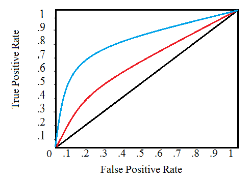{#id .class width=50%}

*[sursa: http://www.statisticshowto.com/receiver-operating-characteristic-roc-curve/]*

### Caracteristica de operare a receptorului (ROC)

- Există întotdeauna un **compromis** între $P_d$ (bun) și $P_{fa} (rău)$

  - creșterea $P_d$ implică și creșterea $P_{fa}$
  - pentru a fi siguri că nu ratăm nici un semnal (creșterea $P_d$), plătim prin creșterea probabilității de alarme false
    
- Criterii diferite = diferite praguri $K$ = diferite puncte pe grafic = compromisuri diferite
  
  - dar întotdeauna e vorba de un compromis

- O măsură a performanței globale este **Area Under the Curve** (AUC)
  
  - indiferent de alegerea unui prag sau a altuia

- Două situații diferite (două semnale diferite, algoritmi etc) se pot compara prin 
afișarea ROC si compararea AUC-urilor asociate

### Caracteristica Precision vs Recall

- Un grafic similar este cel de **Precision vs Recall**

- **Precision** = $\frac{P(D_1 \cap H_1)}{P(D_1 \cap H_1) + P(D_1 \cap H_0)}$
    
  - = True Positives  / (True Positives + False Positives)

- **Recall** = $\frac{P(D_1 \cap H_1)}{P(D_1 \cap H_1) + P(D_0 \cap H_1)} = P(D_1 | H_1)$

  - = True Positives  / (True Positives + False Negatives)

### Caracteristica Precision vs Recall

Exemplu de grafic Precision vs Recall dintr-o aplicație practică

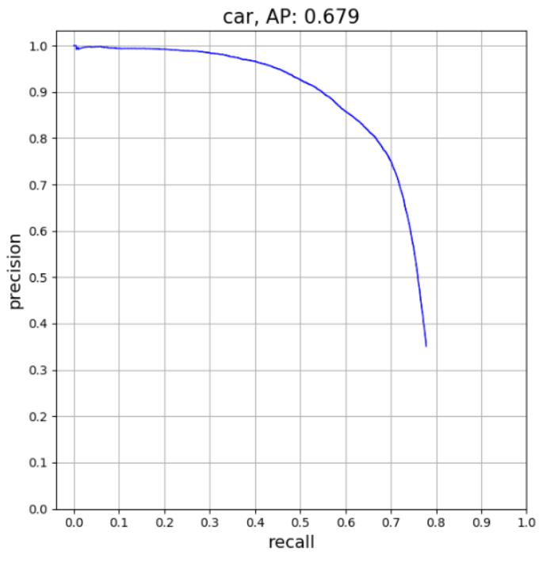{width=60%}

### Caracteristica Precision vs Recall

Aplicația pentru care este obținut graficul precedent:

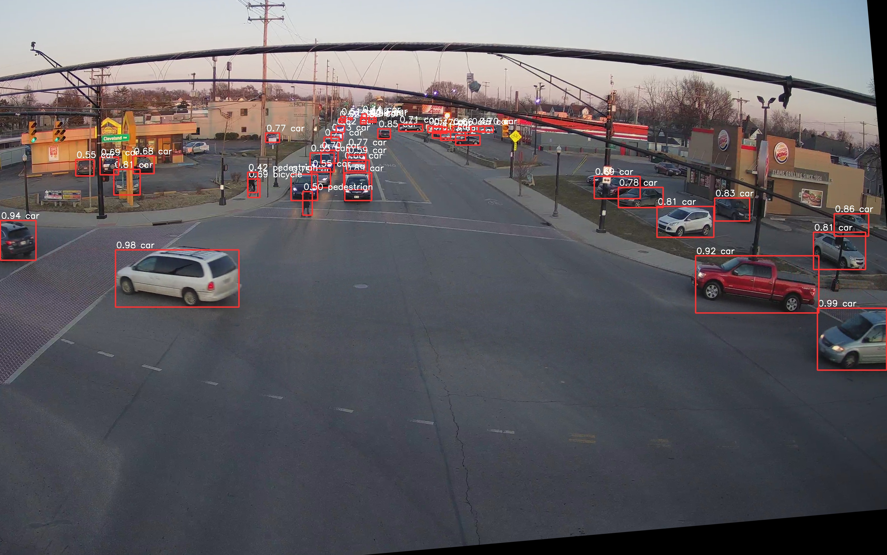

### Raport Semnal-Zgomot

- Cum putem îmbunătăți performanțele de detecție?

  - i.e. creșterea $P_d$ pentru același $P_{af}$
  
  - independent de alegerea unui prag sau a altuia

- Două soluții:
   
  - Creșterea diferenței dintre $s_0(t)$ și $s_1(t)$ (se crește **puterea semnalului**)
  
  - Scăderea zgomotului (se scade **puterea zgomotului**)
  
  - i.e. se crește **raportul Semnal-Zgomot**

### Examen 2020-2021

- Următoarele trei slide-uri nu se cer pentru examenul 2020-2021
(până la Raportul semnal zgomot).

### Performanțele detecției în zgomot alb gaussian

- Considerăm probabilități egale $P(H_0) = P(H_1) = \frac{1}{2}$
    - Sau, echivalent, considerăm doar probabilități condiționate

- Deciziile se iau pe baza raportului de plauzibilitate
$$\frac{w(r|H_1)}{w(r|H_0)} \grtlessH K$$

- Probabilitatea detecției corecte este
$$\begin{split}
P_d =& P(D_1 | H_1)\\
=& \int_{T}^{\infty} w(r | H_1) \\
=& (F(\infty) - F(T)) \\
=& \frac{1}{2} \left( 1 - erf \left( \frac{T - s_1(t_0)}{\sqrt{2}\sigma} \right) \right) \\
=& Q \left( \frac{T - s_1(t_0)}{\sqrt{2}\sigma} \right) \\
\end{split}$$

### Performanțele detecției în zgomot alb gaussian

- Probabilitatea alarmei false este
$$\begin{split}
P_{fa} =& P(D_1 | H_0) \\
=& \int_{T}^{\infty} w(r | H_0) \\
=& (F(\infty) - F(T)) \\
=& \frac{1}{2} \left( 1 - erf \left( \frac{T - s_0(t_0)}{\sqrt{2}\sigma} \right) \right) \\
=& Q \left( \frac{T - s_0(t_0)}{\sqrt{2}\sigma} \right) \\
\end{split}$$

- Rezultă $\frac{T - s_0(t_0)}{\sqrt{2}\sigma} = Q^{-1} \left( P_{fa}\right)$, 

- Și: $\frac{T - s_1(t_0)}{\sqrt{2}\sigma} = Q^{-1} \left( P_{fa}\right) + \frac{s_0(t_0) - s_1(t_0)}{\sqrt{2}\sigma}$

### Performanțele detecției în zgomot alb gaussian

- Înlocuind în $P_d$, obținem:
$$P_d = Q \left( \underbrace{Q^{-1} \left(P_{fa}\right)}_{constant} + \frac{s_0(t_0) - s_1(t_0)}{\sqrt{2}\sigma} \right)$$

- Fie un scenariu simplu:
    - $s_0(t_0) = 0$
    - $s_1(t_0) = A = constant$

- Obținem:
$$P_d = Q \left( \underbrace{Q^{-1} \left(P_{fa}\right)}_{constant} - \frac{A}{\sqrt{2}\sigma} \right)$$

### Raportul semnal zgomot

- **Raportul semnal zgomot (SNR)** = $\frac{\text{puterea semnalului original}}{\text{puterea zgomotului}}$

- Puterea medie a unui semnal = valoarea pătratică medie = $\overline{X^2}$
    - Puterea semnalului original este $\frac{A^2}{2}$
    - Puterea zgomotului este $\overline{X^2} = \sigma^2$ (pentru valoare medie nulă $\mu = 0$)
    
- În cazul nostru, SNR = $\frac{A^2}{2 \sigma^2}$
$$P_d = Q \left( \underbrace{Q^{-1} \left(P_{fa}\right)}_{constant} - \sqrt{SNR} \right)$$

- Pentru $P_{fa}$ de valoare fixă, $P_d$ crește odată cu SNR
    - Q este o funcție monoton descrescătoare

### Performanța depinde de SNR

- Performanța receptorului crește odată cu creșterea SNR
    - SNR mare: performanță bună
    - SNR mic:  performanță slabă
    
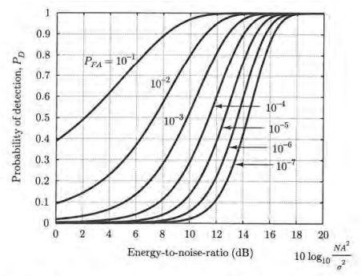{#id .class width=47%}

*[sursa: Fundamentals of Statistical Signal Processing, Steven Kay]*

### Alte aplicații ale teoriei deciziei

- Se pot utiliza aceste criterii de decizie în alte aplicații?
    - nu pentru a decide între semnale, ci în alte scopuri
    
- Matematic, problema se pune sub forma următoare:
    - avem 2 (sau mai multe) distribuții posibile
    - avem 1 valoare observată
    - determinăm cea mai plauzibilă distribuție, pe baza valorii observate

- În acest caz particular, decidem între două semnale

- Dar acest model matematic se poate aplica și în alte contexte:
    - medicină: un semnal ECG indică o boală sau nu?
    - business: va cumpăra clientul un produs, sau nu?
    - De obicei se folosesc mai multe eșantioane, dar principiul
    matematic este același

### Alte aplicații ale teoriei deciziei

Exemplu (pur imaginar): 

- O persoană sănătoasă cu greutatea = X kg are concentrația de trombocite pe ml de sânge distribuită aproximativ $\mathcal{N} \; (\mu=10 \cdot X, \sigma^2 = 20)$.

- O persoană suferind de boala B are o valoare mult mai scăzută,
   distribuită aproximativ $\mathcal{N} \; (100, \sigma^2=10)$.

- În urma analizelor de laborator, ai obținut valoarea $r = 255$. Greuatea ta este 70 kg.

- Decideți: sănătos sau nu?

## II.3 Detecția semnalelor cu mai multe eșantioane

### Eșantioane multiple dintr-un semnal

- Contextul rămâne același:

    - Se transmite un semnal $s(t)$
    - Există **două ipoteze**:

        - $H_0$: semnalul original este $s(t) = s_0(t)$
        - $H_1$: semnalul original este $s(t) = s_1(t)$

    - Receptorul poate lua **două decizii**:

        - $D_0$: se decide că semnalul a fost $s(t) = s_0(t)$
        - $D_1$: se decide că semnalul a fost $s(t) = s_1(t)$

    - Există 4 scenarii posibile

### Eșantioane multiple dintr-un semnal

- Contextul rămâne același:

  - Semnalele sunt afectate de zgomot (necunoscut)
  - Se recepționează un semnal $r(t) = s(t) + n(t)$

- Se iau N eșantioane din $r(t)$, nu doar 1

  - Fiecare eșantion $r_i = r(t_i)$ se ia la momentul $t_i$

- Eșantioanele formează **vectorul de eșantioanelor**
  $$\vec{r} = [r_1, r_2, ... r_N]$$
  
### Eșantioane multiple dintr-un semnal

- Fiecare eșantion $r_i$ este o **variabilă aleatoare**
    - $r(t_i) = s(t_i) + n(t_i)$ = constantă + o v.a.

- Vectorul $\vec{r}$ reprezintă un set de $N$ v.a. dintr-un proces aleator

- Considerând întreg vectorul $\vec{r}$, 
valorile vectorului $\vec{r}$ sunt descrise de **distribuții de ordin $N$**

- În ipoteza $H_0$: 
    $$w_N(\vec{r} | H_0) = w_N(r_1, r_2, ...r_N | H_0)$$

- În ipoteza $H_1$: 
    $$w_N(\vec{r} | H_1) = w_N(r_1, r_2, ...r_N | H_1)$$

### Plauzibilitatea vectorului de eșantioane

- Se aplică **aceleași criterii** bazate pe raportul de plauzibilitate în cazul unui singur eșantion
    $$\frac{w_N(\vec{r} | H_1)}{w_N(\vec{r} | H_0)} \grtlessH K$$

- Observații

    - $\vec{r}$ este un vector; prin el se consideră plauzibilitatea tuturor eșantioanelor
    - $w_N(\vec{r} | H_0)$ = plauzibilitatea vectorului $\vec{r}$ în ipoteza $H_0$
    - $w_N(\vec{r} | H_1)$ = plauzibilitatea vectorului $\vec{r}$ în ipoteza $H_1$
    - valoarea lui $K$ este dată de criteriul de decizie utilizat

- Interpretare: se alege ipoteza cea mai plauzibilă de a fi generat datele observate

    - identic ca la 1 eșantion, doar că acum datele = mai multe eșantioane
    
### Descompunere

- Presupunând că zgomotul este alb, eșantioanele $r_i$ sunt independente

- În acest caz, distribuția totală $w_N(\vec{r} | H_j)$ se poate descompune ca un produs
    
    $$w_N(\vec{r} | H_j) = w(r_1|H_j) \cdot w(r_2|H_j) \cdot ... \cdot w(r_N|H_j)$$

    - de ex. plauzibilitatea obținerii vectorului $[5.1, 4.7, 4.9]$ = plauzibilitatea obținerii lui $5.1$ $\times$
    plauzibilitatea obținerii lui $4.7$ $\times$ plauzibilitatea obținerii lui $4.9$

- Funcțiile $w(r_i|H_i)$ sunt distribuțiile condiționate ale fiecărui eșantion

    - de care am mai văzut deja

### Descompunere

- Prin urmare, criteriile bazate pe raportul de plauzibilitate devin
    $$\frac{w_N(\vec{r} | H_1)}{w_N(\vec{r} | H_0)} = \frac{w(r_1|H_1)}{w(r_1|H_0)}  \cdot 
    \frac{w(r_2|H_1)}{w(r_2|H_0)} ... \frac{w(r_N|H_1)}{w(r_N|H_0)} \grtlessH K$$

- Raportul de plauzibilitate al unui vector de eșantioane = produsul rapoartelor plauzibilitate ale fiecărui eșantion

- **Se înmulțesc** rapoartele de plauzibilitate 
ale fiecărui eșantion în parte, 
și se aplică criteriile asupra rezultatului final

### Criterii de decizie

- Toate criteriile de decizie pot fi scrise astfel:
    $$\frac{w_N(\vec{r} | H_1)}{w_N(\vec{r} | H_0)} = \frac{w(r_1|H_1)}{w(r_1|H_0)}  \cdot 
    \frac{w(r_2|H_1)}{w(r_2|H_0)} ... \frac{w(r_N|H_1)}{w(r_N|H_0)} \grtlessH K$$

- Valoarea lui $K$ se alege ca pentru 1 eșantion:

    - criteriul ML: $K=1$
    - criteriul MPE: $K=\frac{P(H_0)}{P(H_1)}$
    - criteriul MR: $K=\frac{(C_{10}-C_{00})p(H_0)}{(C_{01}-C_{11})p(H_1)}$

### Caz particular: AWGN 

- AWGN = "Additive White Gaussian Noise" = Zgomot alb, gaussian, aditiv

- În ipoteza $H_1$: $w(r_i|H_1) = \frac{1}{\sigma \sqrt{2 \pi}} e^{-\frac{(r_i - s_1(t_i))^2}{2 \sigma^2}}$
- În ipoteza $H_0$: $w(r_i|H_0) = \frac{1}{\sigma \sqrt{2 \pi}} e^{-\frac{(r_i - s_1(t_i))^2}{2 \sigma^2}}$

- Raportul de plauzibilitate al vectorului $\vec{r}$
    $$\frac{w_N(\vec{r} | H_1)}{w_N(\vec{r} | H_0)} = \frac{e^{-\frac{\sum (r_i - s_1(t_i))^2}{2 \sigma^2}}}{e^{-\frac{\sum (r_i - s_0(t_i))^2}{2 \sigma^2}}} = e^{\frac{\sum (r_i - s_0(t_i))^2 - \sum (r_i - s_1(t_i))^2}{2 \sigma^2}}$$

### Criterii de decizie pentru AWGN

- Raportul de plauzibilitate global se compară cu $K$:
    $$\frac{w_N(\vec{r} | H_1)}{w_N(\vec{r} | H_0)} = e^{\frac{\sum (r_i - s_0(t_i))^2 - \sum (r_i - s_1(t_i))^2}{2 \sigma^2}} \grtlessH K$$

- Se aplică logaritmul natural, obținându-se:
    $$\sum (r_i - s_0(t_i))^2 \grtlessH \sum (r_i - s_1(t_i))^2  + 2 \sigma^2 \ln(K)$$

### Interpretarea 1: distanța geometrică

- Sumele reprezintă **distanța geometrică** la pătrat:
    $$\sum (r_i - s_1(t_i))^2 = \|\vec{r} - \vec{s_1(t)}\|^2 = d(\vec{r}, s_1(t))^2$$
    $$\sum (r_i - s_0(t_i))^2 = \|\vec{r} - \vec{s_0(t)}\|^2 = d(\vec{r}, s_0(t))^2$$
    
    - distanța între vectorul observat $\vec{r}$ și 
    semnalele originale $s_1(t)$, respectiv $s_0(t)$
    
    - vectori cu N eșantioane => distanța între vectori de dimensiune $N$

- Totul se reduce la a compara distanțele

### Interpretarea 1: distanța geometrică

- Criteriul Maximum Likelihood:

    - $K = 1$, $\ln(K) = 0$
    - se alege **distanța minimă** între $\vec{r}$
    și vectorii $s_1(t)$, respectiv $s_0(t)$)
    - de unde și numele "receptor de distanță minimă"
    
- Criteriul Minimum Probability of Error:

    - $K = \frac{P(H_0)}{P(H_1)}$
    - Apare un termen suplimentar, în favoarea ipotezei mai probabile

- Criteriul Minimum Risk:

    - $K=\frac{(C_{10}-C_{00})p(H_0)}{(C_{01}-C_{11})p(H_1)}$
    - Termenul suplimentar depinde și de probabilități, și de costuri

### Exercițiu

Exercițiu:

- Un semnal poate avea două valori, $0$ (ipoteza $H_0$) sau $6$ (ipoteza $H_1$). 
Semnalul este afectat de AWGN $\mathcal{N}(0, \sigma^2=1)$.
Receptorul ia 5 eșantioane cu valorile $\left\{ 1.1, 4.4, 3.7, 4.1, 3.8 \right\}$.

    a. Ce decizie se ia conform criteriului plauzibilității maxime?
    b. Ce decizie se ia conform criteriului probabilității minime de eroare. dacă
    $P(H_0) = 2/3$ și $P(H_1) = 1/3$?
    c. Ce decizie se ia conform criteriului roscului minim. dacă
    $P(H_0) = 2/3$ și $P(H_1) = 1/3$, iar $C_{00} = 0$, $C_{10} = 10$, $C_{01} = 20$, $C_{11} = 5$?

### Alt exercițiu
    
Alt exercițiu:

- Fie detecția unui semnal $s(t) = 3 \sin(2 \pi f t)$ care poate fi prezent (ipoteza $H_1$) sau absent ($s_0(t) = 0$, ipoteza $H_0$).
Semnalul este afectat de zgomot alb Gaussian $\mathcal{N}(0, \sigma^2=1)$.
Receptorul ia două eșantioane.
    a. Care sunt cele mai bune momente de eșantionare $t_1$ și $t_2$ pentru a maximiza performanțele detecției?
    b. Receptorul ia două eșantioane $\left\{ 1.1, 4.4 \right\}$, la momentele de timp $t_1 = \frac{0.125}{f}$ și $t_2 = \frac{0.625}{f}$.
    Care este decizia, conform criteriului plauzibilității maxime?â
    c. Dacă se folosește criteriul probabilității minime de eroare, cu
    $P(H_0) = 2/3$ și $P(H_1) = 1/3$?
    d. Dacă se folosește criteriul riscului minim, cu
    $P(H_0) = 2/3$ și $P(H_1) = 1/3$, iar $C_{00} = 0$, $C_{10} = 10$, $C_{01} = 20$, $C_{11} = 5$?
    e. Dar dacă receptorul ia un al treilea eșantion la momentul $t_3 = \frac{0.5}{f}$. Se poate îmbunătăți detecția?

### Interpretarea 2: produs scalar

- Dacă se descompun parantezele:
$$\sum (r_i - s_0(t_i))^2 \grtlessH \sum (r_i - s_1(t_i))^2  + 2 \sigma^2 \ln(K)$$

- Se obține:

$$\begin{split}
\sum (r_i )^2 + \sum s_0(t_i)^2& - 2 \sum r_i s_0(t_i) \grtlessH \sum (r_i )^2 + \\
& + \sum s_1(t_i)^2 - 2 \sum r_i s_1(t_i)  + 2 \sigma^2 \ln(K)
\end{split}$$

- Echivalent cu:
$$\sum r_i s_1(t_i) - \frac{ \sum (s_1(t_i))^2}{2} \grtlessH \sum r_i s_0(t_i) - \frac{\sum (s_0(t_i))^2 }{2}  + \sigma^2 \ln(K)$$

### Interpretarea 2: produs scalar

- Algebră: **produsului scalar** al vectorilor $\vec{a}$ și $\vec{b}$: 
$$\langle a,b \rangle = \sum_i a_i b_i$$

- $\sum r_i s_1(t_i) = \langle \vec{r}, \vec{s_1(t)} \rangle$ este produsul scalar al vectorului $\vec{r} = [r_1, r_2, ... r_N]$
cu $\vec{s_1(t_i)} = [s_1(t_1), s_1(t_2), ... s_1(t_N)]$

- $\sum r_i s_0(t_i) = \langle \vec{r}, \vec{s_0(t)} \rangle$ este produsul scalar al vectorului $\vec{r} = [r_1, r_2, ... r_N]$
cu $\vec{s_0(t_i)} = [s_0(t_1), s_0(t_2), ... s_0(t_N)]$

- $\sum (s_1(t_i))^2 = \sum s_1(t_i) \cdot s_1(t_i) = \langle \vec{s_1(t)}, \vec{s_1(t)} \rangle = E_1$ este **energia** vectorului $s_1(t)$

- $\sum (s_0(t_i))^2 = \sum s_0(t_i) \cdot s_0(t_i) = \langle \vec{s_0(t)}, \vec{s_0(t)} \rangle = E_0$ este **energia** vectorului $s_0(t)$

### Interpretarea 2: produs scalar

- Decizia se poate rescris sub forma:
$$\langle \vec{r}, \vec{s_1} \rangle - \frac{E_1}{2} \grtlessH \langle \vec{r},\vec{s_0} \rangle - \frac{E_0}{2} + \sigma^2 \ln(K)$$

- Interpretare: **comparăm produsele scalare**

    - se scad energiile semnalelor, pentru o comparație corectă
    - există de asemenea termenul care depinde de criteriul ales

### Interpretarea 2: produs scalar

- Caz particular:
    - Dacă cele două semnale au energii egale: $E_1 = \sum s_1(t_i)^2 = E_0 = \sum s_0(t_i)^2$
    
    - Exemple:
    
        - modulație BPSK: $s_1 = A \cos(2 \pi f t)$, $s_0 = -A \cos(2 \pi f t)$
        - modulație 4-PSK: $s_{n=0,1,2,3} = A \cos(2 \pi f t + n \frac{\pi}{4})$
    
    - Atunci formula se simplifică:
    $$\langle \vec{r}, \vec{s_1} \rangle \grtlessH \langle \vec{r},\vec{s_0} \rangle + \sigma^2 \ln(K)$$

### Interpretarea 2: produs scalar

- În domeniul prelucrărilor de semnale, produsul scalar măsoară **similitudinea** a două semnale

- Interpretare: verificăm dacă vectorul eșantioanelor $\vec{r}$ este **mai asemănător**
cu $s_1(t)$ sau cu  $s_0(t)$

    - Se alege cel mai similar cu $\vec{r}$
    - Se scad și energiile semnalelor (necesar d.p.d.v. matematic)

- **Produsul scalar** a doi vectori $\vec{a}$ și $\vec{b}$: 
    $$\langle a,b \rangle = \sum_i a_i b_i$$

### Implementare cu circuite de corelare

{#id .class width=80%}

*[sursa: Fundamentals of Statistical Signal Processing, Steven Kay]*

### Exemplu: BPSK

- Demodulare BPSK:

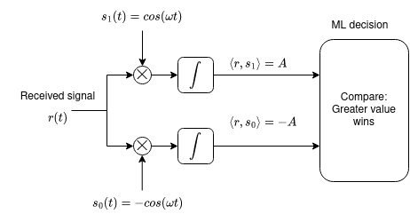

### Exemplu: BPSK

- Demodulare BPSK:

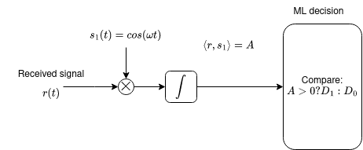

### Exemplu: QPSK

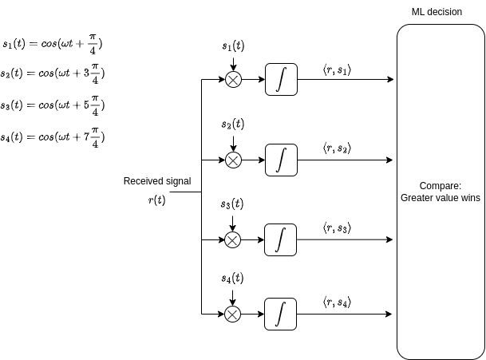{#id .class height=80%}

### Example: QPSK

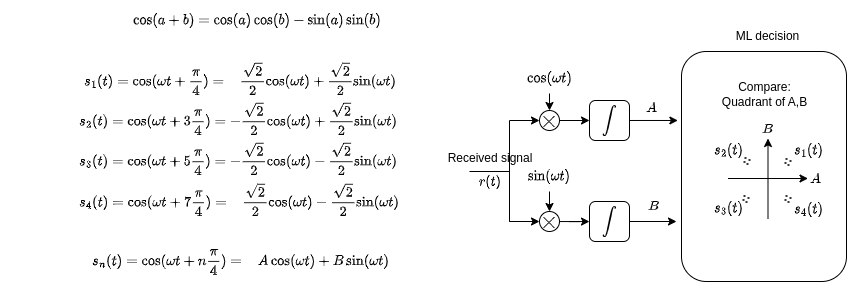

### Filtru adaptat

- Cum se calculează produsul scalar a două semnale $r[n]$ și $s[n]$ de lungime $N$?
$$\langle \vec{r},\vec{s} \rangle = \sum r_i s(t_i)$$

- Fie $h[n]$ semnalul $h[n]$ **oglindit**
    - începe la momentul 0, durează până la momentul $N-1$, dar este oglindit
$$h[n] = s[N-1-n]$$

- Exemplu:
    - dacă $s[n] = [\underuparrow{1}, 2, 3, 4, 5, 6]$
    - atunci $h[n] = s[N-1-n] = [\underuparrow{6}, 5, 4, 3, 2, 1]$

### Filtru adaptat

- Convoluția lui $r[n]$ cu $h[n]$ este
$$y[n] = \sum_k r[k] h[n-k] = \sum_k r[k] h[N-1-n+k]$$

- Rezultatul convoluției, la finalul semnalului de intrare, $y[N-1]$ ($n=N-1$), este chiar produsul scalar:
$$y[N-1] = \sum_k r[k] s[k]$$

### Filtru adaptat

- Pentru detecția unui semnal $s[n]$ se poate folosi un  **filtru a cărui răspuns la impuls =
oglindirea lui $s[n]$**, luându-se eșantionul de la finalul semnalului de intrare
    $$h[n] = s[N-1-n]$$
    - se obține valoarea produsului scalar

- **Filtru adaptat** = un filtru proiectat să aibă răspunsul la impuls egal cu oglindirea
semnalului care se dorește a fi detectat (eng. "matched filter")
    
    - filtrul este *adaptat* semnalului dorit

### Detecția semnalelor cu filtre adaptate

- Se folosește un filtru adaptat la semnalul $s_1(t_i)$

- Se folosește un filtru adaptat la semnalul $s_0(t_i)$

- Se eșantionează ieșirile la momentul final $n = N-1$
    - se obțin valorile produselor scalare

- Se folosește regula de decizie cu produse scalare

### Detecția semnalelor cu filtre adaptate

- Dacă $s_0(t) = 0$, avem nevoie doar de un singur filtru adaptat pentru $s_1(t)$,
și se compară rezultatul cu un prag

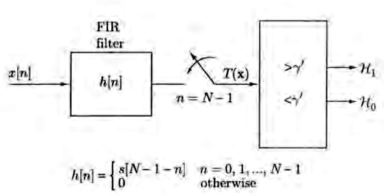{#id .class width=60%}

*[sursa: Fundamentals of Statistical Signal Processing, Steven Kay]*

## II.4 Detecția unui semnal oarecare cu observare continuă

### Observarea continuă a unui semnal oarecare

- Observare continuă = fără eșantionare, se folosește **întreg semnalul continuu**
    - similar cazului cu $N$ eșantioane, dar cu $N \to \infty$

- Semnalele originale sunt $s_0(t)$ si $s_1(t)$

- Semnalele sunt afectate de zgomot
    - Presupunem **doar zgomot Gaussian**, pentru simplitate

- Semnalul recepționat este $r(t)$

### Spațiu Euclidean

- Se extinde cazul precedent cu $N$ eșantioane la cazul unui semnal continuu, $N \to \infty$

- Fiecare semnal $r(t)$, $s_1(t)$ și $s_0(t)$ reprezintă un punct într-un spațiu Euclidian infinit dimensional

- **Distanța** între două semnale este:
$$d(\vec{r},\vec{s}) = \sqrt{\int \left( r(t) - s(t) \right)^2 dt}$$

- **Produsul scalar** între două semnale:
$$\langle \vec{r},\vec{s} \rangle = \int r(t) s(t) dt$$

- Similar cu cazul N dimensional, dar cu integrală în loc de sumă

### Decizie în cazul AWGN: distanțe
    
- În cazul AWGN este aceeași regula de decizie:
$$d(\vec{r}, \vec{s_0})^2 \grtlessH d(\vec{r}, \vec{s_1})^2  + 2 \sigma^2 \ln(K)$$
    
- Distanța = se calculează cu formula precedentă, cu integrală

- Aceleași criterii de decizie:

    - Criteriul Maximum Likelihood: $K = 1$, $\ln(K) = 0$
        - se alege **distanța minimă**
    - Criteriul Minimum Probability of Error: $K = \frac{P(H_0)}{P(H_1)}$
    - Criteriul Minimum Risk: $K=\frac{(C_{10}-C_{00})p(H_0)}{(C_{01}-C_{11})p(H_1)}$
    
### Decizie în cazul AWGN: produse scalare

- În cazul AWGN este aceeași regulă de decizie:
$$\langle \vec{r}, \vec{s_1} \rangle - \frac{E_1}{2} \grtlessH \langle \vec{r},\vec{s_0} \rangle - \frac{E_0}{2} + \sigma^2 \ln(K)$$
    
- Produsul scalar = formula precedentă, cu integrală

- Toate interpretările rămân identice
    - se schimbă doar **tipul de semnal** cu care lucrăm

### Filtru adaptat

- Produsul scalar a două semnale se poate calcula cu un **filtru adaptat**

- **Filtru adaptat** = filtru proiectat să aibă răspunsul la impuls egal cu **oglindirea**
semnalului căutat
    - dacă semnalul original $s(t)$ are lungimea T
    - atunci $h(t) = s(T - t)$
    - filtrul este analogic, răspunsul la impuls este continuu

- Ieșirea unui filtru adaptat la momentul $t = T$ este egală
cu produsul scalar al intrării $r(t)$ cu $s(t)$

### Detecția semnalelor cu filtre adaptate

- Se folosește un filtru adaptat la semnalul $s_1(t)$

- Se folosește un alt filtru adaptat la semnalul $s_0(t)$

- Se eșantionează ieșirile filtrelor la sfârșitul semnalelor, $t = T$
    - se obțin valorile produselor scalare

- Se utilizează regula de decizie cu produse scalare

### Spații vectoriale Euclidiene

- Recapitulare: Spații vectoriale Euclidiene

- Spațiu vectorial
    - suma a două elemente = rămâne în același spațiu
    - multiplicarea cu o constantă = rămâne în același spațiu
    - există operații aritmetice de bază: sumă, multiplicare cu o constantă
    - Exemple
        - 1D = o dreaptă
        - 2D = un plan
        - 3D = spațiu tridimensional
        - N-D = ...
        - $\infty$-D = ..
    
### Spații vectoriale Euclidiene

- Operația fundamentală: **produsul scalar**
    - pentru semnale discrete
        $$\langle \vec{x},\vec{y} \rangle = \sum_i x_i y_i$$
    - pentru semnale continue
        $$\langle \vec{x},\vec{y} \rangle = \int x(t) y(t)$$        

- Norma (lungimea) unui vector = radical(produsul scalar cu sine însuși)
$$\|\vec{x}\| = \sqrt{ \langle \vec{x},\vec{x} \rangle }$$

- Distanța între doi vectori = norma diferenței dintre ei
$$d(\vec{x}, \vec{y}) = \|\vec{x} - \vec{y}\|$$

### Spații vectoriale Euclidiene

- Energia unui semnal = norma la pătrat
$$E_x = \|\vec{x}\|^2 = \langle \vec{x},\vec{x} \rangle$$

- Unghiul dintre doi vectori
$$cos(\alpha) = \frac{\langle x,y \rangle}{||x|| \cdot ||y||}$$
    - are valoare între -1 și 1
    - dacă $\langle x,y \rangle = 0$, vectorii sunt **ortogonali** (perpendiculari)

### Spații vectoriale Euclidiene

- Bonus: transformata Fourier = produs scalar cu $e^{j \omega t}$
$$\mathcal{F} \{ x(t)\} = \langle x(t), e^{j \omega t}\rangle = \int x(t) e^{-j \omega t}$$
    - pentru semnale complexe, al doilea termen se conjugă, de aceea este $-j$ în loc de $j$
        $$\langle \vec{x},\vec{y} \rangle = \sum_i x_i y_i^*$$
        $$\langle \vec{x},\vec{y} \rangle = \int x(t) y(t)^*$$        
 
- Identic pentru semnale discrete

### Spații vectoriale Euclidiene

- Concluzie: definirea algoritmilor în mod generic, 
pe bază de produse scalare / distanțe / norme, este extrem de folositoare!
    - se aplică automat tuturor spațiilor vectoriale
    - un singur algoritm, utilizări pentru multiple tipuri de semnale

## II.5 Detecția semnalelor cu distribuții necunoscute

### Distribuții necunoscute

- Până acum, se cunoștea dpdv. matematic statistica
tuturor datelor:

  - Se cunoșteau semnalele:
  
    - $s_0(t) = ...$
    - $s_1(t) = ...$
    
  - Se cunoștea zgomotul
  
    - gaussian, uniform, etc.
    
  - Se cunoșteau distribuțiile condiționate:
  
    - $w(r|H_0) = ...$
    - $w(r|H_1) = ...$

- În aplicații reale, lucrurile pot fi mai complicate

### Exemplu

- Dacă semnalele $s_0(t)$ și $s_1(t)$
nu există / nu se cunosc?

- Exemplu: recunoașterea feței unei persoane

    - Identificarea persoanei A sau B bazată pe o imagine a feței
    - Avem:
        - 100 imagini ale persoanei A, în condiții diverse
        - 100 imagini ale persoanei B, în condiții diverse

### Eșantioane vs distribuții

- Să comparăm recunoașterea fețelor cu detecția semnalelor

- Aspecte comune:

    - două ipoteze $H_0$ (persoana A) și $H_1$ (persoana B)
    - un vector de eșantioane $\vec{r}$ = imaginea pe baza căreia se face decizia
    - se pot lua două decizii
    - 4 scenarii: rejecție corectă, alarmă falsă, pierdere, detecție corectă

- Ce diferă? Nu există formule matematice

    - nu există semnalele "originale" $s_0(t) = ...$ și $s_1(t)...$
    - (fețele persoanelor A și B nu pot fi exprimate matematic ca semnale)
    - în schimb, avem multe exemple din fiecare distribuție
    
        - 100 imagini ale lui A = exemple ale $\vec{r}$ în ipoteza $H_0$
        - 100 imagini ale lui B = exemple ale $\vec{r}$ în ipoteza $H_1$

### Terminologie

- Terminologia folosită în domeniul **învățării automate** (*machine learning*):

    - Acest tip de problemă = problemă de **clasificare** a semnalelor
        - se dă un vector de date, găsiți-i clasa
        
    - **Clase de semnal** = categoriile posibile ale semnalelor (ipotezele $H_i$, persoanele A/B etc)
    
    - **Set de antrenare** = un set de semnale cunoscute inițial
    
        - de ex. 100 de imagini ale fiecărei persoane
        - setul de date va fi folosit în procesul de decizie

### Eșantioane și distribuții

- Setul de antrenare conține informațiile
pe care le-ar conține distribuțiile condiționate $w(r|H_0)$ și $w(r|H_1)$

    - $w(r|H_0)$ exprimă cum arată valorile lui $r$ în ipoteza $H_0$
    - $w(r|H_1)$ exprimă cum arată valorile lui $r$ în ipoteza $H_1$
    - setul de antrenare exprimă același lucru, nu prin formule, dar prin multe exemple

- Cum se face clasificarea în aceste condiții?

### Algoritmul k-NN

Algoritmul *k-Nearest Neighbours* (k-NN)

- Intrare: 

    - set de antrenare cu vectorii $\vec{x}_1 ... \vec{x}_N$,
    din $L$ clase posibile de semnal $C_1$...$C_L$
    - clasele vectorilor de antrenare sunt cunoscute
    - vector de test $\vec{r}$ care trebuie clasificat
    - parametrul $k$

1. Se calculează distanța între $\vec{r}$ și fiecare vector de antrenare $\vec{x}_i$
    - se poate utiliza distanța Euclidiană, aceeași utilizată 
    pentru detecția semnalelor din secțiunile precedente

2. Se aleg cei mai apropiați $k$ vectori de $\vec{r}$ (cei *$k$ "nearest neighbours*")

3. Se determină clasa lui $\vec{r}$ = clasa majoritară între cei $k$ cei mai apropiați vecini

- Ieșire: clasa vectorului $\vec{r}$

### Algoritmul k-NN

![Algoritmul k-NN ilustrat [1]](img/kNN.png){#id .class width=58%}

\maketiny{
[1] sursa: "KNN Classification using Scikit-learn", Avinash Navlani, https://www.datacamp.com/community/tutorials/k-nearest-neighbor-classification-scikit-learn
}

### Algoritmul k-NN și decizia ML

- Dacă setul de antrenare este foarte mare, algoritmul k-NN devine simular cu decizia pe baza criteriului ML

- Numărul de vectori situați într-o vecinătate a unui punct $r$ este proporțional cu $w(r|H_i)$

- Mai mulți vecini din clasa A decât din clasa B $\Leftrightarrow$ $w(r|H_A)$ > $w(r|H_B)$

### Algoritmul k-NN și decizia ML

- Exemplu: frunze și copaci :) de povestit

### Exercițiu

Exercițiu

1. Fie următorul set de antrenare, compus din
5 vectori din clasa A și alți 5 vectori din clasa B:
    - Clasa A:
    $$
\vec{v}_1 = \begin{bmatrix}  1 \\ -2 \end{bmatrix}\;
\vec{v}_2 = \begin{bmatrix} -1 \\  1 \end{bmatrix}\;
\vec{v}_3 = \begin{bmatrix} -4 \\  2 \end{bmatrix}\;
\vec{v}_4 = \begin{bmatrix}  2 \\  1 \end{bmatrix}\;
\vec{v}_5 = \begin{bmatrix} -2 \\ -2 \end{bmatrix}$$
    
    - Clasa B:
    $$
\vec{v}_6    = \begin{bmatrix}  7 \\ 0 \end{bmatrix}\;
\vec{v}_7    = \begin{bmatrix}  2 \\ 3 \end{bmatrix}\;
\vec{v}_8    = \begin{bmatrix}  3 \\ 2 \end{bmatrix}\;
\vec{v}_9    = \begin{bmatrix} -3 \\ 8 \end{bmatrix}\;
\vec{v}_{10} = \begin{bmatrix} -2 \\ 5 \end{bmatrix}$$

    Determinați clasa vectorului $\vec{x} = \begin{bmatrix} -3 \\ 6 \end{bmatrix}$
utilizând algoritmul k-NN, cu $k=1$, $k=3$, $k=5$, $k=7$ and $k=9$

### Discuție

- k-NN este un algoritm de învățare supervizată
    - se cunosc clasele vectorilor din setul de antrenare

\smallskip

- Efectul lui $k$: netezirea frontierei de decizie:
    - $k$ mic: frontieră foarte cotită / "șifonată" / cu multe coturi
    - $k$ mare: frontieră mai netedă

\smallskip

- Cum se găsește o valoare optimă pentru  $k$?

### *Cross-validation*

- Cum se găsește o valoare optimă pentru  $k$?
    - prin încercări ("băbește")

\smallskip

- "**Cross-validation**" = folosirea unui mic set de test pentru a verifica care valoare a parametrului e mai bună

    - acest set de date se numește set de "**cross-validare**"
    - se impune $k=1$, se testează cu setul de "*cross-validare*" câți vectori sunt clasificați corect
    - se repetă pentru $k=2, 3, ... max$
    - se alege valoarea lui $k$ cu care s-au obținut rezultatele cele mai bune

### Evaluarea algoritmilor

- Cum se evaluează performanța algoritmului k-NN?
    - Se folosește un set de date de testare, și se calculează procentajul vectorilor clasificați corect

\smallskip

- Setul de date pentru evaluarea finală trebuie să fie diferit de setul de "*cross-validare*"
    - pentru evaluarea finală se folosesc date pe care algoritmul nu le-a mai utilizat niciodată

\smallskip

- Cum se împarte setul de date disponibile?

### Seturi de date
    
- Presupunem că avem în total 200 imagini tip fețe, 100 imagini ale persoanei A și 100 ale lui B    

\smallskip
    
- Setul de date total se împarte în:
	\smallskip
    - Set de antrenare
        - vectorii care vor fi utilizați de algoritm
        - cel mai numeros, aprox. 60% din datele totale
        - de ex. 60 imagini ale persoanei A și 60 ale lui B
    \smallskip
    - Set de *cross-validare*
        - utilizat pentru a testa algoritmul în vederea alegerii parametrilor optimi ($k$)
        - mai mic, aprox. 20% din date (de ex. 20 imagini ale lui of A și 20 ale lui B)
    \smallskip
    - Set de testare
        - utilizat pentru evaluarea finală a algoritmului, cu valorile parametrilor fixate
        - mai mic, aprox. 20% din date (de ex. 20 imagini ale lui of A și 20 ale lui B)

### Algoritmul *k-Means*

- k-Means: un algoritm pentru ***clusterizarea*** datelor
    - identificarea grupurilor de date apropiate între ele

\smallskip

- Un exemplu de algoritm de învățare nesupervizată
    - "învățare nesupervizată" = nu se cunosc clasele semnalelor din setul de antrenare

### Algoritmul *k-Means*

Algoritmul *k-Means*

- Intrare: 
    - set de antrenare cu vectorii $\vec{x}_1 ... \vec{x}_N$
    - numărul de clase C

- Inițializare: centroizii C iau valori aleatoare
	$$\vec{c}_i \leftarrow \textrm{ valori aleatoare }$$
- Repetă
  1. Clasificare: se clasifică fiecare vector $\vec{x}$ pe baza celui mai apropiat centroid:
	    $$class{x} = \arg\min_i d(\vec{x}, \vec{c}_i), \forall \vec{x}$$
  2. Actualizare: se actualizează centroizii $\vec{c}_i$ = media vectorilor $\vec{x}$ din clasa $i$
	    $$\vec{c}_i \leftarrow \textrm{ media vectorilor } \vec{x}, \forall \vec{x} \textrm{ din clasa } i$$

- Ieșire: centroizii $\vec{c}_i$, clasele tuturor vectorilor  de intrare $\vec{x}_n$

### Algoritmul *k-Means*

Algoritmul *k-Means* explicat video:

- Urmăriți video-ul următor, de la 6:28 to 7:08

    [https: //www.youtube.com/watch?v=4b5d3muPQmA](https://www.youtube.com/watch?v=4b5d3muPQmA)

\smallskip

- Urmăriți video-ul următor, de la 3:05 la final

    [https: //www.youtube.com/watch?v=IuRb3y8qKX4](https://www.youtube.com/watch?v=IuRb3y8qKX4)
    

### Algoritmul *k-Means*

- Algoritmul *k-Means* poate să nu conveargă spre niște grupuri adecvate de date
    - rezultatele depind de inițializarea aleatoare a centroizilor
    - se rulează de mai multe ori, se alege cel mai bun rezultat
    - există metode de inițializare optimizate (*k-Means++*)

### Exercițiu

Exercițiu

1. Fie datele următoare:
    $$\left\lbrace \vec{v_n} \right\rbrace = 
[ 1.3, -0.1, 0.5, 4.7, 5.1, 5.8, 0.4, 4.8, -0.7, 4.9 ] $$

    Utilizați algoritmul k-Means pentru a găsi doi centroizi $\vec{c}_1$ și $\vec{c}_2$,
pornind de la valorile aleatoare $\vec{c}_1 = -0.5$ și $\vec{c}_2 = 0.9$. 
Realizați 5 iterații ale algoritmului.

