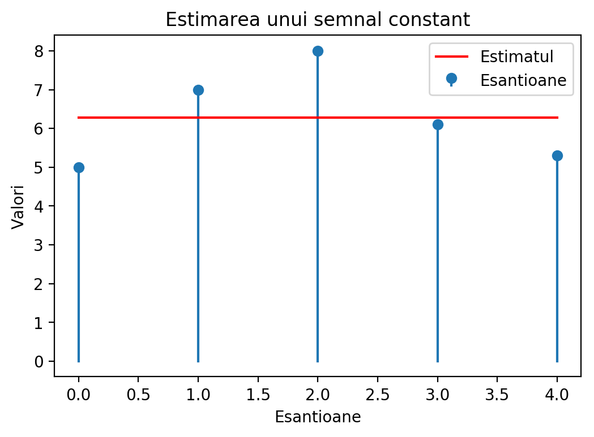
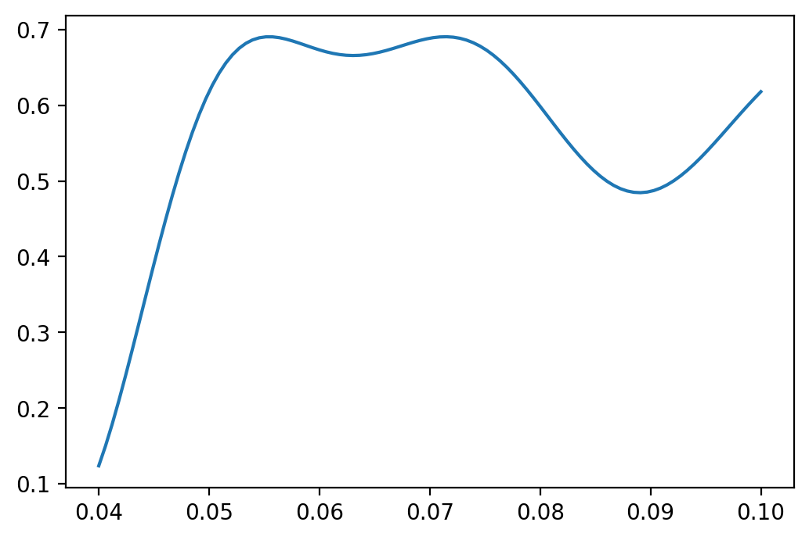

# Chapter III. Elemente de Teoria Estimării

## II.1 Introducere

### Ce înseamnă "estimare"?

* Un emițător transmite un semnal $s_\Theta(t)$ care depinde de parametru **necunoscut** $\Theta$

* Semnalul este afectat de zgomot, se recepționează $r(t) = s_\Theta(t) + zgomot$ 

* Vrem să **găsim** valoarea parametrului
    * pe baza eșantioanelor din semnalul recepționat, sau a întregului semnal
    * datele recepționate au zgomot => parametrul este "estimat"

* Valoarea găsită este $\hat{\Theta}$, **estimatul** lui $\Theta$
    * există întotdeauna eroare de estimare $\epsilon = \hat{\Theta} - \Theta$
    
* Exemple:
    * Amplitudinea unui semnal constant: $r(t) = A + zgomot$, trebuie estimat $A$
    * Faza unui semnal sinusoidal: $r(t) = \cos(2 \pi f t + \phi) + zgomot$, de estimat $\phi$
	* Semnal vocal înregistrat, de estimat/decis ce cuvânt este pronunțat
	
### Estimare și Decizie

* Fie următoarea problemă de estimare: $r(t) = A + zgomot$, de estimat $A$

* La detecție se alege între **două valori cunoscute** ale $A$:
    * de ex. $A$ poate fi 0 sau 5 (ipotezele $H_0$ și $H_1$)
    
* La estimare, $A$ poate fi oricât => se alege între **o infinitate de opțiuni** ale $A$
    * $A$ poate fi orice valoare din $\mathbb{R}$, în general

### Estimare și Detecție

* Detecție = Estimare restrânsă doar la un set discret de opțiuni

* Estimare = Detecție cu un număr infinit de opțiuni posibile

* Metodele statistice sunt similare
    * În practică, distincția între estimare și detecție nu este strictă
    * (de ex. când trebuie să alegem între 1000 de ipoteze, este "detecție" sau "estimare"?)

### Semnalul recepționat

* Semnalul recepționat este $r(t)$
    * este afectat de zgomot, și depinde de parametrul necunoscut $\Theta$
    
* Considerăm **N eșantioane** din $r(t)$, luate la momentele de timp $t_i$
$$\vec{r} = [r_1, r_2, ... r_N]$$

* Fiecare eșantion $r_i$ este o variabilă aleatoare ce depinde de $\Theta$ (și zgomot)
    * Fiecare eșantion are o distribuție care depinde de $\Theta$
$$w_i(r_i; \Theta)$$

* Întregul vector de eșantioane $\vec{r}$ este o variabilă aleatoare N-dimensională
ce depinde de $\Theta$ (și de zgomot)
    * Are o distribuție N-dimensională ce depinde de $\Theta$
    * Egală cu produsul tuturor $w_i(r_i; \Theta)$
$$w(\vec{r}; \Theta) = w_1(r_1; \Theta) \cdot w_2(r_2; \Theta) \cdot ... \cdot w_N(r_N; \Theta)$$

### Tipuri de estimare

* Considerăm estimarea lui $\Theta$ în două cazuri:
    
1. Nu cunoaștem alte informații despre parametru, decât cel mult vreun domeniu de existență (de ex. $\Theta > 0$)
    * Parametrul poate avea orice valoare din domeniul de existență, în mod echiprobabil

2. Se cunoaște o distribuție $w(\Theta)$ a lui $\Theta$, care indică ce valori ale lui $\Theta$
 sunt mai probabile / mai puțin probabile
    * este distribuția *a priori* ("cea cunoscută de dinainte")
    

## II.2 Estimarea de plauzibilitate maximă (Maximum Likelihood)

### Estimarea tip Maximum Likelihood

* Dacă nu se cunoaște vreo distribuție *a priori* se folosește metoda
estimării de plauzibilitate maximă ("Maximum Likelihood", ML)

* Distribuția vectorului recepționat, $w(\vec{r}; \Theta)$, reprezintă **funcția de plauzibilitate**
    * vectorul recepționat $\vec{r}$ este cunoscut, deci e o constantă
    * necunoscuta aici este $\Theta$ 
    $$L(\Theta) = w(\vec{r}; \Theta)$$

### Estimarea tip Maximum Likelihood

Estimarea de plauzibilitate maximă (Maximum Likelihood, ML): 

* Estimatul $\hat{\Theta}$ este 
**valoarea care maximizează plauzibilitatea semnalului recepționat**
    * i.e. valoarea $\Theta$ care maximizează $w(\vec{r}; \Theta)$
    $$\hat{\Theta} = \arg\max_{\Theta} L(\Theta) = \arg\max_{\Theta} w(\vec{r}; \Theta)$$

* Dacă $\Theta$ aparține doar unui anumit domeniu, se face maximizarea
doar asupra acelui domeniu.

### Găsirea maximului

* Cum se rezolvă problema de maximizare?
    * cum se găsește estimatul $\Theta$ care maximizează $L(\Theta)$

* Maximul se găsește prin derivare și egalare cu 0
$$\frac{d L(\Theta)}{d\Theta} = 0$$

* Se poate aplica **logaritmul natural** asupra funcției $L(\Theta)$ înainte de derivare ("log-likelihood function")
$$\frac{d \ln\left(L(\Theta)\right)}{d\Theta} = 0$$

### Procedura de găsire a estimatului

Procedura de găsire a estimatului ML:

1. Se găsește expresia funcției $$L(\Theta) = w(\vec{r}; \Theta)$$

1. Se pune condiția ca derivata lui $L(\Theta)$ sau a lui $\ln(\left(L(\Theta)\right)$ să fie 0
$$\frac{d L(\Theta)}{d\Theta} = 0, \text{ or }\frac{d \ln\left(L(\Theta)\right)}{d\Theta} = 0$$

1. Se rezolvă ecuația, se găsește valoarea $\hat{\Theta}$

1. Se verifică că derivata a doua în punctul $\hat{\Theta}$ este negativă, pentru a verifica că este un punct de maxim
    * întrucât derivata = 0 și pentru maxime și pentru minime

### Exemple

Semnal constant în zgomot gaussian:

* Găsiți estimatul Maximum Likelihood pentru constanta $A$ din 5 măsurători afectate de zgomot
$r_i = A + noise$, cu valori egale cu $[5, 7, 8, 6.1, 5.3]$. Zgomotul este AWGN $\mathcal{N}(\mu=0, \sigma^2)$.

* Soluție: la tablă

* Estimatul $\hat{A}$ este chiar valoarea medie a eșantioanelor (deloc surprinzător)

### Simulare numerică


{width=8cm}\


### Aproximare a unei curbe

* Estimare = aproximare a unei curbe

* Din exemplul grafic anterior:
    * avem un set de date $\vec{r}$
    * se cunoaște forma semnalului = o dreaptă orizontală ($A$ constant)
    * se aproximează în mod optim linia prin setul de date

### Semnal oarecare în AWGN

* Fie semnalul original "curat" $s_\Theta(t)$

* Zgomotul este AWGN $\mathcal{N}(\mu=0, \sigma^2)$

* Eșantioanele $r_i$ sunt luate la momentele $t_i$

* Eșantioanele $r_i$ au distribuție normală, cu media $s_\Theta(t_i)$ și varianța $\sigma^2$

* Funcția de plauzibilitate globală = produsul plauzibilității fiecărui eșantion $r_i$
$$\begin{split}
L(\Theta) =& \prod_{i=1}^N \frac{1}{\sigma \sqrt{2 \pi}} e^{- \frac{(r_i - s_\Theta(t_i))^2}{2 \sigma^2}} \\
=&  \left(\frac{1}{\sigma \sqrt{2 \pi}} \right)^N e^{- \frac{\sum(r_i - s_\Theta(t_i))^2}{2 \sigma^2}}
\end{split}$$

### Semnal oarecare în AWGN

* Logaritmul plauzibilității ("log-likelihood") este
$$\begin{split}
\ln\left(L(\Theta)\right) =& \underbrace{N\ln\left(\frac{1}{\sigma \sqrt{2 \pi}}\right)}_{constant} - \frac{\sum(r_i - s_\Theta(t_i))^2}{2 \sigma^2}
\end{split}$$

### Semnal oarecare în AWGN

* Maximul funcției = minimul exponentului
$$\hat{\Theta} = \arg\max_{\Theta} w(r; \Theta) = \arg\min \sum(r_i - s_\Theta(t_i))^2$$

* Termenul $\sum(r_i - s_\Theta(t_i))^2$ este **distanța $d(\vec{r},s_\Theta)$ la pătrat**
$$d(\vec{r},s_\Theta) = \sqrt{\sum (r_i - s_\Theta(t_i))^2}$$
$$\left(d(\vec{r},s_\Theta)\right)^2 = \sum (r_i - s_\Theta(t_i))^2$$

### Semnal oarecare în AWGN

* Estimarea ML se poate rescrie sub forma:
$$\hat{\Theta} = \arg\max_{\Theta} w(r; \Theta) = \arg\min d(\vec{r}, \vec{s}_\Theta)^2$$

* Estimatul de plauzibilitate maximă (estimatul ML) $\hat{\Theta}$ = 
valoarea care face $s_\Theta(t_i)$ 
**cel mai apropiat de vectorul recepționat $\vec{r}$**
    * mai aproape = mai probabil
    * cel mai aproape = cel mai probabil = plauzibilitate maximă

* Estimare ML = minimizarea distanței

* Relația e valabilă pentru orice fel de spații vectoriale
    * vectori cu N elemente, semnale continue, etc
    * doar se înlocuiește definiția distanței Euclidiene


### Semnal oarecare în AWGN

* Estimatul se găsește prin setarea derivatei la 0
$$\begin{split}
\frac{d \ln\left(L(\Theta)\right)}{d\Theta} = 0
\end{split}$$
înseamnă
$$\begin{split}
\sum(r_i - s_\Theta(t_i)) \frac{d s_\Theta(t_i)}{d\Theta} = 0
\end{split}$$

### Simulare numerică

Estimarea frecvenței $f$ a unui semnal sinusoidal

* Găsiți estimatul Maximum Likelihood pentru frecvența $f$ a unui semnal cosinus, din 10 măsurători
 afectate de zgomot $r_i = cos(2\pi f t_i) + zgomot$ de valori $[...]$. 
 Zgomotul este AWGN $\mathcal{N}(\mu=0, \sigma^2)$.
Momentele de eșantionare sunt $t_i = [0,1,2,3,4,5,6,7,8,9]$

* Soluție: la tablă

### Simulare numerică

Funcția de plauzibilitate este


{width=8cm}\


### Simulare numerică


```
Frecventa originala = 0.070000, estimatul = 0.071515
```

{width=8cm}\


### Estimare ML și Detecție ML

* La estimarea ML, estimatul $\hat{\Theta}$ este valoarea care maximizează 
funcția de plauzibilitate

* La detecție ML, criteriul de decizie $\frac{w(r | H_1)}{w(r | H_0)} \grtlessH 1$
înseamnă "alege ipoteza pentru care funcția de plauzibilitate este mai mare"

* Același principiu, doar în contexte diferite:
    * la detecție, avem de ales doar între câteva opțiuni predefinite
    * la estimare nu mai avem constrângeri => se alege valoarea maximă a întregii funcții


### Funcția de pierdere ("Loss function")

* Distanța $d(\vec{r}, \vec{s}_\Theta)$ se mai numește
funcție de pierdere ("**loss function**") în domeniul *Machine Learning*
    * distanța Euclidiană = funcția de pierdere tip "**Mean Squared Error**" (MSE)

* Pentru un $\vec{r}$ dat, valoarea de pierdere MSE = $\frac{1}{N}d(\vec{r},\vec{s}_\Theta)$

* Alte funcții de pierdere sunt folosite în diverse aplicații

### Parametri multipli

* Dacă semnalul depinde de mai mulți parametri?
    * de ex. amplitudinea, frecvența și faza inițială a unui cosinus:
$$s_\vec{\Theta}(t) = A \cos(2 \pi f t + \phi)$$

* Se va considera $\Theta$ ca fiind un vector:
$$\bm{\Theta} = [\Theta_1, \Theta_2, ... \Theta_M]$$
    * e.g. $\bm{\Theta} = [\Theta_1, \Theta_2, \Theta_3] =[A, f, \phi]$

### Coborâre după gradient (Gradient Descent)

* Cum se estimează parametrii $\bm{\Theta}$ în cazuri complicate?
    * în aplicații reale, unde pot fi foarte mulți parametri ($\bm{\Theta}$ este vector)

* De obicei nu se pot găsi valorile optime prin formule directe

* Se îmbunătățesc valorile în mod iterativ cu algoritmi tip  **coborâre după gradient**

### Coborâre după gradient (Gradient Descent)

1. Se inițializează parametrii cu valori aleatoare $\bm{\Theta}^{(0)}$
2. Repetă la fiecare iterație $k$:
    1. Se calculează valoarea de pierdere $L(\bm{\Theta}^{(k)})$
    2. Se calculează derivata $\frac{\partial L}{\partial \Theta_i^{(k)}}$ pentru toți $\Theta_i$
    3. Se actualizează toate valorile $\Theta_i$ prin scăderea derivatei:
        $$\Theta_i^{(k+1)} = \Theta_i^{(k)} - \mu \frac{\partial L}{\partial \Theta_i^{(k)}}$$
        * sau, sub formă vectorială:
        $$\bm{\Theta}^{(k+1)} = \bm{\Theta}^{k} - \mu \frac{\partial L}{\partial \bm{\Theta}^{(k)}}$$ 
3. Până la îndeplinirea unui criteriu de terminare (de ex. parametrii nu se mai modifică mult)

### Coborâre după gradient (Gradient Descent)

* Explicații la tablă

* Exemplu: regresia logistică cu valori 2D
    * exemplu la tablă

### Rețele Neurale

* Cel mai proeminent exemplu: **Rețele Neurale Artificiale** (a.k.a. "Rețele Neurale",
"Deep Learning", etc.)
    * Pot fi văzute ca un exemplu de estimare ML
    * Utilizează o funcție de pierdere (de obicei nu funcția tip MSE)
    * Se utilizează algoritmul *Gradient Descent* pentru găsirea parametrilor
    * Aplicații de vârf: recunoașterea de imagini, automated driving etc.
 
* Mai multe informații despre rețele neurale / machine learning: 
    * căutați cursuri sau cărți, eventual online (de ex. cartea dl.prof. Iulian Ciocoiu)
    * participați la IASI AI Meetup


## II.3 Estimare Bayesiană

### Distribuția *a priori*

* Presupunem că se știe de dinainte o distribuție a lui $\Theta$, $w(\Theta)$
    * știm de dinainte care e probabilitatea de a fi a anume valoare sau alta
    * se numește distribuția *a priori*

* Estimarea trebuie să ia în calcul și distribuția *a priori*
    * estimatul va fi "tras" înspre valori mai probabile
    
* Cunoscută sub numele de "estimare Bayesiană"
    * Thomas Bayes = a descoperit regula lui Bayes
    * Chestiile bazate pe regula lui Bayes poartă deseori numele de "Bayesian"

### Funcția de cost

* **Eroarea de estimare** = diferența între estimatul $\hat{\Theta}$ și valoarea reală $\Theta$
$$\epsilon = \hat{\Theta} - \Theta$$

* **Funcția de cost $C(\epsilon)$** atribuie un cost pentru fiecare eroare de estimare posibilă
    * când $\epsilon = 0$, costul $C(0) = 0$ 
    * erori $\epsilon$ mici au costuri mici
    * erori $\epsilon$ mari au costuri mari

* Funcții de cost uzuale:
    * Pătratică: $C(\epsilon) = \epsilon^2 = \left( \hat{\Theta} - \Theta \right)^2$
    * Uniformă: 
    $C(\epsilon) = \begin{cases}
    0, \text{ if } |\epsilon| = |\hat{\Theta} - \Theta | \leq E \\
    1, \text{ if } |\epsilon| = |\hat{\Theta} - \Theta | > E \\
    \end{cases}$
    * Liniară: $C(\epsilon) = |\epsilon| = | \hat{\Theta} - \Theta |$
    * (desenate la tablă)

### Riscul Bayesian

* Pentru fiecare pereche de valori $\vec{r}$ și $\Theta$, $w(\vec{r}; \Theta)$ 
indică cât de probabilă este acea pereche de valori

* Prin multiplicare cu $C(\epsilon$ se obține costul pentru fiecare pereche $\vec{r}$ și $\Theta$
$$C(\epsilon) w(\vec{r}; \Theta)$$

* Integrând după $\Theta$ se obține costul total pentru un anume $\vec{r}$ și toți $\Theta$
$$\int_{-\infty}^\infty C(\epsilon) w(\vec{r}; \Theta) d\Theta$$

* Integrând mai de parte și după $\vec{r}$ se obține costul global pentru toți $\vec{r}$ și toți $\Theta$
$$R = \int_{-\infty}^\infty \int_{-\infty}^\infty C(\epsilon) w(\vec{r}; \Theta) d\Theta d\vec{r}$$

### Minimizarea riscului

* Se dorește minimizarea riscului R (= a costului global)

* Regula lui Bayes: $w(\vec{r}; \Theta) = w(\Theta | \vec{r}) w(\vec{r})$

* Înlocuind în R, se obține
$$\begin{split}
R =& \int_{-\infty}^\infty \int_{-\infty}^\infty C(\epsilon) w(\Theta | \vec{r}) w(\vec{r}) d\Theta d\vec{r} \\
=& \int_{-\infty}^\infty w(\vec{r}) \left[ \int_{-\infty}^\infty C(\epsilon) w(\Theta | \vec{r}) d\Theta \right] d\vec{r}
\end{split}$$

* Cum $w(\vec{r}) \geq 0$, minimizarea integralei $I$ din interior asigură minimul lui $R$
$$I = \int_{-\infty}^\infty C(\epsilon) w(\Theta | \vec{r}) d\Theta$$

* Vom înlocui $C(\epsilon)$ cu definiția sa și derivăm după $\hat{\Theta}$
    * Atenție: derivăm după $\hat{\Theta}$, nu $\Theta$!

### Estimatorul EPMM (eroare pătratică medie minimă)

* Când funcția de cost este pătratică $C(\epsilon) = \epsilon^2 = \left( \hat{\Theta} - \Theta \right)^2$
$$I = \int_{-\infty}^\infty (\hat{\Theta} - \Theta)^2 w(\Theta | \vec{r}) d\Theta$$

* Vrem $\hat{\Theta}$ care minimizează $I$, deci derivăm
$$\frac{dI}{d\hat{\Theta}} = 2 \int_{-\infty}^\infty (\hat{\Theta} - \Theta) w(\Theta | \vec{r}) d\Theta = 0$$

* Echivalent cu
$$\hat{\Theta} \underbrace{\int_{-\infty}^\infty w(\Theta | \vec{r})}_1 d\Theta = \int_{-\infty}^\infty \Theta w(\Theta | \vec{r}) d\Theta$$

* Estimatorul de **eroare pătratică medie minimă (EPMM) ("Minimum Mean Squared Error, MMSE")**:
$$\hat{\Theta} = \int_{-\infty}^\infty \Theta \cdot w(\Theta | \vec{r}) d\Theta$$

### Interpretare

* $w(\Theta | \vec{r})$ este distribuția **a posteriori** a lui $\Theta$
    * este distribuția lui $\Theta$ **după** ce cunoaștem semnalul recepționat $\vec{r}$
    * distribuția *a priori* $w(\Theta)$ este cea de dinainte de a recepționa datele
    
* Estimatorul EPMM este **valoarea medie** a distribuției *a posteriori*

### Estimatorul MAP

* Dacă funcția de cost este uniformă $C(\epsilon) = \begin{cases}
    0, \text{ if } |\epsilon| = |\hat{\Theta} - \Theta | \leq E \\
    1, \text{ if } |\epsilon| = |\hat{\Theta} - \Theta | > E \\
    \end{cases}$

* Știm că $\Theta = \hat{\Theta} - \epsilon$

* Se obține
$$\begin{split}
I =& \int_{-\infty}^{\hat{\Theta}-E} w(\Theta | \vec{r}) d\Theta + \int_{\hat{\Theta} + E}^\infty w(\Theta | \vec{r}) d\Theta \\
I =& 1 - \int_{\hat{\Theta}-E}^{\hat{\Theta}+E} w(\Theta | \vec{r}) d\Theta
\end{split}$$

### Estimatorul MAP

* Pentru minimizarea $I$, trebuie să maximizăm $\int_{\hat{\Theta}-E}^{\hat{\Theta}+E} w(\Theta | \vec{r}) d\Theta$, integrala
din jurul punctului $\hat{\Theta}$

* Pentru $E$ foarte mic, funcția $w(\Theta | \vec{r})$ este aproximativ constantă, deci se va alege punctul unde funcția este maximă

* Estimatorul **Maximum A Posteriori (MAP)** este
$$\hat{\Theta} = \arg\max w(\Theta | \vec{r})$$

* $\arg\max$ = "valoarea la care funcția este maximă"
    * $\max f(x)$ = valoarea maximă a unei funcții
    * $\arg\max f(x)$ = valoarea $x$ pentru care funcția atinge valoarea maximă

### Interpretare

* Estimatorul MAP: $\hat{\Theta}$ = valoarea care maximizează distribuția *a posteriori*

* Estimatorul EPMM: $\hat{\Theta}$ = valoarea medie a distribuției *a posteriori*

{#id .class width=60%}

*[image from https://allenlu2007.wordpress.com]*


### Cum se găsește distribuția *a posteriori*

* Cum găsim distribuția *a posteriori* $w(\Theta | \vec{r})$?

* Regula lui Bayes
$$w(\Theta | \vec{r}) = \frac{w(\vec{r}; \Theta)}{w(\vec{r})} = \frac{w(\vec{r} | \Theta) \cdot w(\Theta)}{w(\vec{r})}$$

* Cum $w(\vec{r})$ e constant pentru un $\vec{r}$ dat, estimatorul MAP este
$$\hat{\Theta} = \arg\max w(\Theta | \vec{r}) = \arg\max w(\vec{r} | \Theta) w(\Theta)$$

* Estimatorul MAP este valoarea care maximizează plauzibilitatea datelor recepționate, 
dar **multiplicate** cu distribuția *a priori* $w(\Theta)$

* Estimatorul EPMM  este valoarea medie a aceleiași funcții


### Relația cu estimatorul ML

* Estimatorul ML este $\arg\max w(\vec{r} | \Theta)$

* Estimatorul MAP = similar cu cel ML dar multiplicând în prealabil funcția cu distribuția *a priori* $w(\Theta)$

* Dacă $w(\Theta)$ ar fi constant, estimatorul MAP se reduce la cel ML
    * $w(\Theta)$ = constant înseamnă că toate valorile $\Theta$ sunt la fel de posibile
    * adică nu avem nici o idee/preferință unde s-ar afla valoarea reală $\Theta$

### Relația cu detecția semnalelor

* Criteriul probabilității minime de eroare $\frac{w(r | H_1)}{w(r | H_0)} \grtlessH \frac{P(H_0)}{P(H_1)}$

* Se poate rescrie ca $w(r | H_1)\cdot P(H_1) \grtlessH w(r | H_0) P(H_0)$
    * adică se alege ipoteza pentru care $w(r | H)\cdot P(H)$ este mai mare
    * $w(r | H_1)$, $w(r | H_0)$ sunt plauzibilitățile semnalului recepționat
    * $P(H_1)$, $P(H_0)$ sunt probabilitățile *a priori* (inițiale) ale ipotezelor

* Estimatorul MAP = valoarea pentru care $w(\vec{r} | \Theta) w(\Theta)$ e maxim
    * $w(\vec{r} | \Theta)$ este plauzibilitatea semnalului recepționat
    * $w(\Theta)$ este distribuția *a priori*

* Același principiu, doar în contexte diferite:
    * la detecție, avem de ales doar între câteva opțiuni predefinite
    * la estimare, nu avem constrângeri => se alege valoarea care maximizează întreaga funcție

### Examen 2018-2019

* Până aici s-a făcut în 2018-2019. Celelalte slide-uri din acest fișier nu se cer.

### Exercițiu

Exercițiu: valoare constantă, 1 măsurătoare, zgomot Gaussian același $\sigma$

* Vrem să estimam temperatura de astăzi din Sahara
* Termometrul indică 40 grade, dar valoarea este afectată de zgomot Gaussian $\mathcal{N}(0, \sigma^2=2)$ (termometru ieftin)
* Se știe că de obicei în această perioadă a anului temperatura este în jur de 35 grade, cu o distribuție Gaussiană $\mathcal{N}(35, \sigma^2 = 2)$.
* Estimați valoarea reală a temperaturii folosind estimarea ML, MAP și EPMM(MMSE)


### Exercițiu

Exercițiu: valoare constantă, 1 măsurătoare, zgomot Gaussian același $\sigma$

* Dacă avem trei termometre, care indică 40, 38, 41 grade?

Exercițiu: valoare constantă, 1 măsurătoare, zgomot Gaussian $\sigma$ diferit

* Dacă temperatura în această perioadă a anului are distribuție Gaussiană $\mathcal{N}(35, \sigma_2^2 = 3)$
    * cu varianță diferită, $\sigma_2 \neq \sigma$

### Semnal oarecare în zgomot Gaussian (AWGN)

* Fie semnalul original "curat" $s_\Theta(t)$

* Zgomotul este Gaussian (AWGN) $\mathcal{N}(\mu=0, \sigma^2)$

* Ca în cazul estimării de plauzibilitate maximă, funcția de plauzibilitate este:
$$\begin{split}
w(\vec{r} | \Theta) =&  \frac{1}{\sigma \sqrt{2 \pi}} e^{- \frac{\sum(r_i - s_\Theta(t_i))^2}{2 \sigma^2}}
\end{split}$$

* Dar acum aceasta **se înmulțește cu $w(\Theta)$**
$$w(\vec{r} | \Theta) \cdot w(\Theta)$$

### Semnal oarecare în zgomot Gaussian (AWGN)

* Estimatorul MAP estimator este cel care maximizează produsul
$$\hat{\Theta}_{MAP} = \arg\max w(\vec{r} | \Theta) w(\Theta)$$

* Logaritmând:
$$\begin{split}
\hat{\Theta}_{MAP} =& \arg\max \ln \left( w(\vec{r} | \Theta) \right) + \ln \left( w(\Theta) \right) \\
=& \arg\max - \frac{\sum(r_i - s_\Theta(t_i))^2}{2 \sigma^2} + \ln \left(w(\Theta)\right)
\end{split}$$

### Distribuție "a priori" Gaussiană

* Dacă distribuția "a priori" este de asemenea Gaussiană $\mathcal{N}(\mu_\Theta, \sigma_\Theta^2)$
$$ \ln \left(w(\Theta)\right) = - \frac{\sum(\Theta - \mu_\Theta)^2}{2 \sigma_\Theta^2}$$

* Estimatorul MAP devine
$$ \hat{\Theta}_{MAP} = \arg\min \frac{\sum(r_i - s_\Theta(t_i))^2}{2 \sigma^2} + \frac{\sum(\Theta - \mu_\Theta)^2}{2 \sigma_\Theta^2}$$

* Poate fi rescris
$$ \hat{\Theta}_{MAP} = \arg\min d(\vec{r},s_\Theta)^2 + \underbrace{\frac{\sigma^2}{\sigma_\Theta^2}}_\lambda \cdot d(\Theta, \mu_\Theta)^2$$

### Interpretare

* Estimatorul MAP în zgomot Gaussian și cu distribuție "a priori" Gaussiană
$$\hat{\Theta}_{MAP} = \arg\min d(\vec{r},s_\Theta)^2 + \underbrace{\frac{\sigma^2}{\sigma_\Theta^2}}_\lambda \cdot d(\Theta, \mu_\Theta)^2$$

* $\hat{\Theta}_{MAP}$ este apropiat de valoarea medie $\mu_\Theta$ și de asemenea 
face ca semnalul adevărat să fie apropiat de eșantioanele recepționate $\vec{r}$
    * Exemplu: "caut locuință aproape de serviciu dar și aproape de Mall"
    * $\lambda$ controlează importanța relativă a celor doi termeni
    
* Cazuri particulare
    * $\sigma_\Theta$ foarte mic = distribuția "a priori" este foarte specifică (îngustă) = $\lambda$ mare = termenul al doilea este dominant = $\hat{\Theta}_{MAP}$ foarte apropiat de $\mu_\Theta$
    * $\sigma_\Theta$ foarte mare = distribuția "a priori" este foarte nespecifică = $\lambda$ mic = primul termen este dominant = $\hat{\Theta}_{MAP}$ apropiat de estimatorul de plauzibilitate maximă

### Aplicații

* În general, aplicațiile practice:
    * utilizează diverse tipuri de distribuții "a priori"
    * estimează **mai mulți parametri** (un vector de parametri)

* Aplicații
    * reducerea zgomotului din semnale
    * restaurarea semnalelor (parți lipsă din imagini, imagini *blurate* etc)
    * compresia semnalelor
    
### Estimatori nedeplasați

* Cum caracterizăm calitatea unui estimator?
    * Există diverse abordări
    
* Un estimator $\hat{\Theta}$ este **o variabilă aleatoare**
    * poate avea diverse valori, pentru că se calculează pe baza eșantioanelor recepționate, care depind de zgomot
    * exemplu: se repetă aceeași estimare pe calculatoare diferite => valori estimate ușor diferite

* Fiind o variabilă aleatoare, se pot defini:
    * valoarea medie a estimatorului: $E \left\{ \hat{\Theta} \right\}$
    * varianța estimatorului: $E \left\{ (\hat{\Theta} - \Theta)^2 \right\}$
    
### Estimatori nedeplasați

* Estimator **nedeplasat** = valoarea medie a estimatorului este egală cu valoarea adevărată a parametrului $\Theta$
$$E \left\{ \hat{\Theta} \right\} = \Theta$$
      
* Estimator **deplasat** = valoarea medie a estimatorului diferă de valoarea adevărată a parametrului $\Theta$
    * diferența $E \left\{ \hat{\Theta} \right\} - \Theta$ se numește **deplasarea** estimatorului


### Estimatori nedeplasați

* Exemplu: semnal constant A, zgomot Gaussian (cu media), estimatorul de plauzibilitate maximă este $\hat{A}_{ML} = \frac{1}{N}\sum_i r_i$

* Atunci:
$$\begin{split}
E \left\{ \hat{A}_{ML} \right\} =& \frac{1}{N}E \left\{ \sum_i r_i \right\} \\
=& \frac{1}{N} \sum_{i=1}^N E \left\{ r_i \right\} \\
=& \frac{1}{N} \sum_{i=1}^N E \left\{ A + zgomot \right\} \\
=& \frac{1}{N} \sum_{i=1}^N A \\
=& A
\end{split}$$

* Acest estimator este nedeplasat

### Varianța unui estimator

* Dacă un estimator are **varianța** mare, valoarea estimată poate fi departe de cea reală
    * indiferent dacă estimatorul este nedeplasat sau nu

* De obicei se preferă estimatori de **varianță redusă**, tolerându-se o eventuală mică deplasare

