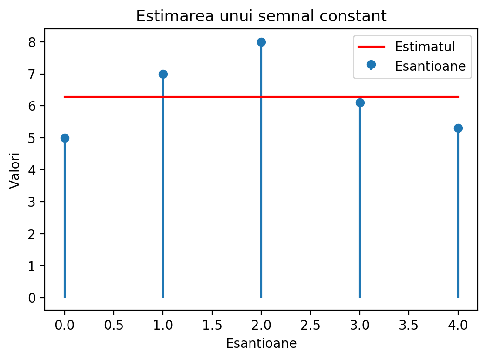
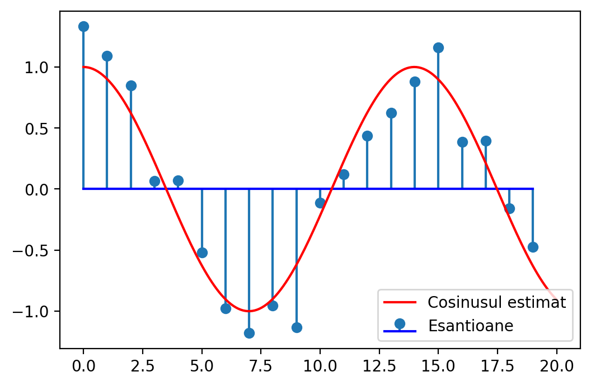

# Chapter III. Elemente de Teoria Estimării

## II.1 Introducere

### Ce înseamnă "estimare"?

* Un emițător transmite un semnal $s_\Theta(t)$ care depinde de parametru **necunoscut** $\Theta$

* Semnalul este afectat de zgomot, se recepționează $r(t) = s_\Theta(t) + zgomot$ 

* Vrem să **găsim** valoarea parametrului
    * pe baza eșantioanelor din semnalul recepționat, sau a întregului semnal
    * datele recepționate au zgomot => parametrul este "estimat"

* Valoarea găsită este $\hat{\Theta}$, **estimatul** lui $\Theta$
    * există întotdeauna eroare de estimare $\epsilon = \hat{\Theta} - \Theta$
    
* Exemple:
    * Amplitudinea unui semnal constant: $r(t) = A + zgomot$, trebuie estimat $A$
    * Faza unui semnal sinusoidal: $r(t) = \cos(2 \pi f t + \phi) + zgomot$, de estimat $\phi$
	* Semnal vocal înregistrat, de estimat/decis ce cuvânt este pronunțat
	
### Estimare și Decizie

* Fie următoarea problemă de estimare: $r(t) = A + zgomot$, de estimat $A$

* La detecție se alege între **două valori cunoscute** ale $A$:
    * de ex. $A$ poate fi 0 sau 5 (ipotezele $H_0$ și $H_1$)
    
* La estimare, $A$ poate fi oricât => se alege între **o infinitate de opțiuni** ale $A$
    * $A$ poate fi orice valoare din $\mathbb{R}$, în general

### Estimare și Detecție

* Detecție = Estimare restrânsă doar la un set discret de opțiuni

* Estimare = Detecție cu un număr infinit de opțiuni posibile

* Metodele statistice sunt similare
    * În practică, distincția între estimare și detecție nu este strictă
    * (de ex. când trebuie să alegem între 1000 de ipoteze, este "detecție" sau "estimare"?)

### Semnalul recepționat

* Semnalul recepționat este $r(t)$
    * este afectat de zgomot, și depinde de parametrul necunoscut $\Theta$
    
* Considerăm **N eșantioane** din $r(t)$, luate la momentele de timp $t_i$
$$\vec{r} = [r_1, r_2, ... r_N]$$

* Fiecare eșantion $r_i$ este o variabilă aleatoare ce depinde de $\Theta$ (și zgomot)
    * Fiecare eșantion are o distribuție care depinde de $\Theta$
$$w_i(r_i; \Theta)$$

* Întregul vector de eșantioane $\vec{r}$ este o variabilă aleatoare N-dimensională
ce depinde de $\Theta$ (și de zgomot)
    * Are o distribuție N-dimensională ce depinde de $\Theta$
    * Egală cu produsul tuturor $w_i(r_i; \Theta)$
$$w(\vec{r}; \Theta) = w_1(r_1; \Theta) \cdot w_2(r_2; \Theta) \cdot ... \cdot w_N(r_N; \Theta)$$

### Tipuri de estimare

* Considerăm estimarea lui $\Theta$ în două cazuri:
    
1. Nu cunoaștem alte informații despre parametru, decât cel mult vreun domeniu de existență (de ex. $\Theta > 0$)
    * Parametrul poate avea orice valoare din domeniul de existență, în mod echiprobabil

2. Se cunoaște o distribuție $w(\Theta)$ a lui $\Theta$, care indică ce valori ale lui $\Theta$
 sunt mai probabile / mai puțin probabile
    * este distribuția *a priori* ("cea cunoscută de dinainte")
    

## II.2 Estimarea de plauzibilitate maximă (Maximum Likelihood)

### Definiția plauzibilității maxime

* Dacă nu se cunoaște vreo distribuție *a priori* se folosește metoda
estimării de plauzibilitate maximă ("Maximum Likelihood", ML)

* Distribuția vectorului recepționat, $w(\vec{r}; \Theta)$, reprezintă **funcția de plauzibilitate**
    * vectorul recepționat $\vec{r}$ este cunoscut, deci e o constantă
    * necunoscuta aici este $\Theta$ 
    $$L(\Theta) = w(\vec{r}; \Theta)$$

* Estimarea de plauzibilitate maximă: estimatul $\hat{\Theta}$ este 
**valoarea care maximizează plauzibilitatea semnalului recepționat**
    * i.e. valoarea $\Theta$ care maximizează $w(\vec{r}; \Theta)$
    $$\hat{\Theta} = \arg\max_{\Theta} L(\Theta) = \arg\max_{\Theta} w(\vec{r}; \Theta)$$

* Dacă $\Theta$ aparține doar unui anumit domeniu, se face maximizarea
doar asupra acelui domeniu.

### Calculul maximului

* Maximul se găsește prin derivare și egalare cu 0
$$\frac{d L(\Theta)}{d\Theta} = 0$$

* Se poate aplica **logaritmul natural** asupra funcției $L(\Theta)$ înainte de derivare ("log-likelihood function")
$$\frac{d \ln\left(L(\Theta)\right)}{d\Theta} = 0$$

### Calculul maximului

Metoda:

1. Se găsește expresia funcției $$L(\Theta) = w(\vec{r}; \Theta)$$

1. Se pune condiția ca derivata lui $L(\Theta)$ sau a lui $\ln(\left(L(\Theta)\right)$ să fie 0
$$\frac{d L(\Theta)}{d\Theta} = 0, \text{ or }\frac{d \ln\left(L(\Theta)\right)}{d\Theta} = 0$$

1. Se rezolvă ecuația, se găsește valoarea $\hat{\Theta}$

1. Se verifică că derivata a doua în punctul $\hat{\Theta}$ este negativă, pentru a verifica că este un punct de maxim
    * întrucât derivata = 0 și pentru maxime și pentru minime

### Exemple

Semnal constant în zgomot gaussian:

* Găsiți estimatul Maximum Likelihood pentru constanta $A$ din 5 măsurători afectate de zgomot
$r_i = A + noise$, cu valori egale cu $[5, 7, 8, 6.1, 5.3]$. Zgomotul este AWGN $\mathcal{N}(\mu=0, \sigma^2)$.

* Soluție: la tablă

* Estimatul $\hat{A}$ este chiar valoarea medie a eșantioanelor (deloc surprinzător)

### Simulare numerică


{width=8cm}\


### Semnal oarecare în AWGN

* Fie semnalul original "curat" $s_\Theta(t)$

* Zgomotul este AWGN $\mathcal{N}(\mu=0, \sigma^2)$

* Eșantioanele $r_i$ sunt luate la momentele $t_i$

* Eșantioanele $r_i$ au distribuție normală, cu media $s_\Theta(t_i)$ și varianța $\sigma^2$

* Funcția de plauzibilitate globală = produsul plauzibilității fiecărui eșantion $r_i$
$$\begin{split}
L(\Theta) =& \prod_{i=1}^N \frac{1}{\sigma \sqrt{2 \pi}} e^{- \frac{(r_i - s_\Theta(t_i))^2}{2 \sigma^2}} \\
=&  \left(\frac{1}{\sigma \sqrt{2 \pi}} \right)^N e^{- \frac{\sum(r_i - s_\Theta(t_i))^2}{2 \sigma^2}}
\end{split}$$

* Logaritmul plauzibilității ("log-likelihood") este
$$\begin{split}
\ln\left(L(\Theta)\right) =& \underbrace{N\ln\left(\frac{1}{\sigma \sqrt{2 \pi}}\right)}_{constant} - \frac{\sum(r_i - s_\Theta(t_i))^2}{2 \sigma^2}
\end{split}$$

### Semnal oarecare în AWGN

* Maximul funcției = minimul exponentului
$$\hat{\Theta} = \arg\max_{\Theta} w(r; \Theta) = \arg\min \sum(r_i - s_\Theta(t_i))^2$$

* Termenul $\sum(r_i - s_\Theta(t_i))^2$ este **distanța $d(\vec{r},s_\Theta)$ la pătrat**
$$d(\vec{r},s_\Theta) = \sqrt{\sum (r_i - s_\Theta(t_i))^2}$$
$$\left(d(\vec{r},s_\Theta)\right)^2 = \sum (r_i - s_\Theta(t_i))^2$$

* Estimatul de plauzibilitate maximă $\hat{\Theta}$ = valoarea care face $s_\Theta(t_i)$ 
**cel mai apropiat de vectorul recepționat $\vec{r}$**
    * mai aproape = mai probabil
    * cel mai aproape = cel mai probabil = plauzibilitate maximă

* Pentru semnale continue? Similar, dar utilizând distanța între semnale continue


### Semnal oarecare în AWGN

* Estimatul se găsește prin setarea derivatei la 0
$$\begin{split}
\frac{d \ln\left(L(\Theta)\right)}{d\Theta} = 0
\end{split}$$
înseamnă
$$\begin{split}
\sum(r_i - s_\Theta(t_i)) \frac{d s_\Theta(t_i)}{d\Theta} = 0
\end{split}$$

### Simulare numerică

Estimarea frecvenței $f$ a unui semnal sinusoidal

* Găsiți estimatul Maximum Likelihood pentru frecvența $f$ a unui semnal cosinus, din 10 măsurători
 afectate de zgomot $r_i = cos(2\pi f t_i) + zgomot$ de valori $[...]$. 
 Zgomotul este AWGN $\mathcal{N}(\mu=0, \sigma^2)$.
Momentele de eșantionare sunt $t_i = [0,1,2,3,4,5,6,7,8,9]$

* Soluție: la tablă

### Simulare numerică

Funcția de plauzibilitate este


{width=8cm}\


### Simulare numerică


```
Frecventa originala = 0.070000, estimatul = 0.071515
```

{width=8cm}\


### Estimare ML și Detecție ML

* La estimarea ML, estimatul $\hat{\Theta}$ este valoarea care maximizează 
funcția de plauzibilitate

* La detecție ML, criteriul de decizie $\frac{w(r | H_1)}{w(r | H_0)} \grtlessH 1$
înseamnă "alege ipoteza pentru care funcția de plauzibilitate este mai mare"

* Același principiu, doar în contexte diferite:
    * la detecție, avem de ales doar între câteva opțiuni predefinite
    * la estimare nu mai avem constrângeri => se alege valoarea maximă a întregii funcții

## II.3 Estimare Bayesiană

### Distribuția *a priori*

* Presupunem că se știe de dinainte o distribuție a lui $\Theta$, $w(\Theta)$
    * știm de dinainte care e probabilitatea de a fi a anume valoare sau alta
    * se numește distribuția *a priori*

* Estimarea trebuie să ia în calcul și distribuția *a priori*
    * estimatul va fi "tras" înspre valori mai probabile
    
* Cunoscută sub numele de "estimare Bayesiană"
    * Thomas Bayes = a descoperit regula lui Bayes
    * Chestiile bazate pe regula lui Bayes poartă deseori numele de "Bayesian"

### Funcția de cost

* **Eroarea de estimare** = diferența între estimatul $\hat{\Theta}$ și valoarea reală $\Theta$
$$\epsilon = \hat{\Theta} - \Theta$$

* **Funcția de cost $C(\epsilon)$** atribuie un cost pentru fiecare eroare de estimare posibilă
    * când $\epsilon = 0$, costul $C(0) = 0$ 
    * erori $\epsilon$ mici au costuri mici
    * erori $\epsilon$ mari au costuri mari

* Funcții de cost uzuale:
    * Pătratică: $C(\epsilon) = \epsilon^2 = \left( \hat{\Theta} - \Theta \right)^2$
    * Uniformă: 
    $C(\epsilon) = \begin{cases}
    0, \text{ if } |\epsilon| = |\hat{\Theta} - \Theta | \leq E \\
    1, \text{ if } |\epsilon| = |\hat{\Theta} - \Theta | > E \\
    \end{cases}$
    * Liniară: $C(\epsilon) = |\epsilon| = | \hat{\Theta} - \Theta |$
    * (desenate la tablă)

### Riscul Bayesian

* Pentru fiecare pereche de valori $\vec{r}$ și $\Theta$, $w(\vec{r}; \Theta)$ 
indică cât de probabilă este acea pereche de valori

* Prin multiplicare cu $C(\epsilon$ se obține costul pentru fiecare pereche $\vec{r}$ și $\Theta$
$$C(\epsilon) w(\vec{r}; \Theta)$$

* Integrând după $\Theta$ se obține costul total pentru un anume $\vec{r}$ și toți $\Theta$
$$\int_{-\infty}^\infty C(\epsilon) w(\vec{r}; \Theta) d\Theta$$

* Integrând mai de parte și după $\vec{r}$ se obține costul global pentru toți $\vec{r}$ și toți $\Theta$
$$R = \int_{-\infty}^\infty \int_{-\infty}^\infty C(\epsilon) w(\vec{r}; \Theta) d\Theta d\vec{r}$$

### Minimizarea riscului

* Se dorește minimizarea riscului R (= a costului global)

* Regula lui Bayes: $w(\vec{r}; \Theta) = w(\Theta | \vec{r}) w(\vec{r})$

* Înlocuind în R, se obține
$$\begin{split}
R =& \int_{-\infty}^\infty \int_{-\infty}^\infty C(\epsilon) w(\Theta | \vec{r}) w(\vec{r}) d\Theta d\vec{r} \\
=& \int_{-\infty}^\infty w(\vec{r}) \left[ \int_{-\infty}^\infty C(\epsilon) w(\Theta | \vec{r}) d\Theta \right] d\vec{r}
\end{split}$$

* Cum $w(\vec{r}) \geq 0$, minimizarea integralei $I$ din interior asigură minimul lui $R$
$$I = \int_{-\infty}^\infty C(\epsilon) w(\Theta | \vec{r}) d\Theta$$

* Vom înlocui $C(\epsilon)$ cu definiția sa și derivăm după $\hat{\Theta}$
    * Atenție: derivăm după $\hat{\Theta}$, nu $\Theta$!

### Estimatorul EPMM (eroare pătratică medie minimă)

* Când funcția de cost este pătratică $C(\epsilon) = \epsilon^2 = \left( \hat{\Theta} - \Theta \right)^2$
$$I = \int_{-\infty}^\infty (\hat{\Theta} - \Theta)^2 w(\Theta | \vec{r}) d\Theta$$

* Vrem $\hat{\Theta}$ care minimizează $I$, deci derivăm
$$\frac{dI}{d\hat{\Theta}} = 2 \int_{-\infty}^\infty (\hat{\Theta} - \Theta) w(\Theta | \vec{r}) d\Theta = 0$$

* Echivalent cu
$$\hat{\Theta} \underbrace{\int_{-\infty}^\infty w(\Theta | \vec{r})}_1 d\Theta = \int_{-\infty}^\infty \Theta w(\Theta | \vec{r}) d\Theta$$

* Estimatorul de **eroare pătratică medie minimă (EPMM) ("Minimum Mean Squared Error, MMSE")**:
$$\hat{\Theta} = \int_{-\infty}^\infty \Theta \cdot w(\Theta | \vec{r}) d\Theta$$

### Interpretare

* $w(\Theta | \vec{r})$ este distribuția **a posteriori** a lui $\Theta$
    * este distribuția lui $\Theta$ **după** ce cunoaștem semnalul recepționat $\vec{r}$
    * distribuția *a priori* $w(\Theta)$ este cea de dinainte de a recepționa datele
    
* Estimatorul EPMM este **valoarea medie** a distribuției *a posteriori*

### Estimatorul MAP

* Dacă funcția de cost este uniformă $C(\epsilon) = \begin{cases}
    0, \text{ if } |\epsilon| = |\hat{\Theta} - \Theta | \leq E \\
    1, \text{ if } |\epsilon| = |\hat{\Theta} - \Theta | > E \\
    \end{cases}$

* Știm că $\Theta = \hat{\Theta} - \epsilon$

* Se obține
$$\begin{split}
I =& \int_{-\infty}^{\hat{\Theta}-E} w(\Theta | \vec{r}) d\Theta + \int_{\hat{\Theta} + E}^\infty w(\Theta | \vec{r}) d\Theta \\
I =& 1 - \int_{\hat{\Theta}-E}^{\hat{\Theta}+E} w(\Theta | \vec{r}) d\Theta
\end{split}$$

### Estimatorul MAP

* Pentru minimizarea $I$, trebuie să maximizăm $\int_{\hat{\Theta}-E}^{\hat{\Theta}+E} w(\Theta | \vec{r}) d\Theta$, integrala
din jurul punctului $\hat{\Theta}$

* Pentru $E$ foarte mic, funcția $w(\Theta | \vec{r})$ este aproximativ constantă, deci se va alege punctul unde funcția este maximă

* Estimatorul **Maximum A Posteriori (MAP)** este
$$\hat{\Theta} = \arg\max w(\Theta | \vec{r})$$

* $\arg\max$ = "valoarea la care funcția este maximă"
    * $\max f(x)$ = valoarea maximă a unei funcții
    * $\arg\max f(x)$ = valoarea $x$ pentru care funcția atinge valoarea maximă

### Interpretare

* Estimatorul MAP: $\hat{\Theta}$ = valoarea care maximizează distribuția *a posteriori*

* Estimatorul EPMM: $\hat{\Theta}$ = valoarea medie a distribuției *a posteriori*

{#id .class width=60%}

*[image from https://allenlu2007.wordpress.com]*


### Cum se găsește distribuția *a posteriori*

* Cum găsim distribuția *a posteriori* $w(\Theta | \vec{r})$?

* Regula lui Bayes
$$w(\Theta | \vec{r}) = \frac{w(\vec{r}; \Theta)}{w(\vec{r})} = \frac{w(\vec{r} | \Theta) \cdot w(\Theta)}{w(\vec{r})}$$

* Cum $w(\vec{r})$ e constant pentru un $\vec{r}$ dat, estimatorul MAP este
$$\hat{\Theta} = \arg\max w(\Theta | \vec{r}) = \arg\max w(\vec{r} | \Theta) w(\Theta)$$

* Estimatorul MAP este valoarea care maximizează plauzibilitatea datelor recepționate, 
dar **multiplicate** cu distribuția *a priori* $w(\Theta)$

* Estimatorul EPMM  este valoarea medie a aceleiași funcții


### Relația cu estimatorul ML

* Estimatorul ML este $\arg\max w(\vec{r} | \Theta)$

* Estimatorul MAP = similar cu cel ML dar multiplicând în prealabil funcția cu distribuția *a priori* $w(\Theta)$

* Dacă $w(\Theta)$ ar fi constant, estimatorul MAP se reduce la cel ML
    * $w(\Theta)$ = constant înseamnă că toate valorile $\Theta$ sunt la fel de posibile
    * adică nu avem nici o idee/preferință unde s-ar afla valoarea reală $\Theta$

### Relația cu detecția semnalelor

* Criteriul probabilității minime de eroare $\frac{w(r | H_1)}{w(r | H_0)} \grtlessH \frac{P(H_0)}{P(H_1)}$

* Se poate rescrie ca $w(r | H_1)\cdot P(H_1) \grtlessH w(r | H_0) P(H_0)$
    * adică se alege ipoteza pentru care $w(r | H)\cdot P(H)$ este mai mare
    * $w(r | H_1)$, $w(r | H_0)$ sunt plauzibilitățile semnalului recepționat
    * $P(H_1)$, $P(H_0)$ sunt probabilitățile *a priori* (inițiale) ale ipotezelor

* Estimatorul MAP = valoarea pentru care $w(\vec{r} | \Theta) w(\Theta)$ e maxim
    * $w(\vec{r} | \Theta)$ este plauzibilitatea semnalului recepționat
    * $w(\Theta)$ este distribuția *a priori*

* Același principiu, doar în contexte diferite:
    * la detecție, avem de ales doar între câteva opțiuni predefinite
    * la estimare, nu avem constrângeri => se alege valoarea care maximizează întreaga funcție

### Exercițiu

Exercițiu: valoare constantă, 1 măsurătoare, zgomot Gaussian același $\sigma$

* Vrem să estimam temperatura de astăzi din Sahara
* Termometrul indică 40 grade, dar valoarea este afectată de zgomot Gaussian $\mathcal{N}(0, \sigma^2=2)$ (termometru ieftin)
* Se știe că de obicei în această perioadă a anului temperatura este în jur de 35 grade, cu o distribuție Gaussiană $\mathcal{N}(35, \sigma^2 = 2)$.
* Estimați valoarea reală a temperaturii folosind estimarea ML, MAP și EPMM(MMSE)


### Exercițiu

Exercițiu: valoare constantă, 1 măsurătoare, zgomot Gaussian același $\sigma$

* Dacă avem trei termometre, care indică 40, 38, 41 grade?

Exercițiu: valoare constantă, 1 măsurătoare, zgomot Gaussian $\sigma$ diferit

* Dacă temperatura în această perioadă a anului are distribuție Gaussiană $\mathcal{N}(35, \sigma_2^2 = 3)$
    * cu varianță diferită, $\sigma_2 \neq \sigma$

