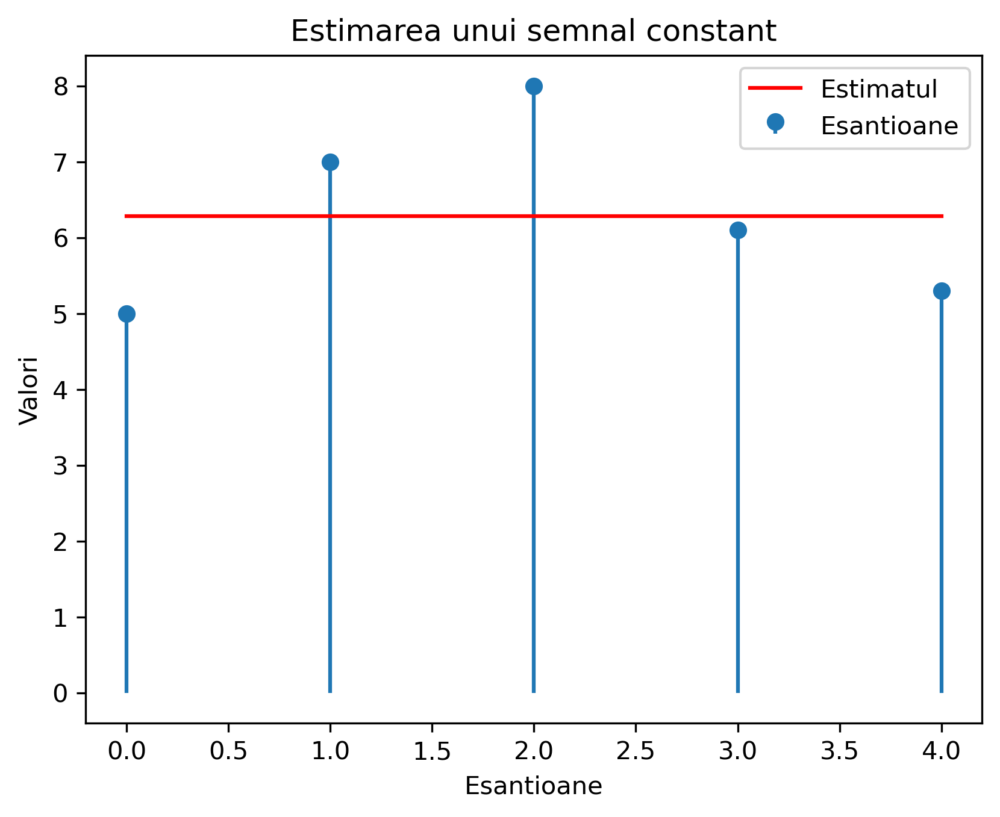
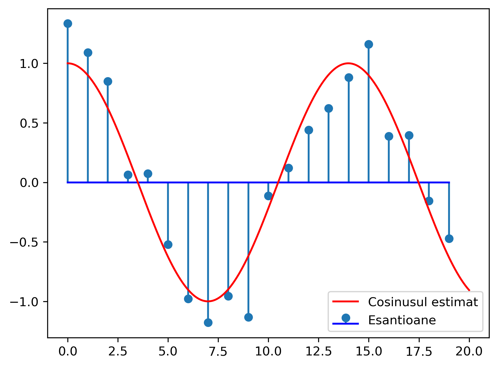
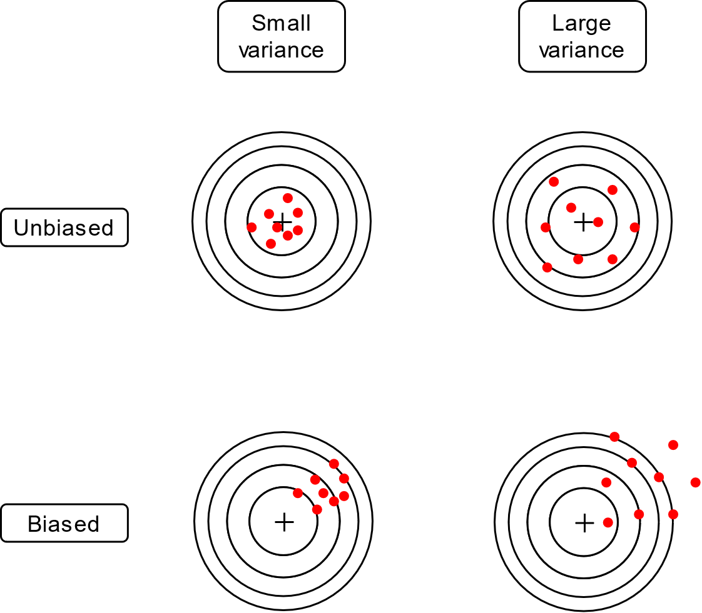

# Capitolul III. Elemente de Teoria Estimării


## III.1 Introducere


### Ce înseamnă "estimare"?

- Un emițător transmite un semnal $s_\Theta(t)$ care depinde de parametru **necunoscut** $\Theta$

- Semnalul este afectat de zgomot, se recepționează
	$$r(t) = s_\Theta(t) + zgomot$$

- Vrem să **găsim** valoarea parametrului $\Theta$

   - pe baza eșantioanelor din semnalul recepționat, sau a întregului semnal
   - datele recepționate au zgomot => parametrul este "estimat"

- Valoarea găsită este $\hat{\Theta}$, **estimatul** lui $\Theta$

   - există întotdeauna eroare de estimare $\epsilon = \hat{\Theta} - \Theta$


### Ce înseamnă "estimare"?

- Exemple:

	- Amplitudinea unui semnal constant: $r(t) = A + zgomot$, trebuie estimat $A$
    - Faza unui semnal sinusoidal: $r(t) = \cos(2 \pi f t + \phi) + zgomot$, de estimat $\phi$
	- Exemple mai complicate:

		- De estimat/decis ce cuvânt este pronunțat într-un semnal vocal


### Estimare și Detecție/Decizie

- Fie următoarea problemă de estimare:

	Se recepționează un semnal $r(t) = A + zgomot$, estimați-l pe $A$

- La detecție: se alege între **două valori cunoscute** ale $A$:

   - de ex. $A$ poate fi 0 sau 5 (ipotezele $H_0$ și $H_1$)

- La estimare: $A$ poate fi oricât => se alege între **o infinitate de opțiuni** ale $A$

   - $A$ poate fi orice valoare din $\mathbb{R}$, în general


### Estimare și Detecție/Decizie

- Detecție = Estimare **restrânsă** doar la un set discret de opțiuni

- Estimare = Detecție cu un număr **infinit de opțiuni** posibile

- Metodele statistice sunt similare

   - În practică, distincția între estimare și detecție nu este strictă
   - (de ex. când trebuie să alegem între 1000 de ipoteze, este "detecție" sau "estimare"?)


### Semnalul recepționat

- Semnalul recepționat este $r(t) = s_\Theta(t) + zgomot$

   - este afectat de zgomot
   - depinde de parametrul necunoscut $\Theta$

- Considerăm **N eșantioane** din $r(t)$, luate la momentele de timp $t_i$
	$$\vec{r} = [r_1, r_2, ... r_N]$$

- Eșantioanele depind de valoarea lui $\Theta$


### Semnalul recepționat

- Fiecare eșantion $r_i$ este o variabilă aleatoare ce depinde de $\Theta$ (și de zgomot)

	- Fiecare eșantion are o distribuție care depinde de $\Theta$
	$$w_i(r_i | \Theta)$$

- Întregul vector de eșantioane $\vec{r}$ este o variabilă aleatoare N-dimensională
ce depinde de $\Theta$ (și de zgomot)

	- Are o distribuție N-dimensională ce depinde de $\Theta$
	- Egală cu produsul tuturor $w_i(r_i | \Theta)$
	$$w(\vec{r} | \Theta) = w_1(r_1 | \Theta) \cdot w_2(r_2 | \Theta) \cdot ... \cdot w_N(r_N | \Theta)$$


### Tipuri de estimare

- Considerăm două tipuri de estimare:

	1. **Estimare de plauzibilitate maximă** (Maximum Likelihood Estimation, MLE):
	În afară de $\vec{r}$ nu se cunoaște nimic despre $\Theta$,
	decât cel mult vreun domeniu de existență (de ex. $\Theta > 0$)


	2. **Estimare Bayesiană**: În afară de $\vec{r}$ se mai cunoaște
	o distribuție *a priori* $w(\Theta)$ a lui $\Theta$,
	care indică ce valori ale lui $\Theta$ sunt mai probabile / mai puțin probabile

		- caz mai general decât primul


## II.2 Estimarea de plauzibilitate maximă (Maximum Likelihood)

### Estimarea tip Maximum Likelihood

- Dacă nu se cunoaște vreo distribuție *a priori* se folosește metoda
estimării de plauzibilitate maximă ("Maximum Likelihood", ML)

- Se definește **plauzibilitatea** unui valori $\Theta$, dat fiind
vectorul de observații $\vec{r}$:
	$$L(\Theta | \vec{r}) = w(\Theta | \vec{r})$$

- $L(\Theta | \vec{r})$ reprezintă funcția de plauzibilitate

- "Plauzibilitatea unei valori $\Theta$, date fiind măsurătorile $\vec{r}$ =
  = probabilitatea de a se fi generat $\vec{r}$ dacă valoarea parametrului ar fi fost $\Theta$"

- A se compara cu formula din Cap. 2, slide 20

  - e aceeași
  - aici "ghicim" pe $\Theta$, acolo "ghiceam" pe $H_i$


### Estimarea tip Maximum Likelihood

Estimarea de plauzibilitate maximă (Maximum Likelihood, ML):

- Estimatul $\hat{\Theta}_{ML}$ este
**valoarea care maximizează plauzibilitatea, dat fiind valorile observate $\vec{r}$**

	- i.e. valoarea care maximizează $L(\Theta | \vec{r})$, adică maximizează
	$w(\vec{r} | \Theta)$
    $$\hat{\Theta}_{ML} = \arg\max_{\Theta} L(\Theta | \vec{r}) = \arg\max_{\Theta} w(\vec{r} | \Theta)$$

- Dacă $\Theta$ aparține doar unui anumit interval, se face maximizarea
doar pe acel interval


### Notații matematice

- Notații matematice generale

	- $\arg\max_{x} f(x)$ = "valoarea $x$ are maximizează funcția f(x)"

	- $\max_{x} f(x)$ = "valoarea maximă a funcției f(x)"

### Estimare vs decizie Maximum Likelihood

- Estimarea ML este foarte similară cu decizia ML!

- Criteriul de decizie ML:

	- "se alege ipoteza cu plauzibilitate mai mare":

		$$\frac{L(H_1 | r)}{L(H_0 | r)} = \frac{w(r|H_1)}{w(r|H_0)} \grtlessH 1$$

- Estimare ML:

    - "se alege valoarea care maximizează plauzibilitatea"

		$$\hat{\Theta}_{ML} = \arg\max_{\Theta } L(\Theta | \vec{r}) = \arg\max_{\Theta} w(\vec{r} | \Theta)$$


### Găsirea maximului

- Cum se rezolvă problema de maximizare?

   - adică cum se găsește estimatul $\hat{\Theta}_{ML}$ care maximizează $L(\Theta | vec{r})$

- Maximul se găsește prin derivare și egalare cu 0
	$$\frac{d L(\Theta | \vec{r})}{d\Theta} = 0$$

- Se poate aplica **logaritmul natural** asupra funcției $L(\Theta | \vec{r})$
înainte de derivare (funcția "log-likelihood")
	$$\frac{d \ln\left(L(\Theta | \vec{r})\right)}{d\Theta} = 0$$

### Procedura de găsire a estimatului

Procedura de găsire a estimatului ML:

1. Se găsește expresia funcției $$L(\Theta | \vec{r}) = w(\vec{r} | \Theta)$$

1. Se pune condiția ca derivata lui $L(\Theta | \vec{r})$ sau a lui $\ln(\left(L(\Theta | \vec{r})\right)$ să fie 0
	$$\frac{d L(\Theta)}{d\Theta} = 0, \text{ sau }\frac{d \ln\left(L(\Theta)\right)}{d\Theta} = 0$$

1. Se rezolvă ecuația, se găsește valoarea $\hat{\Theta}_{ML}$

1. Se verifică că derivata a doua în punctul $\hat{\Theta}_{ML}$ este negativă, pentru a verifica că este un punct de maxim

   - întrucât derivata = 0 și pentru maxime și pentru minime
   - uneori sărim peste această etapă

### Exemplu

- Estimarea unui semnal constant în zgomot gaussian:

	Găsiți estimatul Maximum Likelihood pentru un semnal de valoare constantă
	$s_\Theta(t) = A$ din 5 măsurători afectate de zgomot
	$r_i = A + zgomot$, cu valori egale cu $[5, 7, 8, 6.1, 5.3]$.
	Zgomotul este AWGN $\mathcal{N}(\mu=0, \sigma^2)$.

- Soluție: la tablă

- Estimatul $\hat{A}_{ML}$ este chiar valoarea medie a eșantioanelor

    - (deloc surprinzător)

### Simulare numerică

```{.python .cb.run session=plot}
import matplotlib.pyplot as plt, numpy as np, math;
mu = 0;
sigma = 1;
r = np.array([5, 7, 8, 6.1, 5.3])
plt.stem(r, basefmt=" ", use_line_collection=True)
plt.plot(np.mean(r) * np.ones(r.shape), color = 'red')
plt.xlabel('Esantioane');
plt.ylabel('Valori');
plt.title('Estimarea unui semnal constant');
plt.legend(('Estimatul', 'Esantioane'))
plt.savefig('fig/03_NumericalSim_Constant.png', transparent=True, bbox_inches='tight', dpi=300)
plt.close()
```
{width=70% max-width=1000px}


### Aproximare a unei curbe

- Estimare = aproximare a unei curbe

    - se găsește cea mai bună potrivire a lui $s_\Theta(t)$ pri datele $\vec{r}$

- Din exemplul grafic anterior:

   - avem un set de date $\vec{r}$

   - se cunoaște forma semnalului = o dreaptă orizontală ($A$ constant)

   - se aproximează în mod optim dreapta prin setul de date

### Semnal oarecare în AWGN

- Fie semnalul original $s_\Theta(t)$

- Zgomotul este AWGN $\mathcal{N}(\mu=0, \sigma^2)$

- Eșantioanele $r_i$ sunt luate la momentele $t_i$

- Eșantioanele $r_i$ au distribuție normală, cu media $\mu = s_\Theta(t_i)$
și varianța $\sigma^2$

- Funcția de plauzibilitate globală = produsul plauzibilităților fiecărui eșantion $r_i$
	$$\begin{split}
	L(\Theta | \vec{r}) = w(\vec{r} | \Theta) =& \prod_{i=1}^N \frac{1}{\sigma \sqrt{2 \pi}} e^{- \frac{(r_i - s_\Theta(t_i))^2}{2 \sigma^2}} \\
	=&  \left( \frac{1}{\sigma \sqrt{2 \pi}} \right)^N e^{- \frac{\sum(r_i - s_\Theta(t_i))^2}{2 \sigma^2}}
	\end{split}$$


### Semnal oarecare în AWGN

- Logaritmul plauzibilității ("log-likelihood") este
	$$\begin{split}
	\ln\left(L(\Theta | \vec{r})\right) =& \underbrace{\ln\left(\frac{1}{\sigma \sqrt{2 \pi}}\right)}_{constant} - \frac{\sum(r_i - s_\Theta(t_i))^2}{2 \sigma^2}
	\end{split}$$


### Semnal oarecare în AWGN

- Maximul funcției = minimul exponentului
	$$\hat{\Theta}_{ML} = \arg\max_{\Theta} L(\Theta | \vec{r}) = \arg\min \sum(r_i - s_\Theta(t_i))^2$$

- Termenul $\sum(r_i - s_\Theta(t_i))^2$ este **distanța $d(\vec{r},s_\Theta)$ la pătrat**
	$$d(\vec{r},s_\Theta) = \sqrt{\sum (r_i - s_\Theta(t_i))^2}$$
	$$\left(d(\vec{r},s_\Theta)\right)^2 = \sum (r_i - s_\Theta(t_i))^2$$


### Semnal oarecare în AWGN

- Estimarea ML se poate rescrie sub forma:
	$$\hat{\Theta}_{ML} = \arg\max_{\Theta} L(\Theta | \vec{r}) = \arg\min_\Theta d(\vec{r}, \vec{s}_\Theta)^2$$

- Estimatul de plauzibilitate maximă (ML) $\hat{\Theta}_{ML}$ =
valoarea care face $s_\Theta(t_i)$
**cel mai apropiat de vectorul recepționat $\vec{r}$**

   - mai aproape = potrivire mai bună = mai probabil
   - cel mai aproape = cea mai bună potrivire = cel mai probabil = plauzibilitate maximă


### Semnal oarecare în AWGN

- Estimare ML în zgomot gaussian = **minimizarea distanței**

- Aveam aceeași interpretare și la decizia ML!

	- dar la decizie alegeam minimul din 2 opțiuni
	- aici alegem minimul dintre toate opțiunile posibile

- Relația e valabilă pentru orice fel de spații vectoriale

   - vectori cu N elemente, semnale continue, etc
   - doar se înlocuiește definiția distanței Euclidiene


### Semnal oarecare în AWGN

Procedura pentru estimarea tip ML în zgomot AWGN:

1. Se scrie expresia pentru pătratul distanței:
	$$D = \left(d(\vec{r},s_\Theta)\right)^2 = \sum (r_i - s_\Theta(t_i))^2$$

1. Vrem minimul, deci egalăm derivata cu 0:
	$$\frac{d D}{d\Theta} = \sum 2 (r_i - s_\Theta(t_i)) (- \frac{d s_\Theta(t_i)}{d\Theta}) = 0$$

1. Se rezolvă și obținem valoarea $\hat{\Theta}_{ML}$

1. Se verifică că derivata a doua în punctul $\hat{\Theta}_{ML}$ este pozitivă,
 pentru a se verifica că punctul este un minim

   - uneori sărim peste această etapă

### Simulare numerică

Estimarea frecvenței $f$ a unui semnal sinusoidal

- Găsiți estimatul Maximum Likelihood pentru frecvența $f$
a unui semnal $s_\Theta(t) = cos(2\pi f t_i)$, din 10 măsurători
 afectate de zgomot $r_i = cos(2\pi f t_i) + zgomot$ de valori $[...]$.
 Zgomotul este AWGN $\mathcal{N}(\mu=0, \sigma^2)$.
Momentele de eșantionare sunt $t_i = [0,1,2,3,4,5,6,7,8,9]$

- Soluție: la tablă

### Simulare numerică

Funcția de plauzibilitate este

```{.python .cb.run session=plot}
import matplotlib.pyplot as plt, numpy as np, math;
np.random.seed(102)
mu = 0;
sigma = 0.2;
ftrue = 0.07;
n = np.arange(0,20)
r = np.cos(2 * math.pi * ftrue * n) + sigma*np.random.randn(20)

# Log-likelihood function
fvalues = np.linspace(0.04, 0.1, 100);
L = np.zeros((1,500))
L = [np.log(1./(sigma*math.sqrt(2*math.pi))) - (sum(r - np.cos(2 * math.pi * fvalue * n))**2)/2*sigma*sigma for fvalue in fvalues]
fhat = np.amax(L)
plt.plot(fvalues,L)
plt.savefig('fig/03_NumericalSim_CosineFreq_LogLik.png', transparent=True, bbox_inches='tight', dpi=300)
plt.close()
```
{width=70% max-width=1000px}


### Simulare numerică

```{.python .cb.run session=plot}
import matplotlib.pyplot as plt, numpy as np, math;
np.random.seed(102)
mu = 0;
sigma = 0.2;
ftrue = 0.07;
n = np.arange(0,20)
r = np.cos(2 * math.pi * ftrue * n) + sigma*np.random.randn(20)

# Log-likelihood function
fvalues = np.linspace(0.04, 1/10, 100);
L = np.zeros((1,500))
L = [np.log(1./(sigma*math.sqrt(2*math.pi))) - (sum(r - np.cos(2 * math.pi * fvalue * n))**2)/2*sigma*sigma for fvalue in fvalues]
imax = np.argmax(L)
fhat = fvalues[imax]
plt.stem(n,r, basefmt="b", use_line_collection=True)
ntoplot = np.linspace(0,20,200)
plt.plot(ntoplot, np.cos(2 * math.pi * fhat * ntoplot), color='red')
plt.legend(('Cosinusul estimat','Esantioane'))
print('Frecventa originala = %f, estimatul = %f'%(ftrue, fhat))
plt.savefig('fig/03_NumericalSim_CosineFreq.png', transparent=True, bbox_inches='tight', dpi=300)
plt.close()
```
{width=70% max-width=1000px}

### Estimarea paremetrilor unor distribuții

- Estimarea ML se poate folosi și pentru a estima parametrii unor distribuții

- Avem un set de valori $r_i$, pe care le modelăm ca fiind eșantioane dintr-o distribuție.
  Cum găsim parametrii acelei distribuții?

- Momentan, considerăm un singur parametru necunoscut

### Estimarea parametrilor distribuției normale

- Presupunem că $r_i$ sunt eșantioane dintr-o distribuție normală $\mathcal{N}(\mu, \sigma^2)$
- Distribuția are doi parametri: media $\mu$ și deviația standard $\sigma$

- Estimarea lui $\mu$:

  Este identică cu estimarea unui semnal constant în zgomot gaussian cu media 0:
  $$\hat{\mu}_{ML} = \frac{1}{N} \sum_{i=1}^N r_i$$

- Estimarea lui $\sigma^2$:

  Nu se poate formula ca estimarea unui semnal afectat, prin adunare, de zgomot gaussian,
  dar cu toate acestea se poate utiliza în continuare metoda ML:

  $$\hat{\sigma}_{ML} = \arg\max_{\sigma} w(\vec{r} | \sigma)$$

### Estimarea parametrilor distribuției normale

$$\begin{aligned}
\hat{\sigma}_{ML} &= \arg\max_{\sigma} w(\vec{r} | \sigma) \\
=& \arg\max_{\sigma} \left( \frac{1}{\sigma \sqrt{2 \pi}} \right)^N e^{- \frac{\sum(r_i - \mu)^2}{2 \sigma^2}}   \quad \textrm{( aplicăm ln() )}\\
=& \arg\max_{\sigma} \left( -N \ln(\sigma \sqrt{2 \pi}) - \frac{\sum(r_i - \mu)^2}{2 \sigma^2} \right)\\
\end{aligned}$$

Derivăm și egalăm cu 0 pentru a obține minimul:

$$\begin{split}
-N \frac{1}{\sigma \sqrt{2 \pi}} \sqrt{2 \pi} - \frac{\sum(r_i - \mu)^2}{2} (-2) \sigma^{-3} &= 0 \\
-\frac{N}{\sigma} + \frac{\sum(r_i - \mu)^2}{\sigma^3} &= 0 \\
\sigma^2 &= \frac{\sum(r_i - \mu)^2}{N} \\
\end{split}$$

### Estimarea parametrilor distribuției normale

- Estimarea parametrilor unei distribuții normale e similară cu definițiile mediei și varianței:

  $$\begin{aligned}
  \hat{\mu}_{ML} &= \frac{1}{N} \sum_{i=1}^N r_i \\
  \hat{\sigma}_{ML} &= \sqrt{\frac{\sum_{i=1}^N (r_i - \mu)^2}{N}}
  \end{aligned}$$

- Notă: estimarea lui $\sigma_{ML}$ necesită valoarea lui $\mu$
  - Dacă $\mu$ este cunoscut, totul e în regulă
  - Dacă $\mu$ este necunoscut, se poate folosi $\hat{\mu}_{ML}$,
    dar atunci estimăm pe baza unei alte estimări, ceea ce e problematic
    (estimatorul este deplasat, vom vedea)

### Estimarea parametrilor distribuției uniforme

- Presupunem că $r_i$ sunt eșantioane dintr-o distribuție uniformă $\mathcal{U}[a, b]$
- Distribuția are doi parametri: limitele $a$ și $b$
- Estimarea lui $a$ și $b$:

  $$\begin{aligned}
  \hat{a}_{ML} &= \arg\max_{a} w(\vec{r} | a)\\
  \hat{b}_{ML} &= \arg\max_{b} w(\vec{r} | b)
  \end{aligned}$$

  Prin raționament:
  $$\begin{aligned}
  \hat{a}_{ML} &= \min(r_i) \\
  \hat{b}_{ML} &= \max(r_i)
  \end{aligned}$$

- Intervalul trebuie să cuprindă toate valorile (altfel, probabilitatea ar fi 0),
  dar nu trebuie să fie mai mare decât strict necesar (altfel, probabilitatea ar fi mai mică)

### Parametri multipli

- Dacă semnalul depinde de mai mulți parametri?

	- de ex. amplitudinea, frecvența și faza inițială a unui cosinus:
	$$s_\vec{\Theta}(t) = A \cos(2 \pi f t + \phi)$$

- Se va considera $\Theta$ ca fiind un vector:

	$$\bm{\Theta} = [\Theta_1, \Theta_2, ... \Theta_M]$$

	- e.g. $\bm{\Theta} = [\Theta_1, \Theta_2, \Theta_3] =[A, f, \phi]$


### Parametri multipli

- Se rezolvă cu aceeași procedură, dar în loc de o singură derivată
vom avea $M$ derivate

- Se rezolvă sistemul:
	$$\begin{cases}
	\frac{\partial L}{\partial \Theta_1} = 0 \\
	\frac{\partial L}{\partial \Theta_2} = 0 \\
	\dots \\
	\frac{\partial L}{\partial \Theta_M} = 0 \\
	\end{cases}$$

	- uneori este dificil/imposibil

### Coborâre după gradient (Gradient Descent)

- Cum se estimează parametrii $\bm{\Theta}$ în cazuri complicate?

   - în aplicații reale, unde pot fi foarte mulți parametri ($\bm{\Theta}$ este vector)

- De obicei nu se pot găsi valorile optime prin formule directe

- Se îmbunătățesc valorile în mod iterativ cu algoritmi tip  **coborâre după gradient**
(Gradient Descent)

- Gradient Descent este o metodă generală d găsire a minimului (sau a maximului) unei funcții

### Coborâre după gradient (Gradient Descent)

![Coborâre după gradient[^GD]](img/GradientDescent.jpg){width=70%}

[^GD]: Imagine: [Quick Guide to Gradient Descent and Its Variants, Sahdev Kansal, Towards Data Science, 2020](https://towardsdatascience.com/quick-guide-to-gradient-descent-and-its-variants-97a7afb33add)

### Coborâre după gradient (Gradient Descent)

1. Se inițializează parametrii cu valori aleatoare $\bm{\Theta}^{(0)}$

2. Repetă la fiecare iterație $k$:

    1. Se calculează funcția $L(\bm{\Theta}^{(k)} | \vec{r})$

    2. Se calculează derivatele $\frac{\partial L}{\partial \Theta_i^{(k)}}$ pentru toți $\Theta_i$ ("**Gradient**")

    3. Se actualizează toate valorile $\Theta_i$ prin scăderea derivatei  ("**Descent**"):
        $$\Theta_i^{(k+1)} = \Theta_i^{(k)} - \mu \frac{\partial L}{\partial \Theta_i^{(k)}}$$
       - sau, sub formă vectorială:
        $$\bm{\Theta}^{(k+1)} = \bm{\Theta}^{k} - \mu \frac{\partial L}{\partial \bm{\Theta}^{(k)}}$$

3. Până la îndeplinirea unui criteriu de terminare (de ex. parametrii nu se mai modifică mult)


### Coborâre după gradient (Gradient Descent)

- În fiecare punct, derivata ne spune în ce direcție să mergem

- Pentru găsirea minimului unei funcții, se scade derivata (coborâre după gradient)
  $$\Theta^{(k+1)} = \Theta^{(k)} - \mu \frac{\partial L}{\partial \Theta^{(k)}}$$

- Pentru găsirea maximului unei funcții, se adună derivata (urcare după gradient)
  $$\Theta^{(k+1)} = \Theta^{(k)} + \mu \frac{\partial L}{\partial \Theta^{(k)}}$$

- Parametrul $\mu$ se numește **rată de învățare** (learning rate) și se alege empiric, la o valoare mică

- Alte explicații la tablă

- Exemplu: regresia logistică cu valori 2D
   - exemplu la tablă

### Rețele Neurale

- Cel mai proeminent exemplu: **Rețele Neurale Artificiale** (a.k.a. "Rețele Neurale",
"Deep Learning", etc.)

   - Pot fi văzute ca un exemplu de estimare ML
   - Se utilizează algoritmul *Gradient Descent* pentru găsirea parametrilor
   - Aplicații de vârf: recunoașterea de imagini, automated driving etc.

- Mai multe informații despre rețele neurale / machine learning:

   - căutați cursuri sau cărți online
   - IASI AI Meetup


### Deplasarea și varianța estimatorilor

- Cum caracterizăm calitatea unui estimator?

- Un estimator $\hat{\Theta}$ este **o variabilă aleatoare**

   - poate avea diverse valori, pentru că se calculează pe baza eșantioanelor recepționate, care depind de zgomot
   - exemplu: se repetă aceeași estimare pe calculatoare diferite => valori estimate ușor diferite

- Fiind o variabilă aleatoare, se pot defini:

   - valoarea medie a estimatorului: $E \left\{ \hat{\Theta} \right\}$
   - varianța estimatorului: $E \left\{ (\hat{\Theta} - E \left\{ \hat{\Theta} \right\})^2 \right\}$

### Deplasarea și varianța estimatorilor

{width=65%}

### Deplasarea unui estimator

- **Deplasarea** ("bias") unui estimator = diferența dintre valoarea medie a estimatorului
și valoarea adevărată $\Theta$
	$$Deplasare = E \left\{ \hat{\Theta} \right\} - \Theta$$

- Estimator **nedeplasat** = valoarea medie a estimatorului este egală cu valoarea adevărată a parametrului $\Theta$
	$$E \left\{ \hat{\Theta} \right\} = \Theta$$

- Estimator **deplasat** = valoarea medie a estimatorului diferă de valoarea adevărată a parametrului $\Theta$
   - diferența $E \left\{ \hat{\Theta} \right\} - \Theta$ este **deplasarea** estimatorului


### Deplasarea unui estimator

- Exemplu: semnal constant A, zgomot Gaussian (cu media 0), estimatorul de plauzibilitate maximă este $\hat{A}_{ML} = \frac{1}{N}\sum_i r_i$

- Atunci:
$$\begin{split}
E \left\{ \hat{A}_{ML} \right\} =& \frac{1}{N}E \left\{ \sum_i r_i \right\} \\
=& \frac{1}{N} \sum_{i=1}^N E \left\{ r_i \right\} \\
=& \frac{1}{N} \sum_{i=1}^N E \left\{ A + zgomot \right\} \\
=& \frac{1}{N} \sum_{i=1}^N A \\
=& A
\end{split}$$

- Acest estimator este nedeplasat

### Deplasarea unui estimator

- Exemplu: estimatorul varianței unei distribuții normale, când se folosește media estimată $\hat{\mu}_{ML}$:
	$$\begin{split}
	\hat{\sigma}_{ML}^2 &= \frac{\sum_{i=1}^N (r_i - \hat{\mu}_{ML})^2}{N} \\
	\end{split}$$

- Acest estimator este **deplasat**:
  $$\begin{split}
  E \left\{ \hat{\sigma}_{ML}^2 \right\} &= E \left\{ \frac{\sum_{i=1}^N (r_i - \hat{\mu}_{ML})^2}{N} \right\} \\
  &= \dots \\
  &= \frac{N-1}{N} \sigma^2
  \end{split}$$
  unde $\sigma^2$ este varianța reală a distribuției


- Demonstrație: [*Wikipedia*](https://en.wikipedia.org/wiki/Variance#Sample_variance)
  sau ["*Maximum Likelihood Estimator for Variance is Biased: Proof*", Dawen Liang, Carnegie Mellon University](https://dawenl.github.io/files/mle_biased.pdf)

### Estimatorul nedeplasat al varianței

- Estimatorul MLE al varianței este deplasat, și **subestimează** varianța reală a distribuției

- Pentru a obține un estimator nedeplasat al varianței, se folosește formula:
  $$\hat{\sigma}_{ML}^2 = \frac{1}{N-1} \sum_{i=1}^N (r_i - \hat{\mu}_{ML})^2$$

- Diferența: se împarte la $N-1$ în loc de $N$

- Justificare intuitivă: discuție la tablă, cazul cu 2 puncte; medie este la mijloc; varianța e minimizată, deci subestimează varianța reală

### Varianța unui estimator

- **Varianța** unui estimator măsoară "abaterile" estimatorului în jurul valorii medii

   - aceasta e definiția varianței $\sigma^2$ în general

- Dacă un estimator are **varianța** mare, valoarea estimată poate fi departe de cea reală,
chiar daca estimatorul este nedeplasat

- De obicei se preferă estimatori cu **varianță mică**, tolerându-se o eventuală mică deplasare


## II.3 Estimare Bayesiană


### Estimare Bayesiană

- **Estimarea Bayesiană** ia în calcul termeni suplimentari pe lângă $w(\vec{r} | \Theta)$:

   - o distribuție *a priori* $w(\Theta)$
   - opțional, o funcție de cost

- Se obține echivalentul din estimare pentru criteriile de decizie MPE și MR

### Estimare Bayesiană

- Conceptual, estimarea Bayesiană constă în doi pași:

  1. Găsirea distribuției **posterioare** $w(\Theta | \vec{r})$
  2. Estimaea unei valori de pe distribuție, pe baza unei **funcții de cost**

### Estimare Bayesiană

- Se definește **distribuția *a posteriori* ** a lui $\Theta$,
date fiind observațiile $\vec{r}$, folosind **regula lui Bayes**:

	$$w(\Theta | \vec{r}) = \frac{w(\vec{r} | \Theta) \cdot w(\Theta)}{w(\vec{r})}$$

- Termenii:

	- $\Theta$ este parametrul necunoscut
	- $\vec{r}$ este vectorul de observații
	- $w(\Theta | \vec{r})$ este probabilitatea ca parametrul să aibă valoarea $\Theta$,
	dat fiind vectorul de observații $\vec{r}$;
	- $w(\vec{r} | \Theta)$ este funcția de plauzibilitate
	- $w(\Theta)$ este distribuția **a priori** a lui $\Theta$
	- $w(\vec{r})$ este distribuția **a priori** a lui $\vec{r}$; se presupune a fi constantă

### Estimare Bayesiană

- La estimarea ML, avem doar termenul $w(\vec{r} | \Theta)$.
  Văzut ca o funcție de $\Theta$, acesta nu e o o distrubție a $\Theta$.
  E doar o mărime pe care vrem să o maximizăm.

- Estimarea Bayesiană folosește însă $w(\Theta | \vec{r})$, care **este** chiar distribuția valorilor posibile ale lui $\Theta$

### Regula lui Bayes

- Relația precedentă arată că, în general, estimarea lui $\Theta$ depinde de două lucruri:

  1. De vectorul observațiilor $\vec{r}$, prin termenul $w(\vec{r} | \Theta)$
  2. De informația "a priori" avută despre $\Theta$, prin termenul $w(\Theta)$

  - (termenul $w(\vec{r})$ se presupune constant)

- Numele este "estimare Bayesiană"

   - Thomas Bayes = matematician englez, a descoperit regula cu acest nume
   - Noțiunile bazate pe regula lui Bayes poartă deseori numele de "Bayesiane"

### Distribuția *a priori*

- Presupunem că se știe de dinainte o distribuție a lui $\Theta$, $w(\Theta)$

   - știm de dinainte care e probabilitatea de a fi a anume valoare sau alta
   - se numește distribuția *a priori*

- Estimarea trebuie să ia în calcul și distribuția *a priori*

   - estimatul va fi "tras" înspre valori mai probabile

### Estimatorul MAP

- Cunoaștem distribuția *a posteriori* $w(\Theta | \vec{r})$.
Care este valoarea estimată?

- Se poate alege valoarea care are probabilitate maximă

- Estimatorul **Maximum A Posteriori (MAP)** este
	$$\hat{\Theta}_{MAP} = \arg\max_\Theta w(\Theta | \vec{r}) = \arg\max_\Theta w(\vec{r} | \Theta) \cdot w(\Theta)$$

- Estimatorul MAP alege acea valoare $\Theta$ unde distribuția *a posteriori* $w(\Theta | \vec{r})$ este maximă

- Estimatorul MAP maximizează **produsul** dintre plauzibilitate și
**distribuția *a priori* $w(\Theta)$**

### Estimatorul MAP

Exemplu: Imagine


### Relația dintre estimarea MAP și ML

- Estimatorul ML: $$\arg\max w(\vec{r} | \Theta)$$

- Estimatorul MAP: $$\arg\max w(\vec{r} | \Theta) \cdot w(\Theta)$$

- Estimatorul ML este un caz particular de MAP pentru $w(\Theta)$ constant

   - $w(\Theta)$ = constant înseamnă că toate valorile lui $\Theta$ sunt *a priori* echiprobabile
   - i.e. nu avem extra informații despre valoarea lui $\Theta$


### Relația cu detecția semnalelor

- Criteriul probabilității minime de eroare:
$\frac{w(r | H_1)}{w(r | H_0)} \grtlessH \frac{P(H_0)}{P(H_1)}$

- Se poate rescrie ca $w(r | H_1)\cdot P(H_1) \grtlessH w(r | H_0) P(H_0)$

   - adică se alege ipoteza pentru care $w(r | H_i)\cdot P(H_i)$este mai mare

- **Criteriul de decizie MPE**: se alege ipoteza care maximizează $w(r | H_i)\cdot P(H_i)$

	- dintre cele două ipoteze $H_0$, $H_1$

- **Estimarea MAP**: se alege valoarea care maximizează $w(\vec{r} | \Theta) \cdot w(\Theta)$

	- dintre toate valorile posibile pentru $\Theta$

- Același principiu!


### Funcția de cost

- Vrem s găsim un echivalent și pentru criteriul MR

- Avem nevoie de un echivalent pentru costurile $C_{ij}$

- **Eroarea de estimare** = diferența între estimatul $\hat{\Theta}$ și valoarea reală $\Theta$
	$$\epsilon = \hat{\Theta} - \Theta$$

- **Funcția de cost $C(\epsilon)$** = atribuie un cost pentru fiecare eroare de estimare posibilă

   - când $\epsilon = 0$, costul $C(0) = 0$
   - erori $\epsilon$ mici au costuri mici
   - erori $\epsilon$ mari au costuri mari

### Funcția de cost

- Funcții de cost uzuale:

   - Pătratică:
		$$C(\epsilon) = \epsilon^2 = \left( \hat{\Theta} - \Theta \right)^2$$
   - Uniformă:
		$$C(\epsilon) = \begin{cases}
		0, \text{ if } |\epsilon| = |\hat{\Theta} - \Theta | \leq E \\
		1, \text{ if } |\epsilon| = |\hat{\Theta} - \Theta | > E \\
		\end{cases}$$
   - Liniară:
		$$C(\epsilon) = |\epsilon| = | \hat{\Theta} - \Theta |$$

- De desenat la tablă

### Funcția de cost

- Funcția de cost $C(\epsilon)$ reprezintă echivalentul costurilor $C_{ij}$ de la detecție

    - la detecție aveam doar 4 valori: $C_{00}$, $C_{01}$, $C_{10}$, $C_{11}$
	- aici avem un cost pentru fiecare eroare posibilă $\epsilon$

- Funcția de cost dictează ce valoarea alegem din distribuția $w(\Theta | \vec{r})$

### Importanța funcției de cost

- Fie distribuția *a posteriori* următoare:

{height=35%}

- Care este estimatorul MAP?

- Dar dacă avem funcția de cost următoare:

	- dacă estimarea $\hat{\Theta}$ este < valoarea reală $\Theta$, te costă 1000 \$
	- dacă estimarea $\hat{\Theta}$ este > valoarea reală $\Theta$, platești 1 \$
	- schimbăm valoarea estimată ? :)

### Importanța funcției de cost

- Funcția de cost este cea care impune alegerea unei anume valori $\hat{\Theta}$ de pe distribuția valorilor posibile

- Valoarea cea mai probabilă nu este întotdeauna cea mai bună

- Valoarea cea mai bună este cea care minimizează valoarea medie a costului

### Riscul Bayesian

- Distribuția *a posteriori* $w(\Theta | \vec{r})$ dă probabilitatea fiecărei valori $\hat{\Theta}$
de a fi cea corectă

- Alegerea unui estimat $\hat{\Theta}$ implică o anume eroare $\epsilon$

- Eroarea de estimare are un anumit cost $C(\epsilon)$

- **Riscul** = valoarea medie a costului = $C(\epsilon$) $\times$ probabilitatea:
	$$R = \int_{-\infty}^\infty C(\epsilon) w(\Theta | \vec{r}) d\Theta$$

### The Bayesian risk

- Alegem valoarea $\hat{\Theta}$ care **minimizează costul mediu $R$**
	$$\hat{\Theta} = \arg\min_\Theta \int_{-\infty}^\infty C(\epsilon) w(\Theta | \vec{r}) d\Theta$$

- O obținem înlocuind $C(\epsilon)$ cu definiția sa, și derivând după $\hat{\Theta}$

   - Atenție: se derivează după $\hat{\Theta}$, nu $\Theta$!


### Estimatorul EPMM (eroare pătratică medie minimă)

- Când funcția de cost este pătratică $C(\epsilon) = \epsilon^2 = \left( \hat{\Theta} - \Theta \right)^2$
	$$R = \int_{-\infty}^\infty (\hat{\Theta} - \Theta)^2 w(\Theta | \vec{r}) d\Theta$$

- Vrem $\hat{\Theta}$ care minimizează $R$, deci derivăm
	$$\frac{dR}{d\hat{\Theta}} = 2 \int_{-\infty}^\infty (\hat{\Theta} - \Theta) w(\Theta | \vec{r}) d\Theta = 0$$

- Echivalent cu
	$$\hat{\Theta} \underbrace{\int_{-\infty}^\infty w(\Theta | \vec{r})}_1 d\Theta = \int_{-\infty}^\infty \Theta w(\Theta | \vec{r}) d\Theta$$

- Estimatorul de **eroare pătratică medie minimă (EPMM) ("Minimum Mean Squared Error, MMSE")**:
	$$\hat{\Theta}_{EPMM} = \int_{-\infty}^\infty \Theta \cdot w(\Theta | \vec{r}) d\Theta$$

### Interpretare

- **Estimatorul EPMM**: estimatorul $\hat{\Theta}$ este **valoarea medie** a distribuției *a posteriori* $w(\Theta | \vec{r})$

	$$\hat{\Theta}_{EPMM} = \int_{-\infty}^\infty \Theta \cdot w(\Theta | \vec{r}) d\Theta$$

    - EPMM = "Eroare Pătratică Medie Minimă"
	- valoarea medie = sumă (integrală) din fiecare $\Theta$ ori probabilitatea sa $w(\Theta | \vec{r})$

- Estimatprul EPMM se obține din distribuția *a posteriori* $w(\Theta | \vec{r})$,
considerând funcția de cost pătratică

### Estimatorul MAP

- Dacă funcția de cost este uniformă
	$$C(\epsilon) = \begin{cases}
	0, \text{ if } |\epsilon| = |\hat{\Theta} - \Theta | \leq E \\
	1, \text{ if } |\epsilon| = |\hat{\Theta} - \Theta | > E \\
	\end{cases}$$

- Știm că $\Theta = \hat{\Theta} - \epsilon$

- Se obține
	$$\begin{split}
	R =& \int_{-\infty}^{\hat{\Theta}-E} w(\Theta | \vec{r}) d\Theta + \int_{\hat{\Theta} + E}^\infty w(\Theta | \vec{r}) d\Theta \\
	R =& 1 - \int_{\hat{\Theta}-E}^{\hat{\Theta}+E} w(\Theta | \vec{r}) d\Theta
	\end{split}$$

### Estimatorul MAP

- Pentru minimizarea $R$, trebuie să maximizăm $\int_{\hat{\Theta}-E}^{\hat{\Theta}+E} w(\Theta | \vec{r}) d\Theta$,
integrala din jurul punctului $\hat{\Theta}$

- Pentru $E$ foarte mic, funcția $w(\Theta | \vec{r})$ este aproximativ constantă, deci se va alege punctul unde funcția este maximă

- **Estimatorul Maximum A Posteriori (MAP)** = valoarea $\hat{\Theta}$ care maximizează $w(\Theta | \vec{r})$
	$$\hat{\Theta}_{MAP} = \arg\max_\Theta w(\Theta | \vec{r}) = \arg\max\Theta w(\vec{r} | \Theta) \cdot w(\Theta)$$


### Interpretare

- Estimatorul MAP: $\hat{\Theta}$ = valoarea care maximizează distribuția *a posteriori*

- Estimatorul EPMM: $\hat{\Theta}$ = valoarea medie a distribuției *a posteriori*

{#id .class width=60%}

*[image from https://allenlu2007.wordpress.com]*


### Relația între estim. MAP and EPMM

- Estimatorul MAP = minimizează costul mediu, folosind funcția de cost uniformă

	- ca le detecție: criteriul MPE = criteriul MR când costurile sunt la fel

- Estimatorul EPMM = minimizează costul mediu, folosind funcția de cost pătratică

    - similar cu criteriul MR, dar la estimare

### Exercițiu

Exercițiu: valoare constantă, 1 măsurătoare, zgomot Gaussian același $\sigma$

- Vrem să estimam temperatura de astăzi din Sahara
- Termometrul indică 40 grade, dar valoarea este afectată de zgomot Gaussian $\mathcal{N}(0, \sigma^2=2)$ (termometru ieftin)
- Se știe că de obicei în această perioadă a anului temperatura este în jur de 35 grade, cu o distribuție Gaussiană $\mathcal{N}(35, \sigma^2 = 2)$.
- Estimați valoarea reală a temperaturii folosind estimarea ML, MAP și EPMM(MMSE)


### Exercițiu

Exercițiu: valoare constantă, 1 măsurătoare, zgomot Gaussian același $\sigma$

- Dacă avem trei termometre, care indică 40, 38, 41 grade?

Exercițiu: valoare constantă, 1 măsurătoare, zgomot Gaussian $\sigma$ diferit

- Dacă temperatura în această perioadă a anului are distribuție Gaussiană $\mathcal{N}(35, \sigma_2^2 = 3)$
   - cu varianță diferită, $\sigma_2 \neq \sigma$

### Semnal oarecare în zgomot Gaussian (AWGN)

- Fie semnalul original "curat" $s_\Theta(t)$

- Zgomotul este Gaussian (AWGN) $\mathcal{N}(\mu=0, \sigma^2)$

- Ca în cazul estimării de plauzibilitate maximă, funcția de plauzibilitate este:
$$\begin{split}
w(\vec{r} | \Theta) =&  \frac{1}{\sigma \sqrt{2 \pi}} e^{- \frac{\sum(r_i - s_\Theta(t_i))^2}{2 \sigma^2}}
\end{split}$$

- Dar acum aceasta **se înmulțește cu $w(\Theta)$**
$$w(\vec{r} | \Theta) \cdot w(\Theta)$$

### Semnal oarecare în zgomot Gaussian (AWGN)

- Estimatorul MAP estimator este cel care maximizează produsul
$$\hat{\Theta}_{MAP} = \arg\max w(\vec{r} | \Theta) w(\Theta)$$

- Logaritmând:
$$\begin{split}
\hat{\Theta}_{MAP} =& \arg\max \ln \left( w(\vec{r} | \Theta) \right) + \ln \left( w(\Theta) \right) \\
=& \arg\max - \frac{\sum(r_i - s_\Theta(t_i))^2}{2 \sigma^2} + \ln \left(w(\Theta)\right)
\end{split}$$

### Distribuție "a priori" Gaussiană

- Dacă distribuția "a priori" este de asemenea Gaussiană $\mathcal{N}(\mu_\Theta, \sigma_\Theta^2)$
$$ \ln \left(w(\Theta)\right) = - \frac{\sum(\Theta - \mu_\Theta)^2}{2 \sigma_\Theta^2}$$

- Estimatorul MAP devine
$$ \hat{\Theta}_{MAP} = \arg\min \frac{\sum(r_i - s_\Theta(t_i))^2}{2 \sigma^2} + \frac{\sum(\Theta - \mu_\Theta)^2}{2 \sigma_\Theta^2}$$

- Poate fi rescris
$$ \hat{\Theta}_{MAP} = \arg\min d(\vec{r},s_\Theta)^2 + \underbrace{\frac{\sigma^2}{\sigma_\Theta^2}}_\lambda \cdot d(\Theta, \mu_\Theta)^2$$

### Interpretare

- Estimatorul MAP în zgomot Gaussian și cu distribuție "a priori" Gaussiană
$$\hat{\Theta}_{MAP} = \arg\min d(\vec{r},s_\Theta)^2 + \underbrace{\frac{\sigma^2}{\sigma_\Theta^2}}_\lambda \cdot d(\Theta, \mu_\Theta)^2$$

- $\hat{\Theta}_{MAP}$ este apropiat de valoarea medie $\mu_\Theta$ și de asemenea
face ca semnalul adevărat să fie apropiat de eșantioanele recepționate $\vec{r}$
   - Exemplu: "caut locuință aproape de serviciu dar și aproape de Mall"
   - $\lambda$ controlează importanța relativă a celor doi termeni

- Cazuri particulare
   - $\sigma_\Theta$ foarte mic = distribuția "a priori" este foarte specifică (îngustă) = $\lambda$ mare = termenul al doilea este dominant = $\hat{\Theta}_{MAP}$ foarte apropiat de $\mu_\Theta$
   - $\sigma_\Theta$ foarte mare = distribuția "a priori" este foarte nespecifică = $\lambda$ mic = primul termen este dominant = $\hat{\Theta}_{MAP}$ apropiat de estimatorul de plauzibilitate maximă

### Aplicații

- În general, aplicațiile practice:

   - utilizează diverse tipuri de distribuții "a priori"
   - estimează **mai mulți parametri** (un vector de parametri)

- Aplicații

   - reducerea zgomotului din semnale
   - restaurarea semnalelor (parți lipsă din imagini, imagini *blurate* etc)
   - compresia semnalelor


### Aplicații practice

1. Urmărirea unui obiect ("single object tracking") prin filtrare Kalman

  - urmărirea unui obiect prin măsurători succesive (e.g. din imagini succesive)

  - la fiecare nouă măsurătoare avem două distribuții ale poziției:

	  - cea dată de măsurătoare respectivă, $w(r | \Theta)$
	  - cea prezisă pe baza poziției și vitezei de data trecută
	  - ambele presupuse a fi Gaussiene, caracterizate doar prin medie și varianță

   - cele două se combină prin regula lui Bayes => o distribuție mai precisă $w(\Theta | r)$, tot Gaussiană
   - poziția exactă se estimează prin EPMM (media lui $w(\Theta | r)$
   - $w(\Theta | r)$ prezice poziția de la momentul următor


### Single object tracking

### Single object tracking

### Aplicații practice

2. Constrained Least Squares (CLS) image restoration

  - Avem o imagine $I$ afectată de erori (zgomot, pixeli lipsă, blurare)
  $$I_{zg} = I_{true} + Z$$

  - Estimăm imaginea originală prin:
  $$\hat{I_{true}} = argmin_{I} \|I - I_{zg}\|_2 + \lambda \cdot \|HighPass\lbrace I \rbrace\|_2$$

  - Exemple:

    - [https://www.mathworks.com/help/images/deblurring-images-using-a-regularized-filter.html](https://www.mathworks.com/help/images/deblurring-images-using-a-regularized-filter.html)

    - [https://demonstrations.wolfram.com/ImageRestorationForDegradedImages](https://demonstrations.wolfram.com/ImageRestorationForDegradedImages)

	- Google it

### Constrained Least Squares (CLS) image restoration
