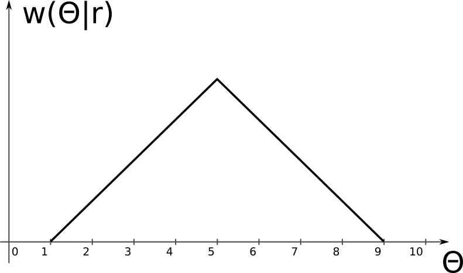

Aceste este un exemplu de examen DEPI. Întrebările sunt doar în scop ilustrativ.

# Exerciții

Pe baza exemplelor de la curs si seminar.

    
# Teorie

1. (1p) Fie variabila aleatoare $X$ reprezentând numărul obținut prin aruncarea unui zar.
Reprezentați funcția de repartiție a lui $X$.

2. (2p) Enunțați teorema Wiener-Hincin.

1. (2p) Completați: "Criteriul probabilității minime de eroare este identic cu criteriul plauzibilității maxime atunci când __________ ". Justificați.

2. (2p) Hașurați probabilitatea condiționată de **rejecție corectă** (decizie corectă că semnalul nu este prezent) în cazul ipotezei $H_0$, pentru criteriul Plauzibilității Maxime, pentru cele două funcții de plauzibilitate de mai jos.
Explicați în cuvinte ce ați colorat.

	{#id .class width=80%}
	
3. (3p) Fie cazul detecției unui semnal constant (0 sau A), afectat de **zgomot Gaussian** cu medie nulă, pe baza unui singur eșantion $r$.
Raportul de plauzibilitate se compară cu o valoare oarecare $K$, $\frac{w(r|H_1)}{w(r|H_0)} \grtlessH K$.
Găsiți regiunile de decizie $R_0$ și $R_1$ (în funcție de $K$).

4. (1p) Dacă zgomotul care afectează un semnal **se dublează**, cum se modifică **raportul Semnal-Zgomot** SNR (justificați în cuvinte):
    a. SNR crește
    b. SNR scade
    c. SNR rămâne constant

1. (5p) Demonstrați că minimizarea integralei $I = \int_{-\infty}^\infty C(\epsilon) w(\Theta | \vec{r}) d\Theta$ utilizând funcția de cost pătratică $C(\epsilon) = \epsilon^2 = (\hat{\Theta} - \Theta)^2$ 
conduce la formula estimatorului de Eroare Pătratică Medie Minimă (EPMM):
$$\hat{\Theta}_{EPMM} = \int_{-\infty}^\infty \Theta w(\Theta|r) d\Theta$$.

2. (1p) Distribuția **a posteriori** a unui parametru necunoscut $\Theta$ este 
funcția triunghiulară de mai jos.
	a. Care este valoarea estimatorului MAP? Explicați.
	a. Care este valoarea estimatorului EPMM? Explicați.

	{#id .class width=40%}
	
3. (2p) Arătați că estimarea Maximum A Posteriori este o generalizare a criteriului probabilității minime de eroare de la detecția semnalelor.
