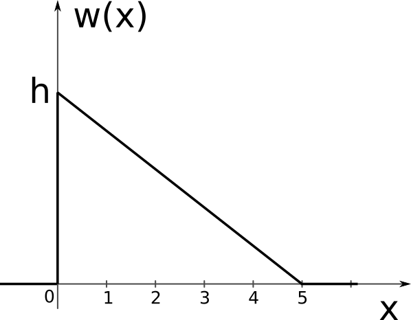

\newcommand*{\underuparrow}[1]{\ensuremath{\underset{\uparrow}{#1}}}
\renewcommand{\vec}[1]{\mathbf{#1}}
\newcommand{\erf}{\operatorname{erf}}

Aceste este un exemplu de examen DEPI. Întrebările sunt doar în scop ilustrativ.

## Exerciții (18p)

1. Fie o variabilă aleatoare $X$ cu distribuția din figură $w(x)=
    \begin{cases}
    h-\frac{h}{5}x, & x \in [0,5] \\
    0, & \textrm{în rest}
    \end{cases}$
	a. (1p) Găsiți valoarea lui $h$ și calculați probabilitatea ca $X$ să fie mai mare decât 3
    d. (1p) Calculați valoarea medie $\overline{X}$
    c. (2p) Găsiți expresia funcției de repartiție a lui $x$
    
{.id width=30%}  

\smallbreak

2. Un semnal constant poate avea două valori posibile, $-2$ (ipoteza $H_0$) sau $4$ (ipoteza $H_1$). 
Semnalul este afectat de zgomot Gaussian cu distribuția $\mathcal{N}(0, \sigma^2=4)$.
La recepție se ia un singur eșantion $r$. 
Probabilitățile celor două ipoteze sunt $P(H_0) = 2/3$, $P(H_1) = 1/3$.
Decizia se ia folosind **criteriul plauzibilității maxime**.
    b. (1p) Scrieți expresiile matematice ale funcțiilor de plauzibilitate $w(r|H_0)$ și $w(r|H_1)$;
    c. (1p) Care este decizia luată, dacă eșantionul $r$ are valoarea $r = 2$?
    d. (1p) Care sunt regiunile de decizie $R_0$ și $R_1$?
    d. (2p) Calculați probabilitatea alarmei false.
	b. (1p) Dacă raportul de plauzibilitate $\frac{w(r|H_1)}{w(r|H_0)} = 3$, 
	care ar fi decizia luată cu **criteriul probabilității minime de eroare**? 
    
\smallbreak

3. (3p) Se transmite unul dintre semnale $s_0(t)$ sau $s_1(t)$, iar la recepție se recepționează $r(t)$. 
Semnalele sunt reprezentate mai jos. Știind că semnalele transmise sunt afectate de zgomot alb
cu distribuție Gaussiană $\mathcal{N}(0, \sigma^2=2)$, să se găsească decizia luată de receptor
conform criteriului plauzibilității maxime, prin una dintre cele două metode:
    i. fie prin metoda observării continue
    ii. fie pe baza a 3 eșantioane luate la momentele $t_1 = 0.5$, $t_2 = 1.5$ și $t_2 = 3.5$

\ {.id width=25%} \      {.id width=25%} \      {.id width=25%}  

\smallbreak

4. (5p) Se recepționează un semnal de forma $r(t) = \underbrace{A + t + 2}_{s_\Theta(t)} + zgomot$, unde $A$ este un parametru necunoscut.
Zgomotul are distribuție Gaussiană $\mathcal{N}(0,\sigma^2=4)$. 
La recepție se iau trei eșantioane, la momentele $t_1 = 1, t_2 = 2, t_3 = 3$, valorile fiind $r_1 = 6.1$, $r_2 = 7.1$, $r_3 = 8.1$.
Estimați parametrul $A$ folosind estimarea de plauzibilitate maximă.

## Formule cunoscute

* primitiva unei funcții Gaussiene: $F(x) = \frac{1}{2}\left(1 + \erf\left(\frac{x - \mu}{\sigma \sqrt{2}}\right)\right)$

    
## Teorie

1. (1p) Fie variabila aleatoare $X$ reprezentând numărul obținut prin aruncarea unui zar.
Reprezentați funcția de repartiție a lui $X$.

2. (2p) Enunțați teorema Wiener-Hincin.

1. (2p) Completați: "Criteriul probabilității minime de eroare este identic cu criteriul plauzibilității maxime atunci când __________ ". Justificați.

2. (2p) Hașurați probabilitatea condiționată de **rejecție corectă** (decizie corectă că semnalul nu este prezent) în cazul ipotezei $H_0$, pentru criteriul Plauzibilității Maxime, pentru cele două funcții de plauzibilitate de mai jos.
Explicați în cuvinte ce ați colorat.

	{#id .class width=70%}
	
3. (3p) Fie cazul detecției unui semnal constant (0 sau A), afectat de **zgomot Gaussian** cu medie nulă, pe baza unui singur eșantion $r$.
Raportul de plauzibilitate se compară cu o valoare oarecare $K$, $\frac{w(r|H_1)}{w(r|H_0)} \grtlessH K$.
Găsiți regiunile de decizie $R_0$ și $R_1$ (în funcție de $K$).

4. (1p) Dacă zgomotul care afectează un semnal **se dublează**, cum se modifică **raportul Semnal-Zgomot** SNR (justificați în cuvinte):
    a. SNR crește
    b. SNR scade
    c. SNR rămâne constant

1. (5p) Demonstrați că minimizarea integralei $I = \int_{-\infty}^\infty C(\epsilon) w(\Theta | \vec{r}) d\Theta$ utilizând funcția de cost pătratică $C(\epsilon) = \epsilon^2 = (\hat{\Theta} - \Theta)^2$ 
conduce la formula estimatorului de Eroare Pătratică Medie Minimă (EPMM):
$$\hat{\Theta}_{EPMM} = \int_{-\infty}^\infty \Theta w(\Theta|r) d\Theta$$

2. (1p) Distribuția **a posteriori** a unui parametru necunoscut $\Theta$ este 
funcția triunghiulară de mai jos.
	a. Care este valoarea estimatorului MAP? Explicați.
	a. Care este valoarea estimatorului EPMM? Explicați.

	{#id .class width=40%}
	
3. (2p) Arătați că estimarea Maximum A Posteriori este o generalizare a criteriului probabilității minime de eroare de la detecția semnalelor.
